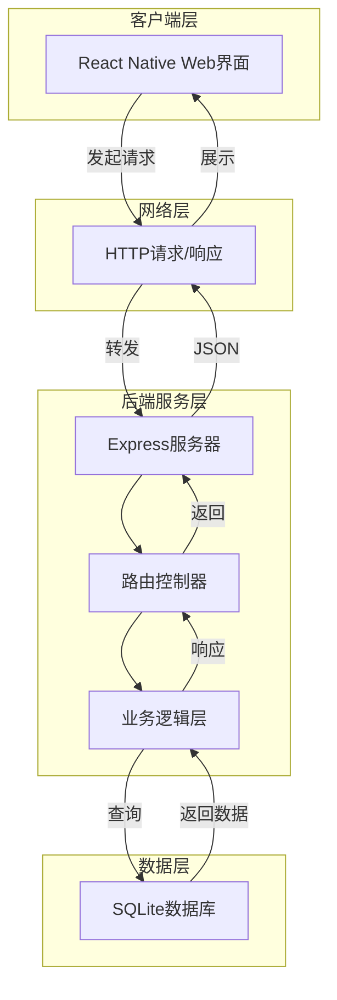
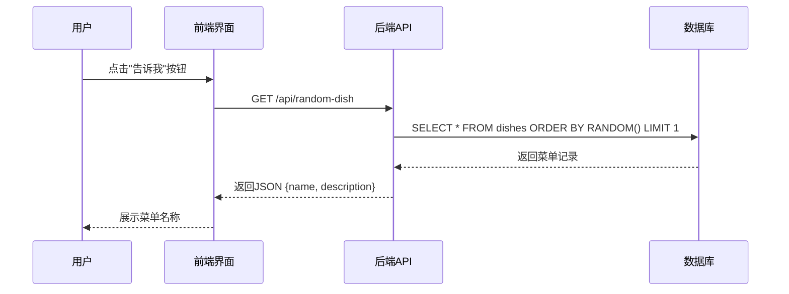
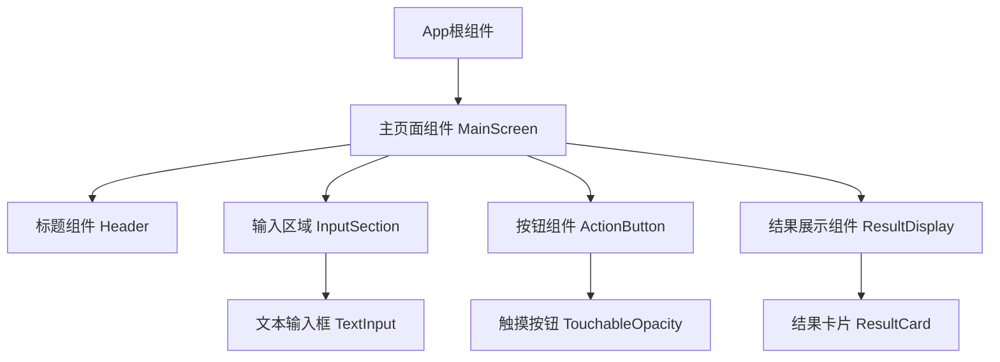
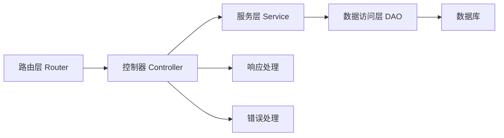
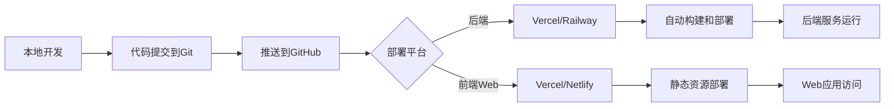
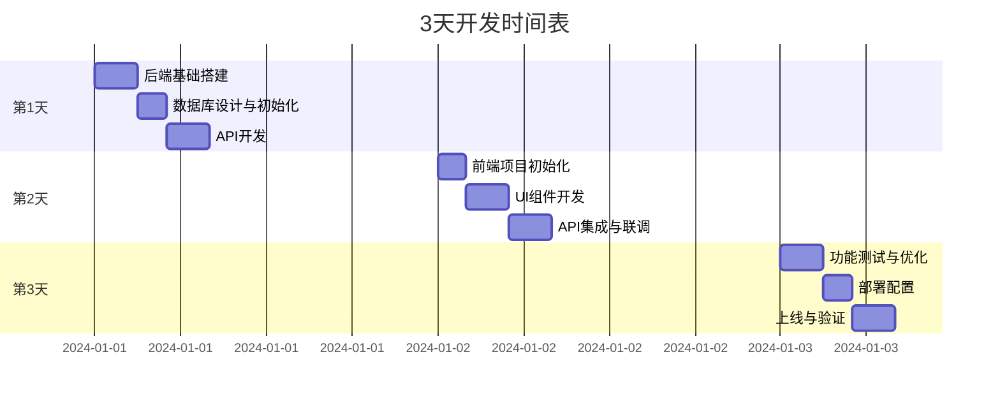

# "今天吃什么" 应用设计文档

## 1. 项目概述

### 1.1 项目目标

在 3 天内完成一款简单的美食推荐应用，用户可通过输入内容或点击按钮获取随机菜单推荐。

### 1.2 核心功能

- 用户输入内容或点击"告诉我"按钮
- 系统从数据库随机返回一条菜单信息
- 展示菜单名称给用户

### 1.3 技术选型

#### 前端技术栈

| 技术组件    | 选型方案                | 选择理由                    |
| ----------- | ----------------------- | --------------------------- |
| 框架        | React Native (Web 优先) | 支持 Web 和移动端跨平台开发 |
| Web 实现    | React Native Web        | 快速实现 Web 版本，代码复用 |
| 状态管理    | React Hooks (useState)  | 功能简单，无需复杂状态管理  |
| HTTP 客户端 | Fetch API               | 原生支持，无需额外依赖      |
| UI 组件     | React Native 基础组件   | 轻量化，满足基本需求        |

#### 后端技术栈（推荐方案）

| 技术组件 | 推荐选型                   | 选择理由                                 |
| -------- | -------------------------- | ---------------------------------------- |
| 运行环境 | Node.js                    | 与前端技术栈统一，学习成本低             |
| Web 框架 | Express.js                 | 轻量级，快速开发，成熟稳定               |
| 数据库   | SQLite                     | 嵌入式数据库，无需独立部署，适合简单应用 |
| ORM 工具 | 原生 SQL 或 better-sqlite3 | 数据结构简单，直接操作更高效             |
| 跨域处理 | cors 中间件                | 支持 Web 端跨域请求                      |

#### 部署方案

| 部署对象 | 推荐方案                  | 特点                             |
| -------- | ------------------------- | -------------------------------- |
| 后端服务 | Vercel / Railway / Render | 免费额度，快速部署，支持 Node.js |
| 前端 Web | Vercel / Netlify          | 静态托管，免费，自动化部署       |
| 数据库   | 本地 SQLite 文件          | 简单场景无需云数据库             |

## 2. 系统架构设计

### 2.1 整体架构



### 2.2 数据流架构



## 3. 前端架构设计

### 3.1 组件层次结构



### 3.2 主要组件定义

| 组件名称      | 职责         | 状态管理                                  | 关键属性                   |
| ------------- | ------------ | ----------------------------------------- | -------------------------- |
| App           | 应用根容器   | 无                                        | -                          |
| MainScreen    | 主界面逻辑   | dishResult (菜单结果), loading (加载状态) | -                          |
| Header        | 展示应用标题 | 无                                        | title (标题文本)           |
| InputSection  | 用户输入区域 | inputText (输入内容)                      | placeholder, onChangeText  |
| ActionButton  | 触发查询按钮 | 无                                        | onPress, text, disabled    |
| ResultDisplay | 展示查询结果 | 无                                        | result (菜单数据), visible |

### 3.3 状态管理策略

主界面状态定义：

- `dishResult`: 存储从后端获取的菜单信息（对象类型：{name, description, category}）
- `inputText`: 用户输入的文本内容（字符串类型）
- `loading`: 请求加载状态（布尔类型）
- `error`: 错误信息（字符串类型或 null）

状态更新流程：

1. 用户点击按钮触发 `handleGetDish` 函数
2. 设置 `loading` 为 true
3. 调用 API 获取数据
4. 成功时更新 `dishResult`，失败时更新 `error`
5. 设置 `loading` 为 false

### 3.4 API 集成层

API 服务封装：

| 方法名        | 功能           | 请求方式 | 端点                    | 返回数据结构                                                |
| ------------- | -------------- | -------- | ----------------------- | ----------------------------------------------------------- |
| getRandomDish | 获取随机菜单   | GET      | /api/random-dish        | {success: boolean, data: {id, name, description, category}} |
| searchDish    | 根据关键词搜索 | GET      | /api/search?keyword=xxx | {success: boolean, data: [{id, name, description}]}         |

错误处理策略：

- 网络错误：展示"网络连接失败，请稍后重试"
- 服务器错误：展示"服务异常，请稍后重试"
- 空数据：展示"暂无推荐，请添加更多菜单"

### 3.5 样式策略

采用 StyleSheet.create 方式定义样式：

- 颜色方案：主色调（橙色/红色系，象征食欲）、辅助色（白色、灰色）
- 排版：居中布局，清晰的视觉层次
- 响应式：适配不同屏幕尺寸
- 交互反馈：按钮点击效果、加载动画

## 4. 后端架构设计

### 4.1 API 端点设计

| 端点             | 方法 | 功能描述     | 请求参数                      | 响应格式                                                 |
| ---------------- | ---- | ------------ | ----------------------------- | -------------------------------------------------------- |
| /api/random-dish | GET  | 获取随机菜单 | 无                            | {success: true, data: {id, name, description, category}} |
| /api/dishes      | GET  | 获取所有菜单 | page, limit (可选)            | {success: true, data: [...], total: number}              |
| /api/search      | GET  | 搜索菜单     | keyword (必需)                | {success: true, data: [...]}                             |
| /api/dishes      | POST | 添加新菜单   | {name, description, category} | {success: true, data: {...}}                             |
| /health          | GET  | 健康检查     | 无                            | {status: "ok"}                                           |

### 4.2 请求/响应示例

**获取随机菜单**

- 请求：`GET /api/random-dish`
- 成功响应：
  ```
  状态码: 200
  响应体: {
    "success": true,
    "data": {
      "id": 15,
      "name": "宫保鸡丁",
      "description": "经典川菜，鸡肉鲜嫩，花生香脆",
      "category": "川菜"
    }
  }
  ```
- 失败响应：
  ```
  状态码: 404
  响应体: {
    "success": false,
    "message": "暂无菜单数据"
  }
  ```

### 4.3 数据模型设计

#### dishes 表结构

| 字段名      | 数据类型     | 约束                       | 说明                           |
| ----------- | ------------ | -------------------------- | ------------------------------ |
| id          | INTEGER      | PRIMARY KEY, AUTOINCREMENT | 主键 ID                        |
| name        | VARCHAR(100) | NOT NULL                   | 菜品名称                       |
| description | TEXT         | NULL                       | 菜品描述                       |
| category    | VARCHAR(50)  | NULL                       | 菜品分类（川菜/粤菜/家常菜等） |
| created_at  | DATETIME     | DEFAULT CURRENT_TIMESTAMP  | 创建时间                       |

#### 初始数据集

包含至少 20 条基础菜单数据：

- 川菜：宫保鸡丁、麻婆豆腐、水煮鱼、回锅肉
- 粤菜：白切鸡、糖醋排骨、广式烧鹅
- 家常菜：西红柿炒鸡蛋、青椒肉丝、鱼香肉丝
- 面食：兰州拉面、炸酱面、刀削面
- 快餐：汉堡、披萨、炸鸡

### 4.4 业务逻辑层架构



业务逻辑职责划分：

| 层级       | 职责                             | 示例                             |
| ---------- | -------------------------------- | -------------------------------- |
| 路由层     | 定义 API 端点和 HTTP 方法        | app.get('/api/random-dish', ...) |
| 控制器层   | 处理请求参数，调用服务，返回响应 | 验证请求、调用服务、格式化响应   |
| 服务层     | 核心业务逻辑                     | 随机查询算法、搜索逻辑           |
| 数据访问层 | 数据库操作                       | SQL 查询执行                     |

### 4.5 中间件设计

| 中间件名称     | 功能             | 执行顺序 |
| -------------- | ---------------- | -------- |
| express.json() | 解析 JSON 请求体 | 1        |
| cors           | 处理跨域请求     | 2        |
| logger         | 请求日志记录     | 3        |
| errorHandler   | 全局错误处理     | 最后     |

错误处理策略：

- 捕获所有未处理的异常
- 统一错误响应格式：`{success: false, message: "错误信息"}`
- 记录错误日志便于调试
- 区分开发环境和生产环境的错误详情

## 5. 数据库设计

### 5.1 数据库选型理由

选择 SQLite 的原因：

- 零配置：无需独立数据库服务器
- 轻量级：单个文件存储，易于备份和迁移
- 高性能：对于小型应用读写速度优秀
- 跨平台：支持所有主流操作系统
- 成本优势：完全免费，无需云数据库费用

### 5.2 数据访问模式

查询操作：

- 随机查询：使用 `ORDER BY RANDOM() LIMIT 1` 实现随机获取
- 关键词搜索：使用 `WHERE name LIKE '%keyword%'` 实现模糊匹配
- 分页查询：使用 `LIMIT` 和 `OFFSET` 实现

索引策略：

- 在 name 字段上创建索引以提升搜索性能
- id 作为主键自动索引

## 6. 部署架构

### 6.1 部署流程设计



### 6.2 环境配置

| 环境变量      | 说明           | 示例值                     |
| ------------- | -------------- | -------------------------- |
| PORT          | 服务器端口     | 3000                       |
| NODE_ENV      | 运行环境       | production/development     |
| DATABASE_PATH | 数据库文件路径 | ./data/dishes.db           |
| CORS_ORIGIN   | 允许的跨域源   | https://yourapp.vercel.app |

### 6.3 推荐部署平台对比

| 平台    | 优势                       | 适用场景     | 免费额度              |
| ------- | -------------------------- | ------------ | --------------------- |
| Vercel  | 零配置，自动 CI/CD，速度快 | 前后端都适用 | 每月 100GB 带宽       |
| Railway | 支持数据库，易用           | 后端服务     | 每月 500 小时运行时间 |
| Render  | 简单直观，支持 SQLite      | 后端服务     | 750 小时/月           |
| Netlify | 前端优化，CDN 加速         | 前端 Web     | 100GB 带宽            |

## 7. 3 天开发计划

### 7.1 总体时间规划



### 7.2 第 1 天：后端开发（8 小时）

#### 上午（4 小时）：基础搭建

**目标**：完成后端项目初始化和数据库设计

任务清单：

1. 创建 Node.js 项目，初始化 package.json
2. 安装核心依赖：express, better-sqlite3, cors, nodemon
3. 创建项目目录结构
4. 设计数据库表结构
5. 编写数据库初始化脚本
6. 准备 20-30 条初始菜单数据
7. 执行数据库初始化，验证数据插入成功

项目目录结构：

```
backend/
├── src/
│   ├── routes/        # 路由定义
│   ├── controllers/   # 控制器
│   ├── services/      # 业务逻辑
│   ├── db/           # 数据库相关
│   └── app.js        # 应用入口
├── data/
│   └── dishes.db     # SQLite数据库文件
├── package.json
└── .env
```

验收标准：

- 数据库文件成功创建
- 表结构正确
- 初始数据插入成功（至少 20 条）

#### 下午（4 小时）：API 开发与测试

任务清单：

1. 实现 GET /api/random-dish 端点
2. 实现 GET /api/dishes 端点（获取所有菜单）
3. 实现 GET /api/search 端点（搜索功能）
4. 实现 POST /api/dishes 端点（添加菜单）
5. 配置 CORS 中间件
6. 实现全局错误处理
7. 编写 API 测试用例（使用 Postman 或 curl）
8. 测试所有端点功能正常

验收标准：

- 所有 API 端点返回正确的数据格式
- 随机接口每次返回不同结果
- 错误处理正确（如数据为空时的响应）
- 跨域配置生效

### 7.3 第 2 天：前端开发（8 小时）

#### 上午（4 小时）：项目初始化与 UI 开发

任务清单：

1. 使用 create-expo-app 或 React Native CLI 初始化项目
2. 配置 React Native Web 支持
3. 安装必要依赖
4. 创建组件目录结构
5. 开发 Header 组件（应用标题）
6. 开发 InputSection 组件（输入框，预留功能）
7. 开发 ActionButton 组件（"告诉我"按钮）
8. 开发 ResultDisplay 组件（结果展示卡片）
9. 实现基础样式（颜色、布局、字体）

项目目录结构：

```
frontend/
├── src/
│   ├── components/    # 可复用组件
│   ├── screens/       # 页面
│   ├── services/      # API服务
│   ├── styles/        # 样式文件
│   └── App.js         # 应用入口
├── package.json
└── app.json
```

验收标准：

- Web 端可正常运行并查看界面
- UI 布局美观，符合设计预期
- 按钮点击有视觉反馈

#### 下午（4 小时）：功能集成与联调

任务清单：

1. 创建 API 服务模块（封装 fetch 请求）
2. 实现状态管理（useState hooks）
3. 连接按钮点击事件与 API 调用
4. 实现加载状态展示（Loading 动画）
5. 实现结果展示逻辑
6. 实现错误提示功能
7. 前后端联调测试
8. 修复发现的 bug
9. 优化用户体验（动画、过渡效果）

验收标准：

- 点击按钮能成功获取随机菜单
- 加载状态显示正常
- 数据展示格式正确
- 错误处理友好（网络错误、空数据等）
- 前后端完全打通

### 7.4 第 3 天：测试、优化与部署（8 小时）

#### 上午（4 小时）：测试与优化

任务清单：

1. 功能完整性测试
   - 随机获取菜单功能
   - 多次点击测试
   - 边界情况测试（数据库为空等）
2. 兼容性测试
   - 不同浏览器测试（Chrome, Safari, Firefox）
   - 不同屏幕尺寸测试（手机、平板、桌面）
3. 性能优化
   - API 响应时间优化
   - 前端渲染优化
   - 减少不必要的重复渲染
4. 用户体验优化
   - 添加动画效果
   - 优化加载状态
   - 改进错误提示文案
5. 代码优化
   - 清理无用代码
   - 添加必要注释
   - 统一代码风格

验收标准：

- 无明显 bug
- 多浏览器表现一致
- 加载速度快（< 1 秒）
- 用户体验流畅

#### 下午（4 小时）：部署上线

任务清单：

1. 准备部署配置
   - 后端：创建 vercel.json 或 railway 配置
   - 前端：配置构建命令
2. 环境变量配置
3. 后端部署
   - 推送代码到 GitHub
   - 连接 Vercel/Railway
   - 配置部署参数
   - 执行部署
   - 验证后端 API 可访问
4. 前端部署
   - 配置 API 地址（指向已部署的后端）
   - 构建生产版本
   - 部署到 Vercel/Netlify
   - 验证 Web 应用可访问
5. 完整流程测试
   - 测试生产环境功能
   - 验证前后端通信正常
6. 性能监控配置（可选）
7. 准备文档
   - API 文档
   - 部署说明
   - 使用指南

验收标准：

- 后端服务稳定运行，API 可公网访问
- 前端 Web 应用可通过 URL 访问
- 生产环境功能完全正常
- 获得可分享的应用链接

### 7.5 风险与应对

| 风险类型 | 具体风险                  | 应对策略                           |
| -------- | ------------------------- | ---------------------------------- |
| 技术风险 | React Native Web 配置复杂 | 使用 Expo 工具链简化配置           |
| 技术风险 | 部署平台不熟悉            | 提前阅读官方文档，使用快速开始模板 |
| 时间风险 | 某个环节超时              | 优先保证核心功能，次要功能可省略   |
| 时间风险 | bug 修复耗时              | 预留缓冲时间，简化功能降低复杂度   |
| 功能风险 | 数据库数据不足            | 准备充足的初始数据（30+条）        |
| 部署风险 | 部署失败                  | 准备备选平台方案，本地测试充分     |

### 7.6 成功关键要素

1. **简化优先**：功能保持最简，避免过度设计
2. **快速验证**：每完成一个模块立即测试
3. **时间控制**：严格按时间表执行，避免陷入细节优化
4. **渐进开发**：先实现核心功能，再添加辅助功能
5. **文档清晰**：记录关键配置和命令，便于后续维护

## 8. 测试策略

### 8.1 后端测试

| 测试类型 | 测试内容         | 工具/方法       |
| -------- | ---------------- | --------------- |
| 单元测试 | 数据库查询函数   | 手动验证或 Jest |
| 接口测试 | API 端点功能     | Postman/curl    |
| 边界测试 | 空数据、错误参数 | Postman         |
| 性能测试 | 并发请求响应     | 简单压力测试    |

### 8.2 前端测试

| 测试类型     | 测试内容           | 方法             |
| ------------ | ------------------ | ---------------- |
| 功能测试     | 按钮点击、数据展示 | 手动测试         |
| UI 测试      | 不同屏幕尺寸适配   | 浏览器开发者工具 |
| 兼容性测试   | 多浏览器表现       | 实际设备测试     |
| 用户体验测试 | 交互流畅度         | 真实用户测试     |

### 8.3 集成测试

测试场景：

- 用户点击按钮 → 发送请求 → 接收响应 → 展示结果（完整流程）
- 网络错误场景处理
- 数据为空场景处理
- 连续多次点击的表现

## 9. 后期扩展规划（3 天后）

### 9.1 移动端开发（Android/iOS）

基于 React Native 现有代码，扩展到原生移动应用：

- 使用 Expo 构建原生应用
- 添加移动端特定功能（如震动反馈）
- 适配移动端 UI/UX
- 发布到应用商店

### 9.2 功能增强建议

| 功能点       | 优先级 | 实现复杂度 | 价值                  |
| ------------ | ------ | ---------- | --------------------- |
| 用户收藏功能 | 中     | 中         | 记录喜欢的菜品        |
| 菜品图片展示 | 高     | 低         | 提升视觉吸引力        |
| 分类筛选     | 中     | 低         | 按川菜/粤菜等分类推荐 |
| 历史记录     | 低     | 中         | 查看推荐历史          |
| 用户投稿菜品 | 低     | 高         | UGC 内容              |
| 附近餐馆推荐 | 高     | 高         | 基于地理位置推荐      |
| 营养信息展示 | 低     | 中         | 健康饮食参考          |

### 9.3 技术优化方向

- 数据库迁移到云数据库（支持多用户、数据同步）
- 添加缓存机制（Redis）提升性能
- 实现用户系统（注册、登录）
- 添加数据统计分析（最受欢迎菜品）
- CI/CD 自动化部署流程
- 性能监控和错误追踪
