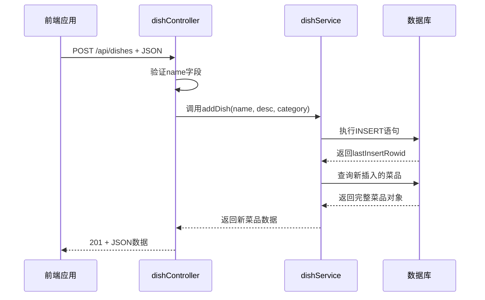
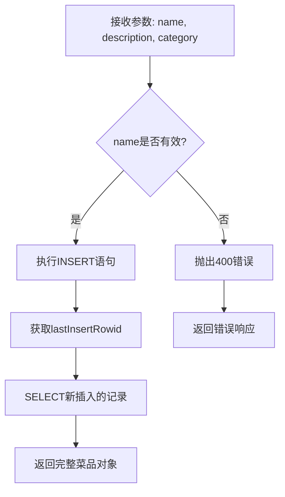

# 添加菜品API

<cite>
**本文档引用的文件**   
- [dishController.js](file://backend/src/controllers/dishController.js)
- [dishService.js](file://backend/src/services/dishService.js)
- [database.js](file://backend/src/db/database.js)
- [api.js](file://backend/src/routes/api.js)
- [api.js](file://frontend/src/services/api.js)
</cite>

## 目录
1. [简介](#简介)
2. [API端点说明](#api端点说明)
3. [请求体结构与验证规则](#请求体结构与验证规则)
4. [成功响应示例](#成功响应示例)
5. [服务层逻辑分析](#服务层逻辑分析)
6. [前端提交示例代码](#前端提交示例代码)
7. [安全性建议](#安全性建议)
8. [错误处理机制](#错误处理机制)

## 简介
本文档详细描述了用于添加新菜品的POST `/api/dishes` API接口。该接口是“吃什么”应用的核心功能之一，允许用户向数据库中添加新的菜品记录。文档涵盖请求格式、验证规则、响应结构、后端实现逻辑以及前端调用方式，并提供安全性建议以确保系统稳定与数据安全。

## API端点说明
该API用于向系统中添加一道新的菜品。使用HTTP POST方法提交数据。

- **端点**: `POST /api/dishes`
- **控制器函数**: `addDish`
- **路由定义文件**: [api.js](file://backend/src/routes/api.js#L15)



**Diagram sources**
- [dishController.js](file://backend/src/controllers/dishController.js#L77-L100)
- [dishService.js](file://backend/src/services/dishService.js#L43-L53)

## 请求体结构与验证规则
请求体必须为JSON格式，包含以下字段：

| 字段名 | 类型 | 是否必填 | 说明 |
|-------|------|---------|------|
| name | 字符串 | 是 | 菜品名称，不能为空 |
| description | 字符串 | 否 | 菜品描述 |
| category | 字符串 | 否 | 菜品分类（如川菜、粤菜等） |

### 错误校验规则
当请求不符合要求时，返回400状态码及错误信息：
- 若 `name` 字段缺失或为空字符串，返回：
  ```json
  {
    "success": false,
    "message": "菜品名称不能为空"
  }
  ```

**Section sources**
- [dishController.js](file://backend/src/controllers/dishController.js#L80-L87)

## 成功响应示例
当菜品成功创建后，服务器返回201状态码（Created）及新菜品的完整信息。

### 请求体示例
```json
{
  "name": "宫保鸡丁",
  "description": "鸡肉鲜嫩，花生香脆，麻辣鲜香",
  "category": "川菜"
}
```

### 成功响应示例
```json
{
  "success": true,
  "data": {
    "id": 26,
    "name": "宫保鸡丁",
    "description": "鸡肉鲜嫩，花生香脆，麻辣鲜香",
    "category": "川菜",
    "created_at": "2025-04-05 10:30:00"
  }
}
```

**Section sources**
- [dishController.js](file://backend/src/controllers/dishController.js#L90-L95)

## 服务层逻辑分析
`addDish` 服务函数负责执行数据库操作，包含数据验证和持久化逻辑。

### 实现流程
1. 使用参数化SQL语句将菜品插入数据库
2. 获取插入后的自增ID（`lastInsertRowid`）
3. 立即查询并返回完整的菜品记录

### 数据库约束
根据数据库初始化脚本，表结构定义如下：

```sql
CREATE TABLE dishes (
  id INTEGER PRIMARY KEY AUTOINCREMENT,
  name VARCHAR(100) NOT NULL,
  description TEXT,
  category VARCHAR(50),
  created_at DATETIME DEFAULT CURRENT_TIMESTAMP
);
```

- `name` 字段最大长度为100字符，且不可为空
- `category` 字段最大长度为50字符
- 插入时自动记录创建时间



**Diagram sources**
- [dishService.js](file://backend/src/services/dishService.js#L43-L53)
- [database.js](file://backend/src/db/database.js#L10-L20)

**Section sources**
- [dishService.js](file://backend/src/services/dishService.js#L43-L53)

## 前端提交示例代码
以下是一个完整的前端表单提交示例，包含错误处理和成功提示。

```javascript
import { addDish } from '../services/api';

async function handleAddDish(formData) {
  const { name, description, category } = formData;

  try {
    // 提交新菜品
    const newDish = await addDish(name, description, category);

    // 显示成功提示
    alert(`成功添加菜品: ${newDish.name}`);

    // 可选：刷新列表或跳转页面
    window.location.reload();

  } catch (error) {
    // 错误处理
    if (error.message === '菜品名称不能为空') {
      alert('请填写菜品名称');
    } else if (error.message.includes('网络连接失败')) {
      alert('无法连接到服务器，请检查后端是否运行');
    } else {
      alert('添加失败: ' + error.message);
    }
  }
}
```

**Section sources**
- [api.js](file://frontend/src/services/api.js#L60-L83)

## 安全性建议
为防止恶意输入和数据库注入风险，建议采取以下措施：

1. **输入长度限制**：
   - 前端应限制 `name` 不超过100字符
   - `description` 不超过500字符
   - `category` 不超过50字符

2. **特殊字符过滤**：
   - 对 `name` 和 `description` 进行HTML实体编码，防止XSS攻击
   - 推荐使用DOMPurify等库进行净化处理

3. **服务端加固建议**：
   - 当前已使用参数化查询，有效防止SQL注入
   - 可增加正则校验，禁止输入中包含SQL关键字或脚本标签
   - 建议增加速率限制（Rate Limiting）防止暴力提交

4. **数据验证增强**：
   - 可在服务层增加trim()处理，去除首尾空格
   - 校验category是否在预定义范围内（如川菜、粤菜等）

**Section sources**
- [database.js](file://backend/src/db/database.js#L10-L20)
- [dishController.js](file://backend/src/controllers/dishController.js#L80-L87)

## 错误处理机制
系统采用分层错误处理机制：

- **400 Bad Request**：客户端数据错误（如缺少name）
- **500 Internal Server Error**：服务端异常（如数据库连接失败）
- 所有错误均返回统一JSON格式：
  ```json
  {
    "success": false,
    "message": "错误详情"
  }
  ```

前端通过检查 `response.ok` 和 `data.success` 双重判断结果状态。

**Section sources**
- [dishController.js](file://backend/src/controllers/dishController.js#L97-L100)
- [api.js](file://frontend/src/services/api.js#L72-L78)