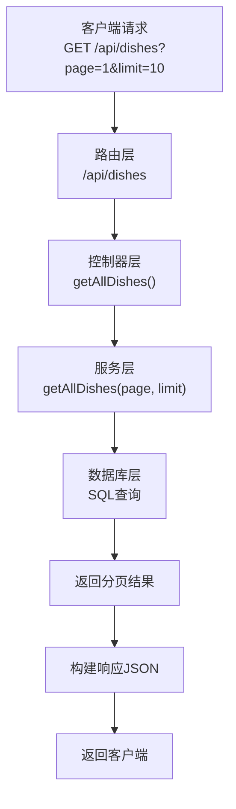
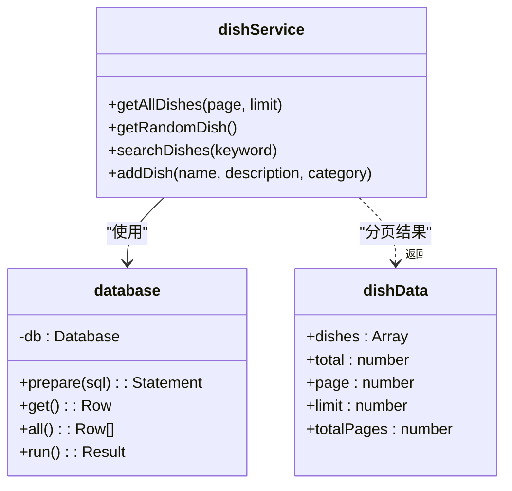
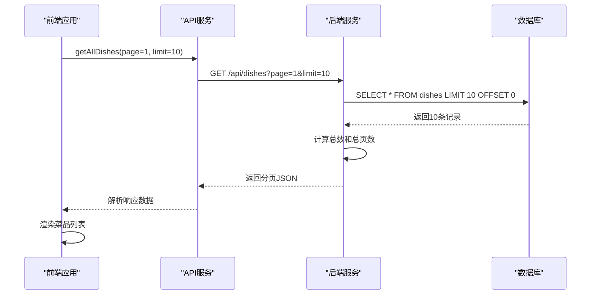
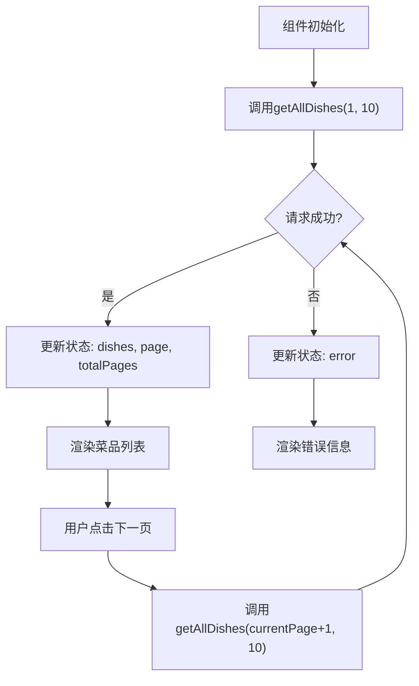

# 菜品列表API

<cite>
**Referenced Files in This Document**   
- [dishController.js](file://backend/src/controllers/dishController.js)
- [dishService.js](file://backend/src/services/dishService.js)
- [api.js](file://backend/src/routes/api.js)
- [api.js](file://frontend/src/services/api.js)
- [ResultDisplay.jsx](file://frontend/src/components/ResultDisplay.jsx)
</cite>

## 目录
1. [简介](#简介)
2. [API端点详情](#api端点详情)
3. [查询参数说明](#查询参数说明)
4. [响应结构](#响应结构)
5. [服务端分页实现机制](#服务端分页实现机制)
6. [前端调用最佳实践](#前端调用最佳实践)
7. [常见问题与解决方案](#常见问题与解决方案)
8. [集成示例](#集成示例)

## 简介
本文档详细说明了`GET /api/dishes`端点的使用方法，该接口用于分页获取所有菜品列表。文档涵盖了API的查询参数、响应格式、服务端实现机制以及前端集成的最佳实践，为开发者提供完整的调用指导。

## API端点详情
`GET /api/dishes`端点用于获取分页的菜品列表，是系统中获取全部菜品数据的核心接口。



**Diagram sources**
- [api.js](file://backend/src/routes/api.js#L7-L8)
- [dishController.js](file://backend/src/controllers/dishController.js#L24-L44)
- [dishService.js](file://backend/src/services/dishService.js#L12-L25)

**Section sources**
- [api.js](file://backend/src/routes/api.js#L7-L8)
- [dishController.js](file://backend/src/controllers/dishController.js#L24-L44)

## 查询参数说明
该端点支持以下查询参数来控制分页行为：

| 参数 | 类型 | 必需 | 默认值 | 说明 |
|------|------|------|--------|------|
| `page` | 整数 | 否 | 1 | 请求的页码，从1开始计数 |
| `limit` | 整数 | 否 | 10 | 每页返回的菜品数量 |

**Section sources**
- [dishController.js](file://backend/src/controllers/dishController.js#L26-L27)

## 响应结构
成功响应返回200状态码，包含分页数据和元信息。

### 成功响应示例 (200)
```json
{
  "success": true,
  "data": [
    {
      "id": 1,
      "name": "宫保鸡丁",
      "description": "经典川菜，酸甜口味",
      "category": "川菜"
    },
    {
      "id": 2,
      "name": "麻婆豆腐",
      "description": "麻辣鲜香，豆腐嫩滑",
      "category": "川菜"
    }
  ],
  "total": 50,
  "page": 1,
  "limit": 10,
  "totalPages": 5
}
```

### 错误响应示例 (500)
```json
{
  "success": false,
  "message": "Failed to get dishes: database error"
}
```

**Section sources**
- [dishController.js](file://backend/src/controllers/dishController.js#L30-L40)

## 服务端分页实现机制
分页功能在服务层通过SQL查询实现，采用LIMIT和OFFSET机制来高效获取指定范围的数据。



**Diagram sources**
- [dishService.js](file://backend/src/services/dishService.js#L12-L25)
- [database.js](file://backend/src/db/database.js)

**Section sources**
- [dishService.js](file://backend/src/services/dishService.js#L12-L25)

## 前端调用最佳实践
为确保良好的性能和用户体验，建议遵循以下最佳实践：

1. **合理设置limit值**：建议将limit设置在10-20之间，避免一次性加载过多数据影响性能
2. **缓存策略**：对已获取的页面数据进行客户端缓存，避免重复请求
3. **错误处理**：妥善处理网络错误和服务器错误，提供友好的用户提示
4. **加载状态**：在请求期间显示加载状态，提升用户体验



**Diagram sources**
- [api.js](file://frontend/src/services/api.js#L22-L33)
- [dishController.js](file://backend/src/controllers/dishController.js#L24-L44)

**Section sources**
- [api.js](file://frontend/src/services/api.js#L22-L33)

## 常见问题与解决方案
### 无效页码处理
当请求的页码超出范围时，后端会返回空数组，前端应妥善处理这种情况，例如显示"没有更多菜品"的提示。

### 性能优化
对于大型数据集，建议：
- 在数据库的name和description字段上创建索引
- 使用合理的limit值避免内存溢出
- 考虑实现无限滚动而非传统分页

**Section sources**
- [dishService.js](file://backend/src/services/dishService.js#L12-L25)
- [dishController.js](file://backend/src/controllers/dishController.js#L24-L44)

## 集成示例
以下是一个前端组件集成分页菜品列表的示例：



**Diagram sources**
- [api.js](file://frontend/src/services/api.js#L22-L33)
- [ResultDisplay.jsx](file://frontend/src/components/ResultDisplay.jsx)

**Section sources**
- [api.js](file://frontend/src/services/api.js#L22-L33)
- [ResultDisplay.jsx](file://frontend/src/components/ResultDisplay.jsx)