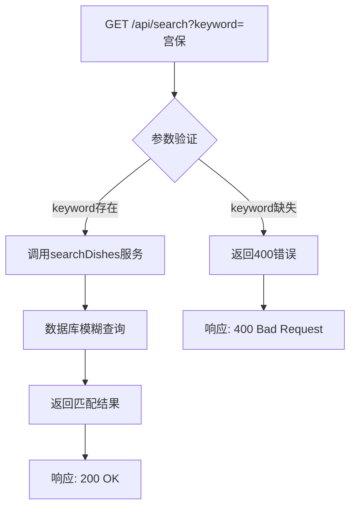
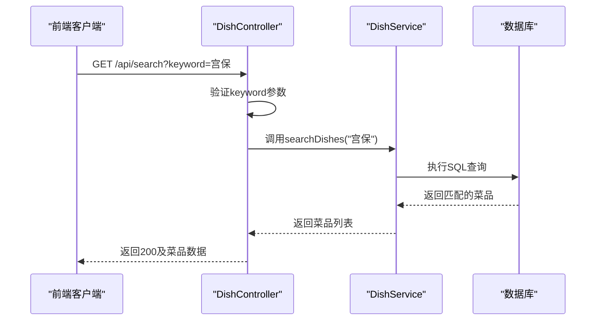
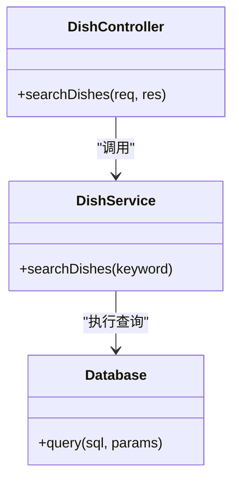

# 菜品搜索API

<cite>
**Referenced Files in This Document**   
- [api.js](file://backend/src/routes/api.js)
- [dishController.js](file://backend/src/controllers/dishController.js)
- [dishService.js](file://backend/src/services/dishService.js)
- [database.js](file://backend/src/db/database.js)
- [api.js](file://frontend/src/services/api.js)
</cite>

## 目录
1. [简介](#简介)
2. [API端点定义](#api端点定义)
3. [请求参数说明](#请求参数说明)
4. [响应结构](#响应结构)
5. [后端实现逻辑](#后端实现逻辑)
6. [前端调用示例](#前端调用示例)
7. [性能优化建议](#性能优化建议)
8. [错误处理与用户提示](#错误处理与用户提示)

## 简介
本文档详细描述了`GET /api/search`端点的实现和使用方法，该接口用于根据关键词搜索菜品。文档涵盖了从后端实现到前端调用的完整流程，包括参数验证、模糊匹配算法、响应结构、错误处理以及性能优化建议。

## API端点定义
`GET /api/search`端点用于根据关键词搜索菜品，支持在菜品名称和描述字段中进行模糊匹配。



**Diagram sources**
- [api.js](file://backend/src/routes/api.js#L1-L18)
- [dishController.js](file://backend/src/controllers/dishController.js#L51-L74)

## 请求参数说明
该API端点接受以下查询参数：

**Section sources**
- [dishController.js](file://backend/src/controllers/dishController.js#L51-L74)

### 必需参数
- **keyword**: 搜索关键词，用于在菜品名称和描述中进行模糊匹配

### 参数验证
当请求中缺少`keyword`参数时，API将返回400错误状态码，并附带相应的错误消息。



**Diagram sources**
- [dishController.js](file://backend/src/controllers/dishController.js#L51-L74)
- [dishService.js](file://backend/src/services/dishService.js#L32-L40)

## 响应结构
### 成功响应 (200 OK)
当搜索成功时，API返回200状态码和匹配的菜品列表。

```json
{
  "success": true,
  "data": [
    {
      "id": 1,
      "name": "宫保鸡丁",
      "description": "经典川菜，鸡肉鲜嫩，花生香脆，麻辣鲜香",
      "category": "川菜",
      "created_at": "2024-01-01T00:00:00Z"
    }
  ]
}
```

### 错误响应
#### 400 Bad Request - 缺少关键词
当请求中缺少`keyword`参数时返回。

```json
{
  "success": false,
  "message": "请提供搜索关键词"
}
```

#### 500 Internal Server Error - 服务器错误
当服务器内部发生错误时返回。

```json
{
  "success": false,
  "message": "服务器内部错误信息"
}
```

**Section sources**
- [dishController.js](file://backend/src/controllers/dishController.js#L51-L74)
- [dishService.js](file://backend/src/services/dishService.js#L32-L40)

## 后端实现逻辑
### 控制器层 (Controller)
`searchDishes`控制器函数负责处理HTTP请求，验证参数并调用服务层。

**Section sources**
- [dishController.js](file://backend/src/controllers/dishController.js#L51-L74)

### 服务层 (Service)
`searchDishes`服务函数实现核心搜索逻辑，使用模糊匹配算法在菜品名称和描述中搜索。



**Diagram sources**
- [dishController.js](file://backend/src/controllers/dishController.js#L51-L74)
- [dishService.js](file://backend/src/services/dishService.js#L32-L40)

### 文本匹配策略
后端使用SQL的`LIKE`操作符配合通配符`%`实现模糊匹配，搜索关键词会同时匹配菜品名称和描述字段。

```javascript
db.prepare('SELECT * FROM dishes WHERE name LIKE ? OR description LIKE ?')
  .all(`%${keyword}%`, `%${keyword}%`);
```

**Section sources**
- [dishService.js](file://backend/src/services/dishService.js#L32-L40)

## 前端调用示例
### 防抖搜索实现
为提升用户体验，建议在前端实现搜索框的防抖功能。

```javascript
// 防抖函数
function debounce(func, delay) {
  let timer;
  return function (...args) {
    clearTimeout(timer);
    timer = setTimeout(() => func.apply(this, args), delay);
  };
}

// 搜索函数
const search = async (keyword) => {
  if (!keyword.trim()) return;
  try {
    const results = await searchDishes(keyword);
    // 更新UI显示结果
    updateResults(results);
  } catch (error) {
    // 显示错误消息
    showError(error.message);
  }
};

// 防抖后的搜索函数
const debouncedSearch = debounce(search, 300);

// 在输入框onInput事件中调用
inputElement.addEventListener('input', (e) => {
  debouncedSearch(e.target.value);
});
```

**Section sources**
- [api.js](file://frontend/src/services/api.js#L42-L58)

## 性能优化建议
### 数据库索引
为提升搜索性能，已在菜品名称字段上创建了数据库索引。

```sql
CREATE INDEX IF NOT EXISTS idx_dish_name ON dishes(name);
```

**Section sources**
- [database.js](file://backend/src/db/database.js#L25)

### 优化建议
1. **复合索引**: 考虑为`name`和`description`字段创建复合索引以进一步提升多字段搜索性能
2. **查询缓存**: 对频繁搜索的关键词实施缓存策略
3. **分页支持**: 对于大量结果，建议实现分页功能
4. **全文搜索**: 对于更复杂的搜索需求，可考虑使用全文搜索引擎如Elasticsearch

## 错误处理与用户提示
### 错误类型与处理
| HTTP状态码 | 错误类型 | 用户提示策略 |
|-----------|---------|------------|
| 400 | 参数缺失 | "请输入搜索关键词" |
| 500 | 服务器错误 | "搜索服务暂时不可用，请稍后重试" |
| 200 (空结果) | 无匹配结果 | "未找到与“关键词”相关的菜品" |

### 空结果用户提示
当搜索返回空结果时，建议显示友好的用户提示，并提供相关建议：

- "未找到与“${keyword}”相关的菜品"
- "您可以尝试使用其他关键词搜索"
- "热门搜索: 宫保鸡丁, 麻婆豆腐, 红烧肉"

**Section sources**
- [dishController.js](file://backend/src/controllers/dishController.js#L51-L74)
- [api.js](file://frontend/src/services/api.js#L42-L58)