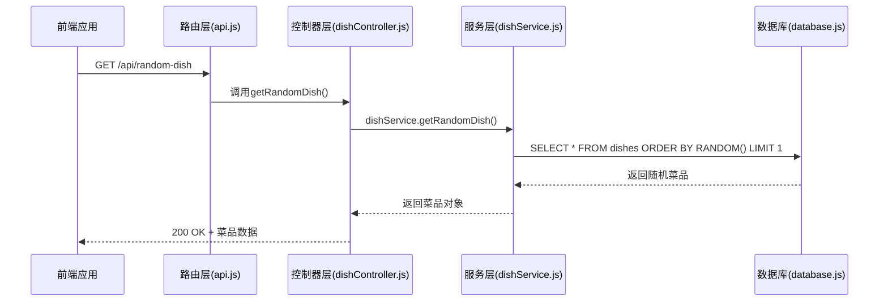

# 随机菜品API

<cite>
**本文档引用的文件**
- [api.js](file://backend/src/routes/api.js)
- [dishController.js](file://backend/src/controllers/dishController.js)
- [dishService.js](file://backend/src/services/dishService.js)
- [api.js](file://frontend/src/services/api.js)
</cite>

## 目录
1. [简介](#简介)
2. [核心功能与应用场景](#核心功能与应用场景)
3. [API端点详情](#api端点详情)
4. [后端实现逻辑](#后端实现逻辑)
5. [前端调用示例](#前端调用示例)
6. [错误处理策略](#错误处理策略)
7. [性能考量与优化建议](#性能考量与优化建议)
8. [结论](#结论)

## 简介
本文档详细描述了`GET /api/random-dish` API端点的设计、实现和使用方法。该接口是“今天吃什么”应用的核心功能，旨在为用户提供随机菜品推荐服务。文档涵盖了从后端路由到前端调用的完整技术栈，确保开发者能够全面理解并正确使用该API。

## 核心功能与应用场景
`GET /api/random-dish`端点专为解决用户日常决策难题“今天吃什么”而设计。通过调用此接口，前端应用可以获取一个随机的菜品信息，帮助用户快速做出选择。该功能适用于移动端应用、网页小工具或任何需要随机推荐的场景。

**Section sources**
- [dishController.js](file://backend/src/controllers/dishController.js#L3-L24)

## API端点详情
### 基本信息
- **HTTP方法**: GET
- **端点路径**: `/api/random-dish`
- **请求参数**: 无
- **认证要求**: 无

### 响应状态码
| 状态码 | 说明 |
|--------|------|
| 200 OK | 请求成功，返回随机菜品数据 |
| 404 Not Found | 数据库中无菜品数据 |
| 500 Internal Server Error | 服务器内部错误 |

### 响应体结构
成功响应返回JSON格式数据，包含以下字段：
- `success`: 布尔值，表示请求是否成功
- `data`: 菜品对象，包含菜品的详细信息（如名称、描述、分类等）

```json
{
  "success": true,
  "data": {
    "id": 1,
    "name": "宫保鸡丁",
    "description": "经典川菜，酸甜微辣",
    "category": "川菜"
  }
}
```

**Section sources**
- [dishController.js](file://backend/src/controllers/dishController.js#L3-L24)
- [api.js](file://backend/src/routes/api.js#L5-L7)

## 后端实现逻辑
### 控制器层
`dishController.js`中的`getRandomDish`函数负责处理HTTP请求。它调用服务层的`getRandomDish`方法获取随机菜品，并根据结果构建适当的HTTP响应。当没有菜品数据时，返回404状态码；发生服务器错误时，返回500状态码。

### 服务层
`dishService.js`中的`getRandomDish`函数实现了核心的随机算法逻辑。它使用SQLite数据库的`ORDER BY RANDOM() LIMIT 1`语句从`dishes`表中随机选择一条记录。此方法确保了每次调用都能返回一个真正随机的菜品。



**Diagram sources**
- [api.js](file://backend/src/routes/api.js#L5-L7)
- [dishController.js](file://backend/src/controllers/dishController.js#L3-L24)
- [dishService.js](file://backend/src/services/dishService.js#L3-L10)

**Section sources**
- [dishService.js](file://backend/src/services/dishService.js#L3-L10)
- [dishController.js](file://backend/src/controllers/dishController.js#L3-L24)

## 前端调用示例
前端通过`fetch` API调用随机菜品接口。`frontend/src/services/api.js`中的`getRandomDish`函数封装了完整的请求逻辑，包括错误处理和数据解析。

```javascript
import { getRandomDish } from './services/api';

async function handleRandomDish() {
  try {
    const dish = await getRandomDish();
    console.log('推荐菜品:', dish.name);
  } catch (error) {
    console.error('获取菜品失败:', error.message);
  }
}
```

**Section sources**
- [api.js](file://frontend/src/services/api.js#L2-L22)

## 错误处理策略
系统实现了多层次的错误处理机制：
1. **后端**：控制器捕获服务层抛出的异常，返回适当的HTTP状态码和错误信息。
2. **前端**：`getRandomDish`函数区分网络错误和业务错误，提供用户友好的错误提示。
3. **特殊处理**：前端特别处理`Failed to fetch`错误，提示用户检查后端服务是否运行。

```mermaid
flowchart TD
A[前端发起请求] --> B{请求成功?}
B --> |是| C[解析JSON响应]
B --> |否| D[检查错误类型]
D --> E{网络错误?}
E --> |是| F[提示"网络连接失败"]
E --> |否| G[显示服务器返回的错误信息]
C --> H{响应成功?}
H --> |是| I[返回菜品数据]
H --> |否| J[显示错误信息]
```

**Diagram sources**
- [dishController.js](file://backend/src/controllers/dishController.js#L3-L24)
- [api.js](file://frontend/src/services/api.js#L2-L22)

## 性能考量与优化建议
### 当前性能特征
- **查询效率**：`ORDER BY RANDOM()`在小数据集上表现良好，但随着数据量增长，性能会线性下降。
- **并发能力**：基于Express的服务器能处理基本的并发请求。

### 优化建议
1. **数据库索引**：确保`dishes`表有适当的索引以提高查询速度。
2. **缓存机制**：对于高并发场景，可引入Redis缓存随机菜品结果。
3. **预生成随机ID**：改为先查询总记录数，生成随机ID再查询，避免全表扫描。
4. **连接池**：使用数据库连接池提高数据库操作效率。
5. **负载均衡**：在高流量场景下，部署多个后端实例并使用负载均衡。

**Section sources**
- [dishService.js](file://backend/src/services/dishService.js#L3-L10)

## 结论
`GET /api/random-dish`端点提供了一个简单而有效的解决方案来解决“今天吃什么”的日常问题。通过清晰的分层架构和完善的错误处理，该API既易于使用又具有良好的健壮性。对于生产环境，建议根据实际负载情况实施相应的性能优化措施。