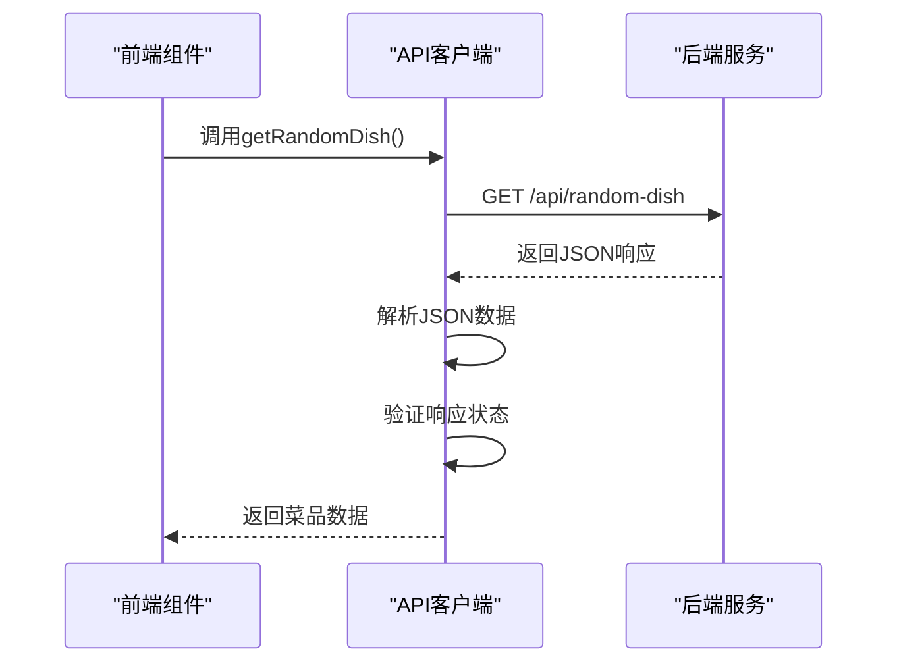
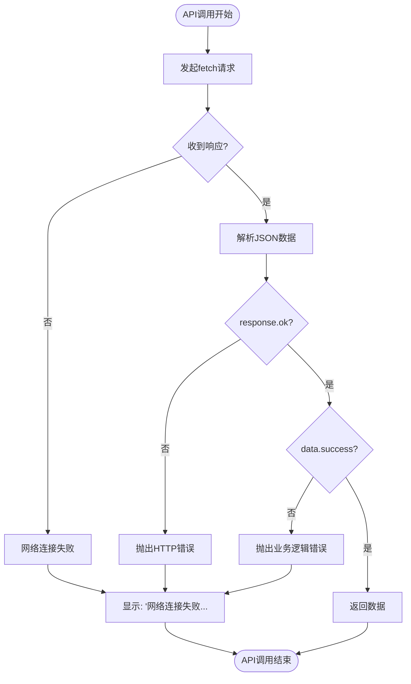
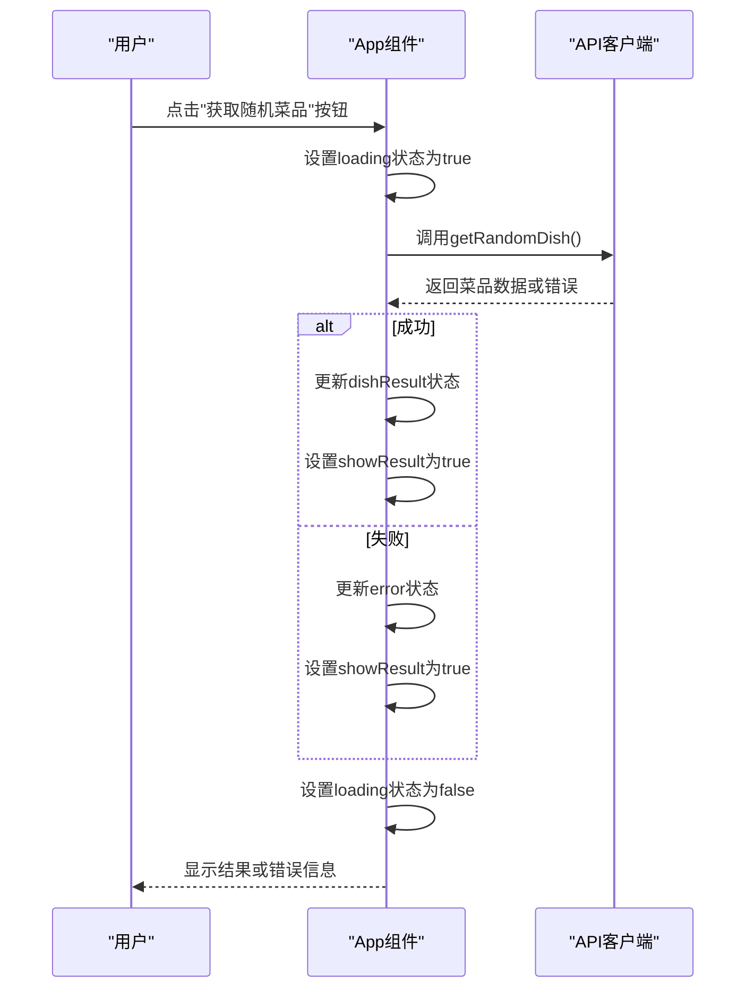

# API 客户端

<cite>
**Referenced Files in This Document**   
- [api.js](file://frontend/src/services/api.js)
- [App.jsx](file://frontend/src/App.jsx)
- [api.js](file://backend/src/routes/api.js)
- [dishController.js](file://backend/src/controllers/dishController.js)
- [dishService.js](file://backend/src/services/dishService.js)
</cite>

## 目录
1. [简介](#简介)
2. [API 客户端核心功能](#api-客户端核心功能)
3. [API 调用实现细节](#api-调用实现细节)
4. [错误处理机制](#错误处理机制)
5. [前端调用示例](#前端调用示例)
6. [API 客户端与后端路由映射](#api-客户端与后端路由映射)
7. [性能优化与调试](#性能优化与调试)
8. [结论](#结论)

## 简介
本文档详细说明了前端应用中API客户端的实现，重点分析了`services/api.js`文件中封装的RESTful API调用逻辑。文档涵盖了从请求配置、响应处理到错误管理的完整流程，并展示了前端组件如何调用这些服务函数。通过本指南，开发者可以全面理解前后端交互机制，掌握API客户端的使用方法和最佳实践。

## API 客户端核心功能

前端API客户端提供了四个核心功能函数，分别用于获取随机菜品、获取所有菜品列表、搜索菜品和添加新菜品。这些函数封装了底层的`fetch`请求，为上层组件提供了简洁的接口。

**Section sources**
- [api.js](file://frontend/src/services/api.js#L2-L83)

## API 调用实现细节

### 请求配置与数据处理
API客户端中的每个函数都使用`fetch` API发起HTTP请求。请求配置包括正确的请求方法、请求头和请求体序列化。例如，`addDish`函数使用POST方法，并设置了`Content-Type: application/json`请求头，确保后端能够正确解析JSON格式的请求体。

所有响应数据都通过`response.json()`进行解析，实现了异步数据获取。客户端还验证了响应状态码（`response.ok`），确保只有成功的HTTP响应才会被进一步处理。



**Diagram sources**
- [api.js](file://frontend/src/services/api.js#L2-L22)
- [api.js](file://backend/src/routes/api.js#L5-L6)

### 函数参数与查询字符串
`getAllDishes`函数支持分页功能，接受`page`和`limit`参数，并将其转换为查询字符串附加到URL中。`searchDishes`函数对搜索关键词使用`encodeURIComponent`进行编码，确保特殊字符能够安全传输。

**Section sources**
- [api.js](file://frontend/src/services/api.js#L24-L58)

## 错误处理机制

### HTTP响应错误处理
API客户端实现了多层次的错误处理机制。首先检查`response.ok`属性来判断HTTP状态码是否在200-299范围内。如果响应不成功，会抛出包含错误消息的异常。此外，还检查后端返回的JSON数据中的`success`字段，实现业务逻辑层面的错误判断。

### 网络连接错误处理
客户端特别处理了网络连接失败的情况。当捕获到`Failed to fetch`错误时，会转换为更友好的用户提示"网络连接失败，请检查后端服务是否运行"，帮助用户快速定位问题。



**Diagram sources**
- [api.js](file://frontend/src/services/api.js#L2-L83)

**Section sources**
- [api.js](file://frontend/src/services/api.js#L10-L18)

## 前端调用示例

### App组件中的API调用
`App.jsx`文件展示了如何在React组件中使用API客户端。组件通过`useState`管理加载状态、错误信息和结果数据。`handleGetDish`异步函数调用`getRandomDish`服务，并在`try-catch`块中处理可能的错误。



**Diagram sources**
- [App.jsx](file://frontend/src/App.jsx#L15-L35)

**Section sources**
- [App.jsx](file://frontend/src/App.jsx#L15-L48)

## API 客户端与后端路由映射

前端API客户端与后端Express路由之间存在明确的对应关系。每个前端服务函数都对应一个后端路由端点，实现了前后端的解耦和清晰的接口定义。

```mermaid
graph TB
subgraph "前端"
A[getRandomDish]
B[getAllDishes]
C[searchDishes]
D[addDish]
end
subgraph "后端"
E[/api/random-dish]
F[/api/dishes]
G[/api/search]
H[/api/dishes]
end
A --> E
B --> F
C --> G
D --> H
style A fill:#f9f,stroke:#333
style B fill:#f9f,stroke:#333
style C fill:#f9f,stroke:#333
style D fill:#f9f,stroke:#333
style E fill:#bbf,stroke:#333
style F fill:#bbf,stroke:#333
style G fill:#bbf,stroke:#333
style H fill:#bbf,stroke:#333
```

**Diagram sources**
- [api.js](file://frontend/src/services/api.js#L2-L83)
- [api.js](file://backend/src/routes/api.js#L5-L18)

### 控制器层处理流程
后端`dishController.js`文件中的控制器函数接收HTTP请求，调用相应的服务层函数，并构造适当的HTTP响应。控制器负责请求验证、错误处理和响应格式化。

**Section sources**
- [dishController.js](file://backend/src/controllers/dishController.js#L3-L100)

## 性能优化与调试

### 调试指南
开发者可以使用浏览器开发者工具的"Network"标签页来调试API调用。可以检查请求URL、请求头、请求体、响应状态码和响应数据。对于错误排查，重点关注：
- 确认后端服务是否在`http://localhost:3000`正常运行
- 检查CORS配置是否正确
- 验证请求参数格式是否正确
- 查看控制台错误信息

### 常见问题排查
1. **网络连接失败**：确保后端服务已启动，且前端API_BASE_URL配置正确
2. **400错误**：检查POST请求的请求体是否包含必需字段
3. **404错误**：验证路由路径是否正确
4. **500错误**：查看后端日志获取详细错误信息

**Section sources**
- [api.js](file://frontend/src/services/api.js#L18-L20)
- [dishController.js](file://backend/src/controllers/dishController.js#L10-L15)

## 结论
本文档全面介绍了前端API客户端的实现细节和使用方法。通过封装`fetch` API，客户端提供了简洁、可靠的接口供前端组件使用。完善的错误处理机制确保了良好的用户体验，而清晰的前后端映射关系则便于维护和扩展。开发者应遵循文档中的最佳实践，确保API调用的稳定性和可维护性。