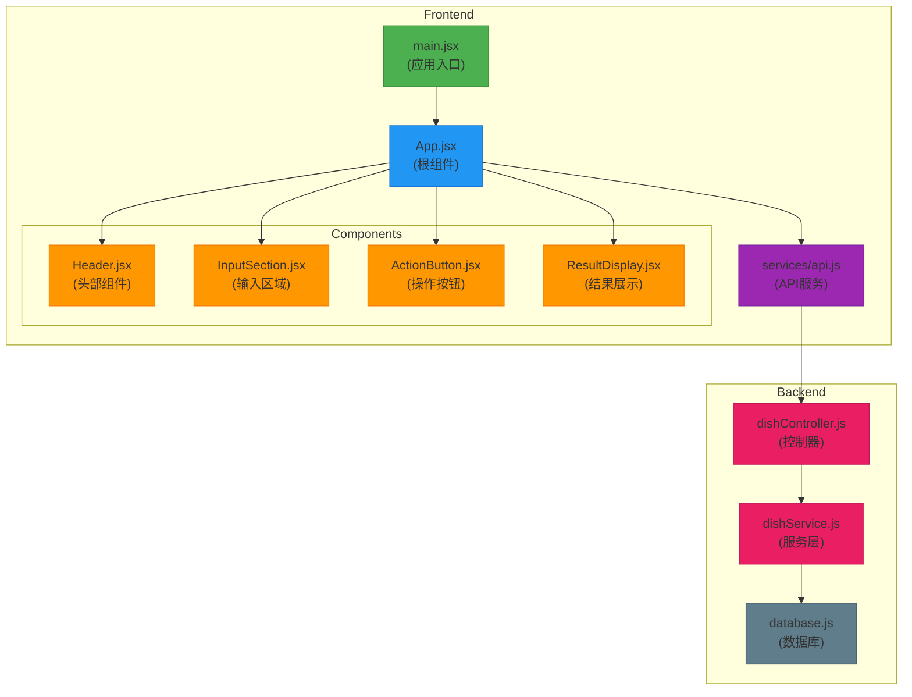
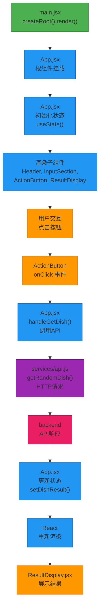
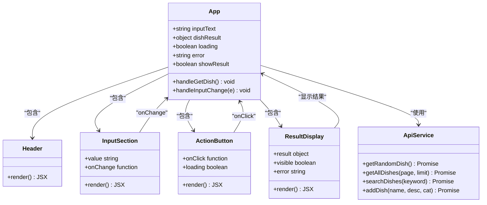
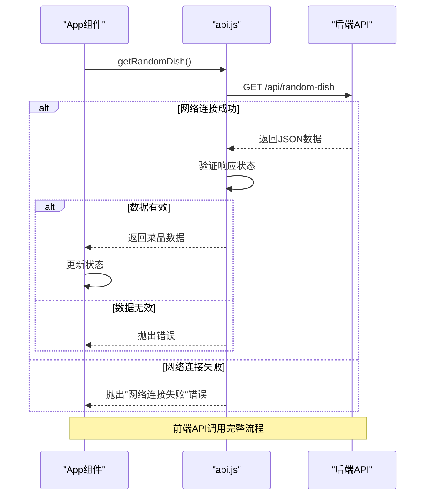
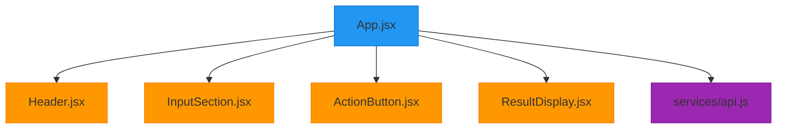

# 前端架构

<cite>
**Referenced Files in This Document**   
- [main.jsx](file://frontend/src/main.jsx)
- [App.jsx](file://frontend/src/App.jsx)
- [Header.jsx](file://frontend/src/components/Header.jsx)
- [InputSection.jsx](file://frontend/src/components/InputSection.jsx)
- [ActionButton.jsx](file://frontend/src/components/ActionButton.jsx)
- [ResultDisplay.jsx](file://frontend/src/components/ResultDisplay.jsx)
- [api.js](file://frontend/src/services/api.js)
- [dishController.js](file://backend/src/controllers/dishController.js)
- [dishService.js](file://backend/src/services/dishService.js)
</cite>

## 目录
1. [简介](#简介)
2. [项目结构](#项目结构)
3. [核心组件](#核心组件)
4. [架构概览](#架构概览)
5. [详细组件分析](#详细组件分析)
6. [依赖分析](#依赖分析)
7. [性能考虑](#性能考虑)
8. [故障排除指南](#故障排除指南)
9. [结论](#结论)

## 简介
WhatEating 是一个基于 React 的前端应用，旨在帮助用户决定"今天吃什么"。该应用通过简洁的用户界面和智能的后端服务，为用户提供随机菜品推荐。本文档全面解析了该应用的前端架构，重点关注 React 应用的启动流程、组件树结构和状态管理机制。文档详细描述了 `main.jsx` 如何渲染根组件 `App.jsx`，以及 `App.jsx` 如何协调 `Header`、`InputSection`、`ActionButton` 和 `ResultDisplay` 等子组件的工作。同时，文档解释了组件间通过 props 传递数据和回调函数的模式，以及前端如何通过 `services/api.js` 与后端通信实现数据获取和提交。为初学者提供了 React 组件生命周期和 Hooks 使用的指导，为专家提供了性能优化建议。

## 项目结构
WhatEating 项目的前端部分采用标准的 React + Vite 架构，文件组织清晰，遵循功能模块化的设计原则。项目根目录下的 `frontend` 文件夹包含了所有前端代码，其中 `src` 目录是主要的源代码存放位置。`components` 子目录集中管理所有 UI 组件，每个组件都有独立的 `.jsx` 和 `.css` 文件，实现了样式与逻辑的分离。`services` 目录封装了与后端 API 的通信逻辑，提供了清晰的接口抽象。`main.jsx` 作为应用的入口点，负责初始化 React 应用并挂载到 DOM。`App.jsx` 作为根组件，协调所有子组件的交互和状态管理。

**Diagram sources**
- [main.jsx](file://frontend/src/main.jsx)
- [App.jsx](file://frontend/src/App.jsx)
- [Header.jsx](file://frontend/src/components/Header.jsx)
- [InputSection.jsx](file://frontend/src/components/InputSection.jsx)
- [ActionButton.jsx](file://frontend/src/components/ActionButton.jsx)
- [ResultDisplay.jsx](file://frontend/src/components/ResultDisplay.jsx)
- [api.js](file://frontend/src/services/api.js)
- [dishController.js](file://backend/src/controllers/dishController.js)
- [dishService.js](file://backend/src/services/dishService.js)

**Section sources**
- [main.jsx](file://frontend/src/main.jsx)
- [App.jsx](file://frontend/src/App.jsx)

## 核心组件
WhatEating 的前端架构围绕 `App.jsx` 根组件构建，该组件使用 React Hooks 管理应用状态，并通过 props 将数据和回调函数传递给子组件。`App` 组件维护了多个状态变量，包括用户输入文本 `inputText`、菜品结果 `dishResult`、加载状态 `loading`、错误信息 `error` 和结果展示状态 `showResult`。这些状态通过 `useState` Hook 进行声明和管理，实现了组件的响应式更新。`handleGetDish` 异步函数负责调用 `getRandomDish` API 获取随机菜品，并在成功或失败时更新相应的状态。`handleInputChange` 函数则用于响应用户输入的变化。这些状态和函数通过 props 传递给子组件，实现了组件间的通信和协调。

**Section sources**
- [App.jsx](file://frontend/src/App.jsx#L8-L46)

## 架构概览
WhatEating 的前端架构采用典型的 React 组件化设计模式，从应用入口到根组件再到各个功能子组件，形成了清晰的组件树结构。应用启动时，`main.jsx` 文件通过 `createRoot` 方法将 `App` 组件渲染到 DOM 的 `root` 元素中，开启了 React 应用的生命周期。`App` 组件作为整个应用的状态中心，负责协调所有子组件的交互。当用户点击"告诉我！"按钮时，事件通过 `ActionButton` 组件的 `onClick` prop 传递到 `App` 组件的 `handleGetDish` 函数，触发 API 调用。获取到数据后，`App` 组件更新其状态，React 的响应式机制自动重新渲染 `ResultDisplay` 组件，展示新的菜品信息。这种单向数据流的设计模式确保了应用状态的可预测性和可维护性。

**Diagram sources**
- [main.jsx](file://frontend/src/main.jsx)
- [App.jsx](file://frontend/src/App.jsx)
- [ActionButton.jsx](file://frontend/src/components/ActionButton.jsx)
- [services/api.js](file://frontend/src/services/api.js)
- [dishController.js](file://backend/src/controllers/dishController.js)

## 详细组件分析
WhatEating 的前端架构由多个功能明确的组件构成，每个组件都遵循单一职责原则，专注于完成特定的 UI 功能。这些组件通过 props 进行通信，形成了清晰的数据流和控制流。以下是对各个关键组件的深入分析。

### App组件分析
`App` 组件是整个应用的核心，它不仅作为组件树的根节点，还承担着状态管理和业务逻辑处理的职责。该组件使用函数式组件和 Hooks 的现代 React 开发模式，通过 `useState` Hook 创建了多个状态变量，实现了复杂的状态管理。组件的返回值定义了应用的 UI 结构，通过 JSX 语法将各个子组件组合在一起，并通过 props 传递必要的数据和回调函数。

**Diagram sources**
- [App.jsx](file://frontend/src/App.jsx#L8-L46)
- [Header.jsx](file://frontend/src/components/Header.jsx)
- [InputSection.jsx](file://frontend/src/components/InputSection.jsx)
- [ActionButton.jsx](file://frontend/src/components/ActionButton.jsx)
- [ResultDisplay.jsx](file://frontend/src/components/ResultDisplay.jsx)
- [api.js](file://frontend/src/services/api.js)

**Section sources**
- [App.jsx](file://frontend/src/App.jsx#L8-L46)

### 子组件分析
WhatEating 的子组件设计简洁而高效，每个组件都专注于完成特定的 UI 功能，体现了 React 组件化开发的最佳实践。

#### Header组件
`Header` 组件负责展示应用的头部信息，包括标题和副标题。该组件是典型的无状态组件，不接收任何 props，也不维护任何内部状态，纯粹用于展示静态内容。其设计简单明了，通过 CSS 类名实现了样式与逻辑的分离。

**Section sources**
- [Header.jsx](file://frontend/src/components/Header.jsx)

#### InputSection组件
`InputSection` 组件实现了用户输入功能，允许用户输入他们想吃的菜品类型。该组件是一个受控组件，其输入值由父组件通过 `value` prop 控制，输入事件通过 `onChange` 回调函数传递给父组件。这种设计模式确保了组件状态的单一数据源，便于父组件统一管理应用状态。

**Section sources**
- [InputSection.jsx](file://frontend/src/components/InputSection.jsx)

#### ActionButton组件
`ActionButton` 组件渲染一个操作按钮，用户点击该按钮来触发获取随机菜品的操作。该组件接收 `onClick` 回调函数和 `loading` 状态作为 props，能够根据加载状态显示不同的文本（"告诉我！" 或 "思考中..."）。按钮的禁用状态也由 `loading` prop 控制，防止用户在请求进行时重复点击。

**Section sources**
- [ActionButton.jsx](file://frontend/src/components/ActionButton.jsx)

#### ResultDisplay组件
`ResultDisplay` 组件负责展示获取到的菜品信息或错误消息。该组件通过 `visible` prop 控制是否显示，通过 `result` prop 接收菜品数据，通过 `error` prop 接收错误信息。组件内部使用条件渲染，根据不同的状态显示相应的内容，包括成功时的菜品名称、描述和分类，以及失败时的错误消息。

**Section sources**
- [ResultDisplay.jsx](file://frontend/src/components/ResultDisplay.jsx)

### API服务分析
`services/api.js` 文件封装了前端与后端通信的所有 API 调用，提供了清晰的接口抽象。`getRandomDish` 函数是应用中最关键的 API 调用，它使用 `fetch` API 向后端发送 HTTP 请求，获取随机菜品数据。函数内部包含了完整的错误处理逻辑，能够区分网络连接失败和其他业务错误，并抛出相应的错误消息。这种封装方式使得组件代码更加简洁，将数据获取逻辑与 UI 逻辑分离，提高了代码的可维护性和可测试性。

**Diagram sources**
- [api.js](file://frontend/src/services/api.js#L2-L22)
- [App.jsx](file://frontend/src/App.jsx#L20-L35)
- [dishController.js](file://backend/src/controllers/dishController.js#L3-L24)

**Section sources**
- [api.js](file://frontend/src/services/api.js#L2-L22)

## 依赖分析
WhatEating 前端应用的组件依赖关系清晰，形成了一个以 `App` 组件为中心的星型结构。`App` 组件直接依赖于所有子组件（`Header`、`InputSection`、`ActionButton`、`ResultDisplay`）和 `services/api.js` 模块。子组件之间没有直接依赖，它们通过 `App` 组件进行间接通信。这种依赖结构降低了组件间的耦合度，使得每个组件都可以独立开发和测试。`services/api.js` 模块作为数据访问层，被 `App` 组件依赖，实现了业务逻辑与数据访问的分离。整个依赖关系简单明了，符合前端开发的最佳实践。

**Diagram sources**
- [App.jsx](file://frontend/src/App.jsx)
- [Header.jsx](file://frontend/src/components/Header.jsx)
- [InputSection.jsx](file://frontend/src/components/InputSection.jsx)
- [ActionButton.jsx](file://frontend/src/components/ActionButton.jsx)
- [ResultDisplay.jsx](file://frontend/src/components/ResultDisplay.jsx)
- [api.js](file://frontend/src/services/api.js)

**Section sources**
- [App.jsx](file://frontend/src/App.jsx)

## 性能考虑
WhatEating 的前端架构在性能方面表现出色，主要得益于 React 的虚拟 DOM 和高效的渲染机制。然而，仍有一些潜在的优化空间。首先，`App` 组件维护了多个状态变量，每次状态更新都会触发整个组件树的重新渲染。虽然 React 的 diff 算法能够高效地更新 DOM，但对于大型应用，可以考虑使用 `React.memo` 对子组件进行记忆化，避免不必要的重渲染。其次，API 调用目前没有实现缓存机制，相同的请求可能会重复发送。可以引入简单的内存缓存或使用 `localStorage` 来存储最近的请求结果，提高应用的响应速度。最后，应用的 bundle 大小可以通过代码分割（code splitting）进一步优化，将不同功能模块的代码分离，实现按需加载。

## 故障排除指南
在开发和使用 WhatEating 应用时，可能会遇到一些常见问题。以下是针对这些问题的故障排除指南：

1. **网络连接失败**：如果点击按钮后出现"网络连接失败，请检查后端服务是否运行"的错误，首先确认后端服务是否已启动。可以通过访问 `http://localhost:3000/api/random-dish` 来测试后端 API 是否正常工作。

2. **获取菜单失败**：如果出现"获取菜单失败"的错误，可能是后端返回了非 200 状态码。检查后端日志，确认数据库连接是否正常，以及 `dishes` 表中是否有数据。

3. **组件未渲染**：如果某个组件没有正确显示，检查 `App.jsx` 中是否正确导入了该组件，并且在 JSX 中正确使用了组件标签。

4. **状态更新问题**：如果状态更新没有触发视图重新渲染，确保使用了 `setState` 函数的正确形式，并且没有直接修改状态对象。

**Section sources**
- [api.js](file://frontend/src/services/api.js)
- [App.jsx](file://frontend/src/App.jsx)

## 结论
WhatEating 的前端架构设计良好，遵循了 React 开发的最佳实践。应用采用组件化设计，结构清晰，职责分明。`main.jsx` 作为应用入口，`App.jsx` 作为状态中心，子组件各司其职，通过 props 进行通信，形成了一个高效、可维护的前端应用。API 服务层的封装使得数据获取逻辑与 UI 逻辑分离，提高了代码的可测试性。尽管架构已经很完善，但仍有一些优化空间，如引入组件记忆化、API 响应缓存和代码分割等技术，可以进一步提升应用的性能和用户体验。总体而言，WhatEating 是一个优秀的 React 应用范例，适合初学者学习和专家参考。