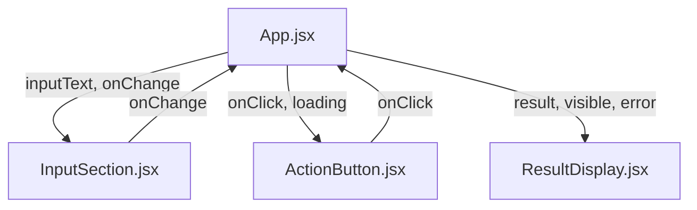
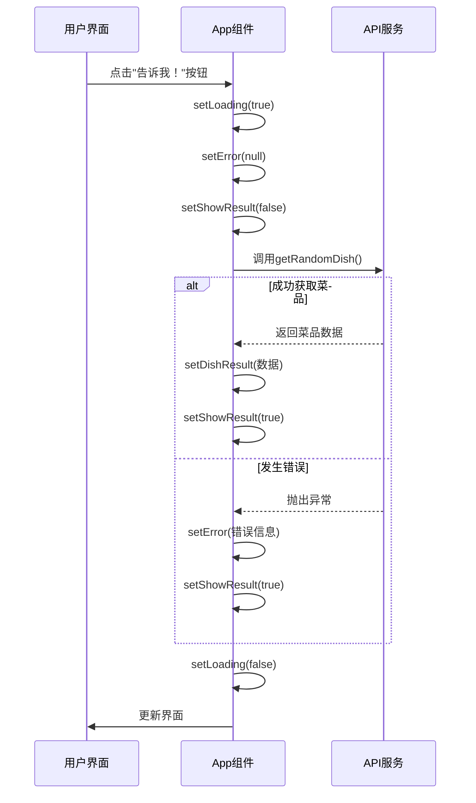
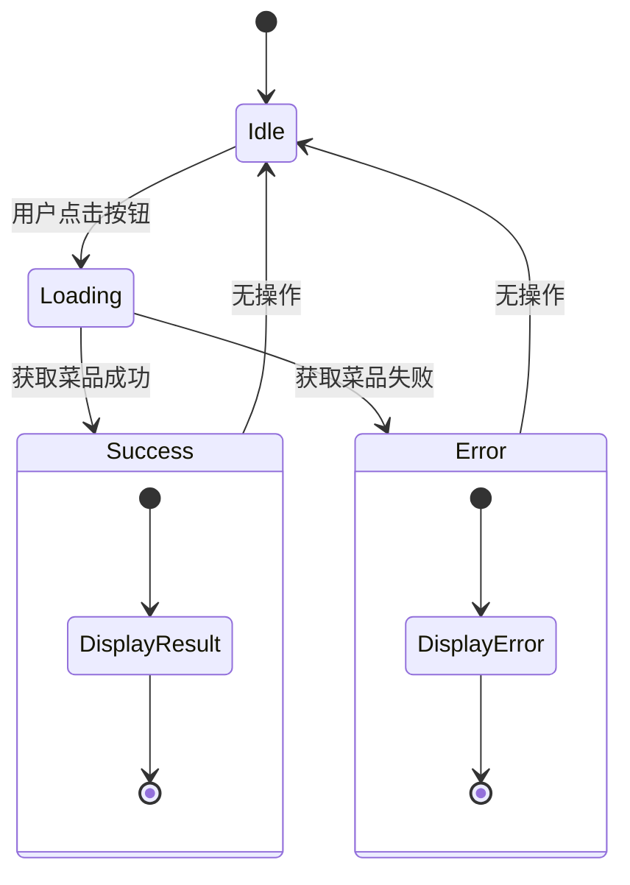

# 状态管理

<cite>
**本文档引用的文件**   
- [App.jsx](file://frontend/src/App.jsx)
- [InputSection.jsx](file://frontend/src/components/InputSection.jsx)
- [ResultDisplay.jsx](file://frontend/src/components/ResultDisplay.jsx)
- [api.js](file://frontend/src/services/api.js)
- [ActionButton.jsx](file://frontend/src/components/ActionButton.jsx)
- [Header.jsx](file://frontend/src/components/Header.jsx)
</cite>

## 目录
1. [简介](#简介)
2. [核心状态变量设计](#核心状态变量设计)
3. [状态提升与组件通信](#状态提升与组件通信)
4. [异步操作状态生命周期](#异步操作状态生命周期)
5. [状态管理最佳实践](#状态管理最佳实践)
6. [状态变化时序图](#状态变化时序图)
7. [常见问题与解决方案](#常见问题与解决方案)
8. [结论](#结论)

## 简介
WhatEating应用采用React Hooks中的useState实现核心状态管理，通过在App.jsx组件中集中管理状态，实现了清晰的状态流转和组件间通信。该状态管理机制围绕用户决策"今天吃什么"的核心功能，协调输入、处理、结果展示等环节，确保用户体验的流畅性和数据的一致性。

**Section sources**
- [App.jsx](file://frontend/src/App.jsx#L8-L46)

## 核心状态变量设计

应用定义了五个关键状态变量，每个都有明确的设计目的和职责：

- **inputText**: 管理用户输入的偏好文本，实现受控组件模式
- **dishResult**: 存储从后端获取的菜品数据，包含名称、描述和分类等信息
- **loading**: 控制加载状态，用于在异步请求期间提供视觉反馈
- **error**: 捕获和展示操作过程中发生的错误信息
- **showResult**: 控制结果展示区域的可见性，实现平滑的UI过渡

这些状态变量共同构成了应用的核心数据流，确保了从用户交互到结果展示的完整闭环。

**Section sources**
- [App.jsx](file://frontend/src/App.jsx#L9-L13)

## 状态提升与组件通信

应用采用状态提升模式，将所有状态集中管理在App.jsx组件中，并通过props将状态和更新函数传递给子组件：



**Diagram sources**
- [App.jsx](file://frontend/src/App.jsx#L38-L44)
- [InputSection.jsx](file://frontend/src/components/InputSection.jsx#L4-L12)
- [ActionButton.jsx](file://frontend/src/components/ActionButton.jsx#L6-L14)
- [ResultDisplay.jsx](file://frontend/src/components/ResultDisplay.jsx#L4-L32)

这种模式确保了状态的单一数据源，避免了组件间状态同步的复杂性，同时保持了子组件的无状态性和可复用性。

**Section sources**
- [App.jsx](file://frontend/src/App.jsx#L38-L44)
- [InputSection.jsx](file://frontend/src/components/InputSection.jsx)
- [ActionButton.jsx](file://frontend/src/components/ActionButton.jsx)
- [ResultDisplay.jsx](file://frontend/src/components/ResultDisplay.jsx)

## 异步操作状态生命周期

handleGetDish函数展示了完整的异步操作状态生命周期管理：



**Diagram sources**
- [App.jsx](file://frontend/src/App.jsx#L15-L30)
- [api.js](file://frontend/src/services/api.js#L3-L18)

该生命周期确保了状态转换的原子性和完整性，无论操作成功或失败，最终都会正确更新UI状态。

**Section sources**
- [App.jsx](file://frontend/src/App.jsx#L15-L30)
- [api.js](file://frontend/src/services/api.js#L3-L18)

## 状态管理最佳实践

### 避免状态竞态
通过在请求开始时重置错误状态和结果可见性，确保每次请求都是独立的：

```javascript
setLoading(true);
setError(null);
setShowResult(false);
```

### 正确处理异步更新
使用try-catch-finally结构确保loading状态总能被正确重置，即使发生异常：

```javascript
finally {
  setLoading(false);
}
```

### 错误边界设计
将错误信息与正常结果分离处理，在ResultDisplay组件中实现专门的错误展示逻辑：

```javascript
if (error) {
  return <div className="result-display error">...</div>;
}
```

这些实践确保了应用的健壮性和用户体验的一致性。

**Section sources**
- [App.jsx](file://frontend/src/App.jsx#L15-L30)
- [ResultDisplay.jsx](file://frontend/src/components/ResultDisplay.jsx#L6-L14)

## 状态变化时序图



**Diagram sources**
- [App.jsx](file://frontend/src/App.jsx#L15-L30)

该时序图清晰地展示了应用在不同操作下的状态转换路径，有助于理解整体状态管理逻辑。

## 常见问题与解决方案

### 状态未更新问题
**问题**: 状态更新后UI未重新渲染
**解决方案**: 确保使用useState提供的更新函数，避免直接修改状态

### 重复渲染问题
**问题**: 组件不必要的重复渲染
**解决方案**: 通过将事件处理函数定义在组件内部，利用React的引用相等性避免子组件重新渲染

### 加载状态不一致
**问题**: loading状态未正确重置
**解决方案**: 在finally块中重置loading状态，确保异常情况下也能正确更新

### 错误信息丢失
**问题**: 错误信息未正确传递
**解决方案**: 在catch块中捕获所有异常并设置错误状态

**Section sources**
- [App.jsx](file://frontend/src/App.jsx#L15-L30)
- [ResultDisplay.jsx](file://frontend/src/components/ResultDisplay.jsx#L6-L14)

## 结论
WhatEating应用的状态管理机制通过合理的状态设计、清晰的生命周期管理和最佳实践应用，实现了高效、可靠的状态管理。这种集中式状态管理模式不仅简化了组件间的通信，还提高了代码的可维护性和可测试性，为应用的持续发展奠定了坚实的基础。