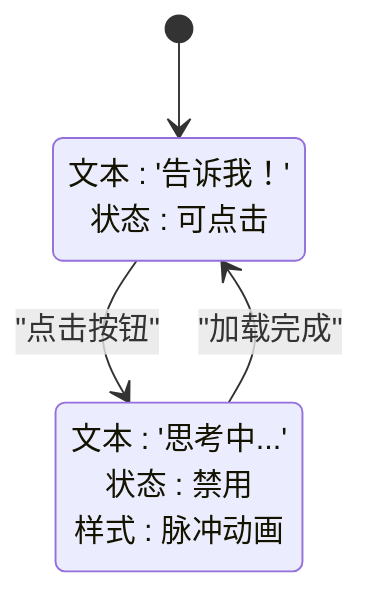
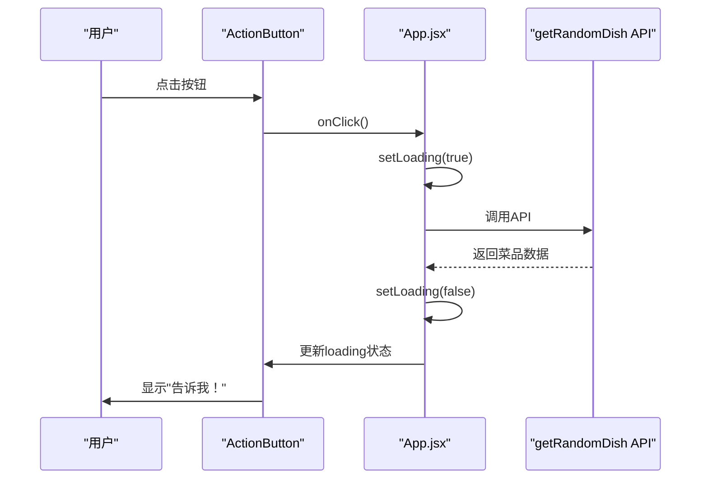

# ActionButton 组件

<cite>
**Referenced Files in This Document**   
- [ActionButton.jsx](file://frontend/src/components/ActionButton.jsx)
- [ActionButton.css](file://frontend/src/components/ActionButton.css)
- [App.jsx](file://frontend/src/App.jsx)
- [api.js](file://frontend/src/services/api.js)
</cite>

## 目录
1. [介绍](#介绍)
2. [核心功能与交互行为](#核心功能与交互行为)
3. [状态管理与UI展示](#状态管理与ui展示)
4. [样式设计](#样式设计)
5. [使用示例](#使用示例)
6. [开发建议](#开发建议)
7. [结论](#结论)

## 介绍

ActionButton 组件是应用程序中的核心交互元素，负责触发主要业务逻辑（获取随机菜品）。该组件通过清晰的状态反馈机制提升用户体验，支持点击、禁用和加载三种状态，并通过条件渲染和动态类名绑定实现丰富的视觉表现。本文档详细说明其设计原理、实现方式和最佳实践。

**Section sources**
- [ActionButton.jsx](file://frontend/src/components/ActionButton.jsx#L1-L18)
- [App.jsx](file://frontend/src/App.jsx#L1-L50)

## 核心功能与交互行为

ActionButton 组件接收三个关键属性：`onClick`、`disabled` 和 `loading`，分别用于控制按钮的点击行为、禁用状态和加载状态。组件通过 `disabled={disabled || loading}` 属性确保在禁用或加载状态下无法触发点击事件，有效防止重复提交。`onClick` 回调函数由父组件（如 App.jsx）提供，实现关注点分离。

**Section sources**
- [ActionButton.jsx](file://frontend/src/components/ActionButton.jsx#L2-L14)

## 状态管理与UI展示

组件根据 `loading` 属性的布尔值进行条件渲染：当 `loading` 为 true 时显示“思考中...”，否则显示“告诉我！”。这种条件渲染机制通过 JSX 的三元运算符实现，为用户提供明确的操作反馈。加载状态不仅改变文本内容，还通过添加 `loading` CSS 类触发动画效果，增强视觉提示。

**Diagram sources**
- [ActionButton.jsx](file://frontend/src/components/ActionButton.jsx#L8-L10)

## 样式设计

组件包含两个层级的样式设计：外层容器 `.action-button-container` 提供内边距布局，按钮本身 `.action-button` 实现主要视觉效果。按钮采用渐变背景、圆角、阴影和悬停动画，营造现代感。`loading` 类通过 `@keyframes pulse` 定义的脉冲动画实现透明度变化，提供平滑的加载指示。样式还包含响应式设计，在小屏幕上自动调整字体大小和内边距。

**Section sources**
- [ActionButton.css](file://frontend/src/components/ActionButton.css#L1-L54)

## 使用示例

在 App.jsx 中，ActionButton 与异步操作紧密结合。当用户点击按钮时，触发 `handleGetDish` 异步函数，该函数调用 `getRandomDish` API。在此过程中，组件通过 `setLoading(true)` 进入加载状态，防止重复请求。API 调用完成后，无论成功或失败，均通过 `finally` 块将 `loading` 状态重置为 false，恢复按钮的可点击状态。

**Diagram sources**
- [App.jsx](file://frontend/src/App.jsx#L15-L45)
- [api.js](file://frontend/src/services/api.js#L2-L22)

## 开发建议

对于初学者，应重点理解条件渲染（`{loading ? '思考中...' : '告诉我！'}`）和动态类名绑定（`className={`action-button ${loading ? 'loading' : ''}`}`）的语法。对于高级开发者，建议使用 `React.memo` 包装 ActionButton 组件以避免不必要的重渲染，特别是在父组件频繁更新但按钮属性未变化的场景下。此外，可扩展组件支持 `type` 属性（如 primary、secondary）以适应不同视觉需求，提高组件复用性。

**Section sources**
- [ActionButton.jsx](file://frontend/src/components/ActionButton.jsx#L2-L14)
- [App.jsx](file://frontend/src/App.jsx#L15-L45)

## 结论

ActionButton 组件通过简洁的 API 设计和丰富的视觉反馈，实现了高效且用户友好的交互体验。其状态管理机制与异步操作的紧密结合，展示了现代前端开发中组件化和状态驱动的最佳实践。通过理解其设计原理，开发者可以构建出更加健壮和可维护的用户界面。