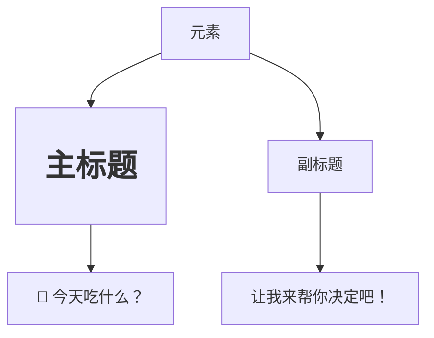
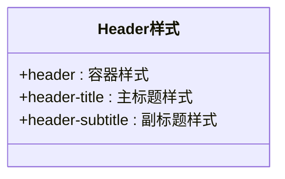
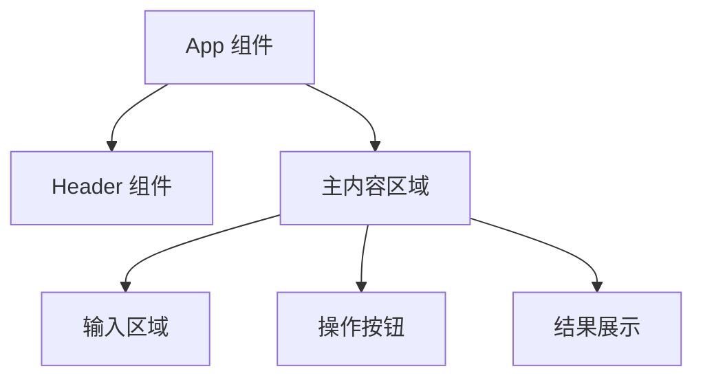

# Header 组件

<cite>
**Referenced Files in This Document**   
- [Header.jsx](file://frontend/src/components/Header.jsx)
- [Header.css](file://frontend/src/components/Header.css)
- [App.jsx](file://frontend/src/App.jsx)
</cite>

## 目录
1. [简介](#简介)
2. [核心职责与功能](#核心职责与功能)
3. [静态结构分析](#静态结构分析)
4. [实现方式与技术特点](#实现方式与技术特点)
5. [样式设计与模块化](#样式设计与模块化)
6. [集成与使用示例](#集成与使用示例)
7. [JSX语法与组件导出机制](#jsx语法与组件导出机制)
8. [扩展建议与高级用法](#扩展建议与高级用法)
9. [性能与副作用分析](#性能与副作用分析)

## 简介
Header 组件是 WhatEating 应用的视觉核心，负责呈现应用的品牌标识和主要信息。该组件以极简的设计理念实现了清晰的用户引导，通过醒目的标题和副标题帮助用户快速理解应用目的。作为前端界面的入口点，它在用户体验旅程中扮演着第一印象的关键角色。

## 核心职责与功能
Header 组件承担着三项核心职责：展示主标题“🍜 今天吃什么？”，呈现副标题“让我来帮你决定吧！”，以及通过视觉设计传达应用的品牌形象。该组件专注于提供静态信息展示，不涉及任何用户交互逻辑或数据处理功能。其设计目标是创建一个吸引人且直观的页面头部区域，为后续的用户操作奠定基础。

**Section sources**
- [Header.jsx](file://frontend/src/components/Header.jsx#L2-L9)

## 静态结构分析
该组件的静态结构由一个语义化的 `<header>` 元素构成，内部包含两个主要文本元素：`<h1>` 作为主标题和 `
` 作为副标题。主标题使用了食物相关的表情符号（🍜）增强视觉吸引力，直接点明应用主题。副标题采用友好、助人的语气，建立与用户的情感连接。这种层级分明的结构不仅符合无障碍访问标准，也确保了良好的信息架构。

**Diagram sources**
- [Header.jsx](file://frontend/src/components/Header.jsx#L4-L7)

## 实现方式与技术特点
Header 组件采用纯函数式 React 组件实现，体现了函数式编程的简洁性。该组件不接收任何 props 输入，也不维护内部状态（state），使其成为一个无状态的展示组件。这种设计选择确保了组件的高度可预测性和可测试性。组件通过 JSX 语法将 HTML 结构与 JavaScript 逻辑无缝集成，最终通过 `export default` 语句对外暴露，供其他组件导入使用。

**Section sources**
- [Header.jsx](file://frontend/src/components/Header.jsx#L2-L11)

## 样式设计与模块化
组件的视觉呈现由独立的 CSS 文件控制，实现了关注点分离的设计原则。`.header` 类定义了容器的布局、背景渐变和阴影效果，创造出现代化的卡片式外观。`.header-title` 类控制主标题的字体大小、粗细和文本阴影，确保其在界面上的突出地位。`.header-subtitle` 类则调整副标题的字体大小和透明度，形成视觉层次。所有样式均采用响应式设计，在移动设备上自动调整字体大小以优化阅读体验。

**Diagram sources**
- [Header.css](file://frontend/src/components/Header.css#L1-L32)

## 集成与使用示例
在 App.jsx 文件中，Header 组件被作为顶级布局的一部分进行集成。通过 `import Header from './components/Header';` 语句导入后，组件以 `<Header />` 的形式在 JSX 中被调用。这种集成方式展示了 React 组件系统的模块化特性，允许将复杂的用户界面分解为可重用的独立单元。组件被放置在主内容区域之上，形成清晰的页面结构。

**Diagram sources**
- [App.jsx](file://frontend/src/App.jsx#L1-L50)

**Section sources**
- [App.jsx](file://frontend/src/App.jsx#L8-L49)

## JSX语法与组件导出机制
JSX 是一种 JavaScript 的语法扩展，允许在 JavaScript 代码中编写类似 HTML 的标记。在 Header 组件中，JSX 用于描述 UI 的结构，最终被编译为 React.createElement() 调用。组件导出机制通过 `export default Header` 实现，这使得其他文件可以使用 `import` 语句来引用该组件。这种模块系统是现代 JavaScript 开发的基础，支持代码的组织、重用和依赖管理。

**Section sources**
- [Header.jsx](file://frontend/src/components/Header.jsx#L11-L11)

## 扩展建议与高级用法
对于需要动态标题的场景，建议扩展组件的 props 接口。可以通过定义一个包含 `title` 和 `subtitle` 属性的 props 对象，使组件能够接收外部传入的文本内容。这种改造将保持组件的纯函数特性，同时增加其灵活性和可重用性。此外，可以考虑添加主题支持，允许通过 props 控制组件的视觉风格，以适应不同的应用场景。

## 性能与副作用分析
Header 组件具有最优的渲染性能，因为它是一个无状态组件，不涉及任何生命周期方法或副作用。由于没有 props 变化或状态更新的可能，React 的协调算法可以高效地处理其渲染。该组件不执行任何网络请求、定时器操作或其他副作用，确保了应用的整体稳定性和可预测性。基于其当前的功能需求，无需进行任何性能优化。

**Section sources**
- [Header.jsx](file://frontend/src/components/Header.jsx#L2-L11)