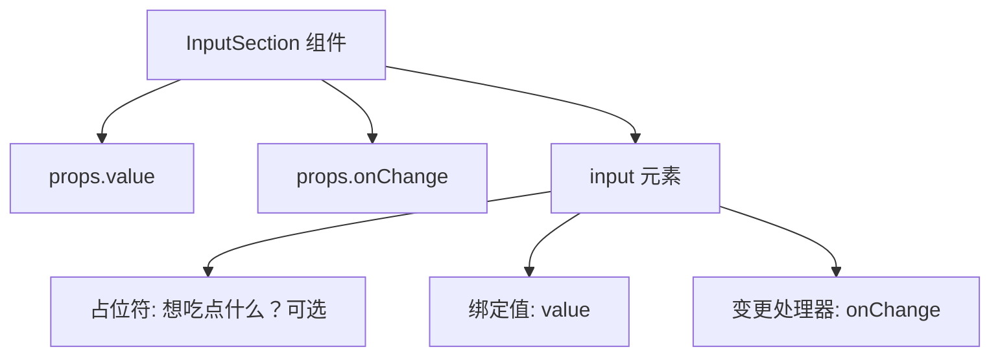
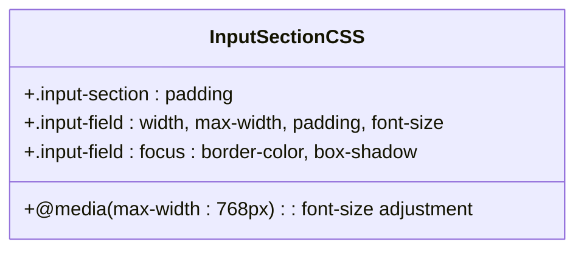
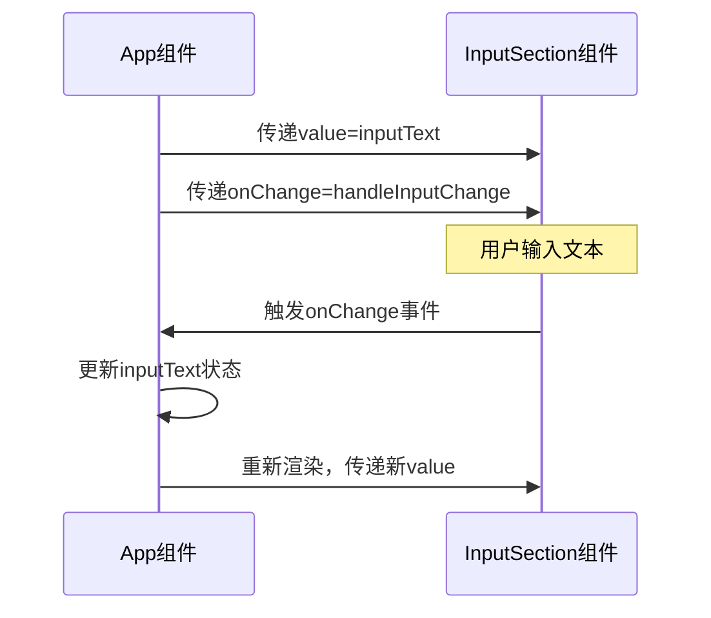

# InputSection 组件

<cite>
**Referenced Files in This Document**   
- [InputSection.jsx](file://frontend/src/components/InputSection.jsx)
- [InputSection.css](file://frontend/src/components/InputSection.css)
- [App.jsx](file://frontend/src/App.jsx)
</cite>

## 目录
1. [简介](#简介)
2. [核心功能与设计](#核心功能与设计)
3. [组件结构分析](#组件结构分析)
4. [CSS 样式实现](#css-样式实现)
5. [使用示例与受控组件模式](#使用示例与受控组件模式)
6. [事件处理机制详解](#事件处理机制详解)
7. [优化建议](#优化建议)
8. [架构原则与设计模式](#架构原则与设计模式)

## 简介
InputSection 组件是应用程序中的用户输入界面核心部分，负责接收用户的文本输入并支持模糊搜索关键词的输入功能。该组件采用 React 受控组件模式，通过 `value` 和 `onChange` 两个属性完全由父组件控制其状态，确保了数据流的单向性和可预测性。

## 核心功能与设计
InputSection 组件实现了基本的文本输入功能，包含一个占位符为“想吃点什么？（可选）”的输入框，允许用户输入任意文本内容以进行菜品搜索。组件本身不维护任何内部状态，所有状态管理均由父组件完成，符合单一职责原则和现代 React 应用的最佳实践。

**Section sources**
- [InputSection.jsx](file://frontend/src/components/InputSection.jsx#L2-L14)

## 组件结构分析
InputSection 是一个函数式组件，接收 `value` 和 `onChange` 作为 props 参数。其内部结构由一个外层容器 div 和一个 input 元素组成。input 元素设置了 type="text"，并应用了 CSS 模块化类名 "input-field"，同时配置了占位符文本、当前值绑定和变更事件处理器。

**Diagram sources**
- [InputSection.jsx](file://frontend/src/components/InputSection.jsx#L2-L14)

**Section sources**
- [InputSection.jsx](file://frontend/src/components/InputSection.jsx#L2-L14)

## CSS 样式实现
组件的样式通过独立的 InputSection.css 文件实现模块化管理。主要定义了两个 CSS 类：`.input-section` 作为外层容器提供内边距布局，`.input-field` 用于输入框的视觉样式控制，包括宽度、字体、边框、圆角、过渡动画等。样式还包含了焦点状态的高亮效果以及针对移动设备的响应式适配。

**Diagram sources**
- [InputSection.css](file://frontend/src/components/InputSection.css#L0-L30)

**Section sources**
- [InputSection.css](file://frontend/src/components/InputSection.css#L0-L30)

## 使用示例与受控组件模式
在 App.jsx 中，InputSection 组件通过 useState Hook 绑定状态，展示了典型的 React 受控组件使用模式。父组件维护 inputText 状态，并将其作为 value 传递给 InputSection，同时将 handleInputChange 函数作为 onChange 回调传递，实现双向数据绑定。

**Diagram sources**
- [App.jsx](file://frontend/src/App.jsx#L33-L40)

**Section sources**
- [App.jsx](file://frontend/src/App.jsx#L33-L40)

## 事件处理机制详解
onChange 事件处理机制是 React 表单控制的核心。当用户在输入框中输入内容时，浏览器会触发 input 事件，React 会合成此事件并调用绑定的 onChange 处理函数。在本例中，handleInputChange 函数接收事件对象 e，并通过 e.target.value 获取输入值，进而更新组件状态，形成完整的控制循环。

**Section sources**
- [App.jsx](file://frontend/src/App.jsx#L33-L33)

## 优化建议
对于高级开发者，建议在此组件基础上添加以下优化策略：
- **输入防抖**：避免频繁的状态更新和可能的 API 请求，提升性能
- **长度限制**：设置最大输入字符数，防止过长查询影响系统稳定性
- **输入验证**：对特殊字符或敏感内容进行过滤或提示
- **自动补全**：结合历史记录或热门搜索提供智能建议

这些优化可以在不改变组件基本架构的前提下，通过增强父组件逻辑或封装更高阶组件的方式实现。

## 架构原则与设计模式
InputSection 组件体现了清晰的架构原则：无内部状态、完全受控、职责单一。这种设计使得组件高度可复用、易于测试，并且与父组件之间的数据流明确可控。它遵循了 React 的受控组件模式，确保了 UI 与状态的一致性，是构建可维护前端应用的良好范例。

**Section sources**
- [InputSection.jsx](file://frontend/src/components/InputSection.jsx#L2-L14)
- [App.jsx](file://frontend/src/App.jsx#L33-L40)