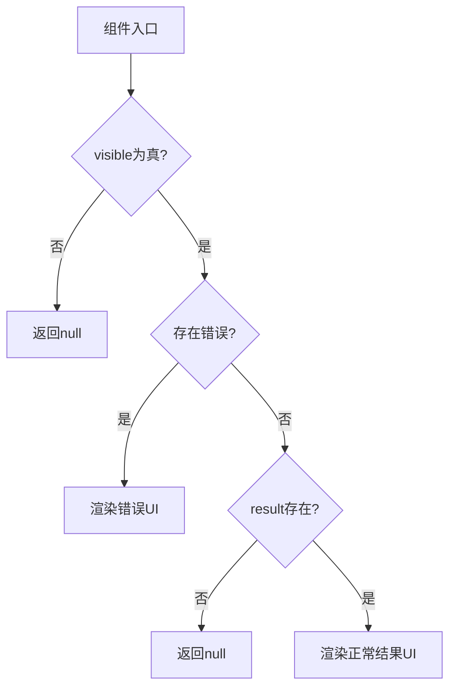
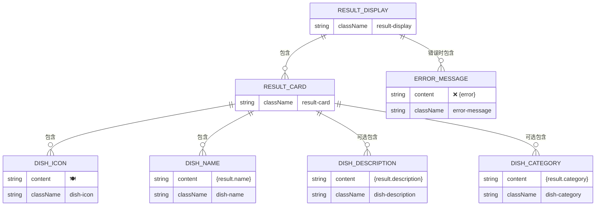
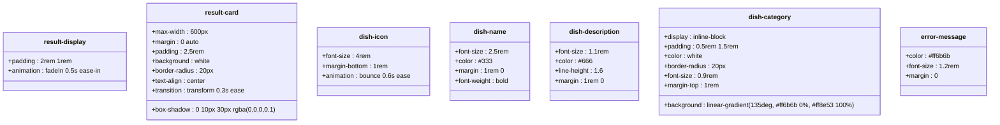
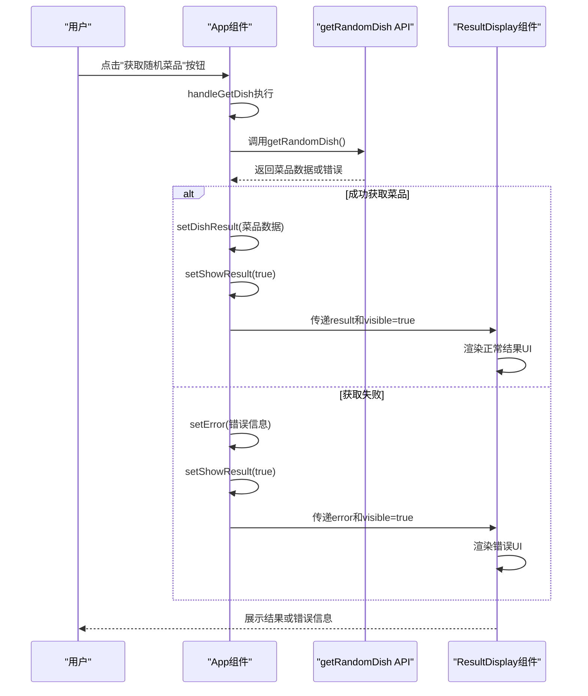

# ResultDisplay 组件

<cite>
**Referenced Files in This Document**  
- [ResultDisplay.jsx](file://frontend/src/components/ResultDisplay.jsx)
- [ResultDisplay.css](file://frontend/src/components/ResultDisplay.css)
- [App.jsx](file://frontend/src/App.jsx)
- [api.js](file://frontend/src/services/api.js)
</cite>

## 目录
1. [简介](#简介)
2. [核心功能与状态管理](#核心功能与状态管理)
3. [条件渲染逻辑分析](#条件渲染逻辑分析)
4. [UI结构与JSX嵌套](#ui结构与jsx嵌套)
5. [CSS样式与响应式设计](#css样式与响应式设计)
6. [在App.jsx中的集成示例](#在appjsx中的集成示例)
7. [初学者指南：React条件渲染模式](#初学者指南react条件渲染模式)
8. [高级优化建议](#高级优化建议)

## 简介
ResultDisplay 组件是前端应用中负责展示随机菜品结果的核心UI组件。它通过接收 `result`、`visible` 和 `error` 三个props，实现多状态的UI切换：隐藏状态（当 `visible` 为假）、错误提示状态（当 `error` 存在）和正常结果展示状态（当 `result` 存在且无错误）。该组件采用函数式组件和JSX语法，结合CSS样式类和动画效果，为用户提供直观、美观的结果展示体验。

**Section sources**  
- [ResultDisplay.jsx](file://frontend/src/components/ResultDisplay.jsx#L2-L33)

## 核心功能与状态管理
ResultDisplay 组件通过三个关键props管理其显示状态：
- `result`: 包含菜品信息的对象，包括名称、描述和分类等字段
- `visible`: 布尔值，控制组件是否渲染到DOM中
- `error`: 字符串，当获取菜品信息失败时包含错误信息

组件通过这些props实现了清晰的状态分离，确保在不同场景下展示恰当的UI。当 `visible` 为 `false` 时，组件完全不渲染，避免了不必要的DOM元素；当存在 `error` 时，展示错误信息；否则展示正常的菜品结果。

**Section sources**  
- [ResultDisplay.jsx](file://frontend/src/components/ResultDisplay.jsx#L2-L33)

## 条件渲染逻辑分析
ResultDisplay 组件采用了典型的React条件渲染模式，通过一系列if语句实现多状态切换：

**Diagram sources**  
- [ResultDisplay.jsx](file://frontend/src/components/ResultDisplay.jsx#L4-L31)

**Section sources**  
- [ResultDisplay.jsx](file://frontend/src/components/ResultDisplay.jsx#L4-L31)

## UI结构与JSX嵌套
组件的UI结构采用分层嵌套的JSX设计，确保语义清晰且易于样式化：

**Diagram sources**  
- [ResultDisplay.jsx](file://frontend/src/components/ResultDisplay.jsx#L2-L31)

**Section sources**  
- [ResultDisplay.jsx](file://frontend/src/components/ResultDisplay.jsx#L2-L31)

## CSS样式与响应式设计
组件的样式定义在独立的CSS文件中，采用BEM命名规范，确保样式作用域清晰且可维护：

**Diagram sources**  
- [ResultDisplay.css](file://frontend/src/components/ResultDisplay.css#L1-L93)

**Section sources**  
- [ResultDisplay.css](file://frontend/src/components/ResultDisplay.css#L1-L93)

## 在App.jsx中的集成示例
ResultDisplay 组件在App.jsx中被完整集成，展示了其与应用状态管理的协作模式：

**Diagram sources**  
- [App.jsx](file://frontend/src/App.jsx#L15-L30)
- [ResultDisplay.jsx](file://frontend/src/components/ResultDisplay.jsx#L2-L33)

**Section sources**  
- [App.jsx](file://frontend/src/App.jsx#L15-L30)
- [ResultDisplay.jsx](file://frontend/src/components/ResultDisplay.jsx#L2-L33)

## 初学者指南：React条件渲染模式
对于React初学者，ResultDisplay组件展示了几个重要的条件渲染模式：

1. **空值处理**: `if (!visible) return null;` 是React中常见的模式，用于根据条件完全跳过组件渲染
2. **早期返回**: 通过多个if语句实现"卫语句"模式，避免深层嵌套
3. **短路求值**: `{result.description && 
{result.description}
}` 利用JavaScript的短路求值特性实现条件渲染
4. **状态分离**: 将不同的UI状态（隐藏、错误、正常）明确分离，提高代码可读性

这些模式是React开发中的最佳实践，有助于创建清晰、可维护的组件。

**Section sources**  
- [ResultDisplay.jsx](file://frontend/src/components/ResultDisplay.jsx#L4-L31)

## 高级优化建议
对于高级开发者，可以考虑以下优化方案来进一步提升用户体验：

1. **动画过渡效果**: 当前组件已有fadeIn和bounce动画，可进一步添加状态切换时的过渡动画，如使用React Transition Group
2. **结果复制功能**: 添加"复制"按钮，允许用户一键复制菜品信息到剪贴板
3. **加载骨架屏**: 在当前组件中，加载状态由父组件处理，可考虑在ResultDisplay内部添加加载骨架屏，提供更流畅的用户体验
4. **结果缓存**: 实现本地缓存机制，避免重复请求相同数据
5. **无障碍支持**: 添加适当的ARIA标签，提高组件的可访问性

这些优化可以在保持现有功能的基础上，显著提升应用的专业性和用户体验。

**Section sources**  
- [ResultDisplay.jsx](file://frontend/src/components/ResultDisplay.jsx#L2-L33)
- [ResultDisplay.css](file://frontend/src/components/ResultDisplay.css#L1-L93)
- [App.jsx](file://frontend/src/App.jsx#L8-L46)