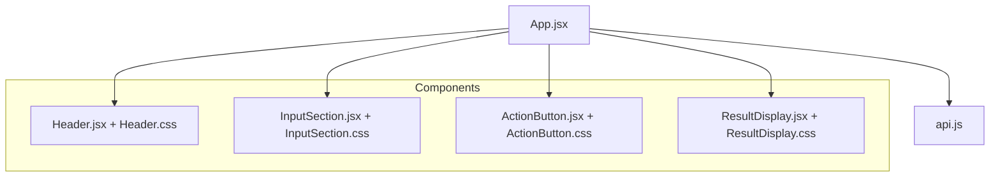
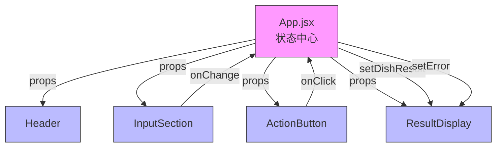
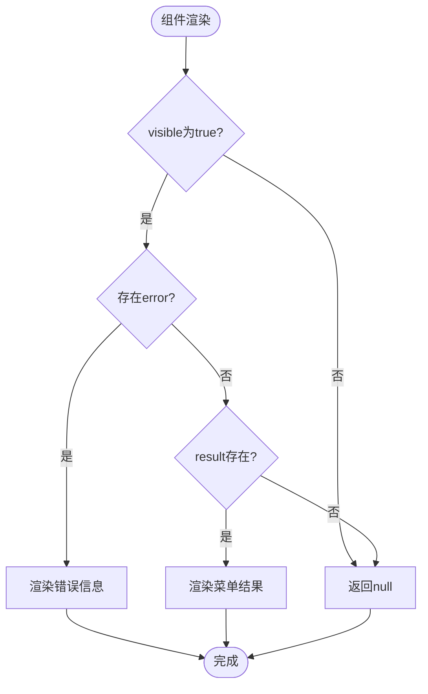
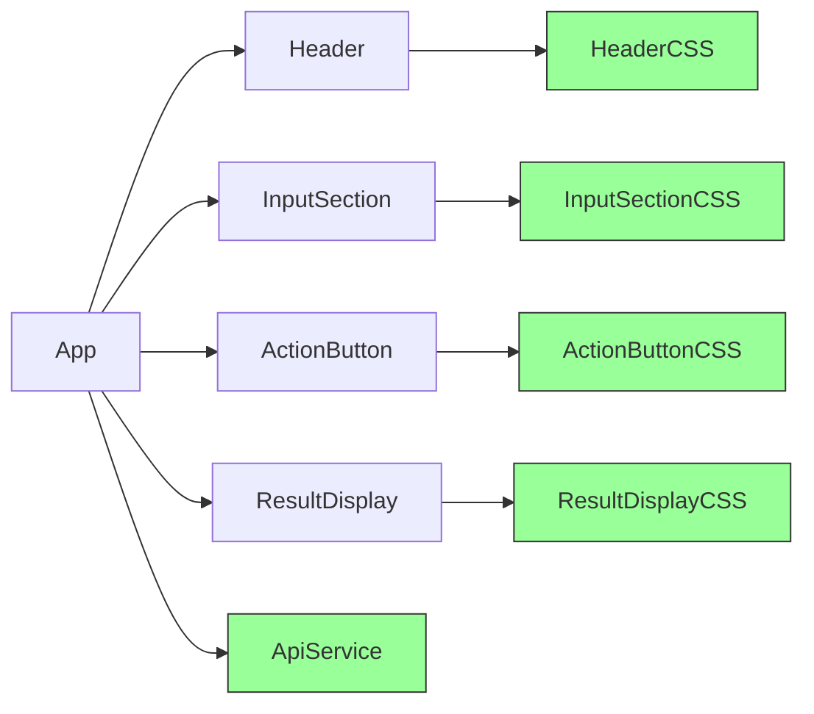

# 组件架构

<cite>
**Referenced Files in This Document**   
- [Header.jsx](file://frontend/src/components/Header.jsx)
- [Header.css](file://frontend/src/components/Header.css)
- [InputSection.jsx](file://frontend/src/components/InputSection.jsx)
- [InputSection.css](file://frontend/src/components/InputSection.css)
- [ActionButton.jsx](file://frontend/src/components/ActionButton.jsx)
- [ActionButton.css](file://frontend/src/components/ActionButton.css)
- [ResultDisplay.jsx](file://frontend/src/components/ResultDisplay.jsx)
- [ResultDisplay.css](file://frontend/src/components/ResultDisplay.css)
- [App.jsx](file://frontend/src/App.jsx)
- [api.js](file://frontend/src/services/api.js)
</cite>

## 目录
1. [简介](#简介)
2. [项目结构](#项目结构)
3. [核心组件](#核心组件)
4. [架构概览](#架构概览)
5. [详细组件分析](#详细组件分析)
6. [依赖分析](#依赖分析)
7. [性能考虑](#性能考虑)
8. [故障排除指南](#故障排除指南)
9. [结论](#结论)

## 简介
本文档详细介绍了WhatEating应用的前端组件架构，重点关注四个核心UI组件：Header、InputSection、ActionButton和ResultDisplay。文档涵盖了这些组件的视觉设计、行为逻辑、用户交互模式、props接口、事件处理机制和内部状态管理。同时，文档还说明了CSS样式模块化实现方式、可访问性实践、响应式布局处理和组件生命周期优化策略。

## 项目结构
WhatEating项目的前端代码组织清晰，采用功能模块化的设计。核心UI组件被统一放置在`src/components`目录下，每个组件由一个JSX文件和一个对应的CSS文件组成，实现了关注点分离。应用逻辑入口位于`App.jsx`，通过组合这些独立的组件来构建完整的用户界面。



**Diagram sources**
- [Header.jsx](file://frontend/src/components/Header.jsx)
- [InputSection.jsx](file://frontend/src/components/InputSection.jsx)
- [ActionButton.jsx](file://frontend/src/components/ActionButton.jsx)
- [ResultDisplay.jsx](file://frontend/src/components/ResultDisplay.jsx)
- [App.jsx](file://frontend/src/App.jsx)

**Section sources**
- [Header.jsx](file://frontend/src/components/Header.jsx)
- [InputSection.jsx](file://frontend/src/components/InputSection.jsx)
- [ActionButton.jsx](file://frontend/src/components/ActionButton.jsx)
- [ResultDisplay.jsx](file://frontend/src/components/ResultDisplay.jsx)
- [App.jsx](file://frontend/src/App.jsx)

## 核心组件
本应用的四个核心组件共同构成了简洁而直观的用户界面。Header组件提供应用标题和副标题，InputSection组件允许用户输入偏好，ActionButton组件触发核心功能，ResultDisplay组件则展示最终结果。这些组件通过props和回调函数在`App.jsx`中被协调和组合，形成了清晰的数据流和控制流。

**Section sources**
- [Header.jsx](file://frontend/src/components/Header.jsx)
- [InputSection.jsx](file://frontend/src/components/InputSection.jsx)
- [ActionButton.jsx](file://frontend/src/components/ActionButton.jsx)
- [ResultDisplay.jsx](file://frontend/src/components/ResultDisplay.jsx)

## 架构概览
整个应用采用自上而下的数据流架构。`App.jsx`作为状态管理的中心，持有所有组件共享的状态（如输入文本、菜单结果、加载状态和错误信息）。它通过props将状态传递给子组件，并通过回调函数接收子组件的事件（如输入变化和按钮点击）。这种模式确保了状态的单一来源，使应用逻辑清晰且易于调试。



**Diagram sources**
- [App.jsx](file://frontend/src/App.jsx)

## 详细组件分析
本节将深入分析每个核心组件的实现细节，包括其props接口、内部逻辑和样式设计。

### Header 组件分析
Header组件是应用的视觉入口，负责展示应用的品牌信息。

```mermaid
classDiagram
class Header {
+render() JSX
}
note right of Header
功能：展示应用标题和副标题
样式：使用渐变背景和阴影
响应式：在小屏幕上调整字体大小
end note
```

**Diagram sources**
- [Header.jsx](file://frontend/src/components/Header.jsx)
- [Header.css](file://frontend/src/components/Header.css)

**Section sources**
- [Header.jsx](file://frontend/src/components/Header.jsx)
- [Header.css](file://frontend/src/components/Header.css)

### InputSection 组件分析
InputSection组件是一个受控输入组件，其值由父组件通过props管理。

```mermaid
classDiagram
class InputSection {
+value : string
+onChange : function
+render() JSX
}
note right of InputSection
props：
- value : 输入框的当前值
- onChange : 值变化时的回调函数
样式：圆角边框，聚焦时高亮
end note
```

**Diagram sources**
- [InputSection.jsx](file://frontend/src/components/InputSection.jsx)
- [InputSection.css](file://frontend/src/components/InputSection.css)

**Section sources**
- [InputSection.jsx](file://frontend/src/components/InputSection.jsx)
- [InputSection.css](file://frontend/src/components/InputSection.css)

### ActionButton 组件分析
ActionButton组件根据应用状态（加载中、禁用）动态改变其外观和行为。

```mermaid
classDiagram
class ActionButton {
+onClick : function
+disabled : boolean
+loading : boolean
+render() JSX
}
note right of ActionButton
props：
- onClick : 点击事件处理器
- disabled : 是否禁用按钮
- loading : 是否处于加载状态
样式：渐变背景，悬停动画，加载脉冲效果
end note
```

**Diagram sources**
- [ActionButton.jsx](file://frontend/src/components/ActionButton.jsx)
- [ActionButton.css](file://frontend/src/components/ActionButton.css)

**Section sources**
- [ActionButton.jsx](file://frontend/src/components/ActionButton.jsx)
- [ActionButton.css](file://frontend/src/components/ActionButton.css)

### ResultDisplay 组件分析
ResultDisplay组件负责根据应用状态渲染不同的UI，包括成功结果、错误信息或不显示。



**Diagram sources**
- [ResultDisplay.jsx](file://frontend/src/components/ResultDisplay.jsx)
- [ResultDisplay.css](file://frontend/src/components/ResultDisplay.css)

**Section sources**
- [ResultDisplay.jsx](file://frontend/src/components/ResultDisplay.jsx)
- [ResultDisplay.css](file://frontend/src/components/ResultDisplay.css)

## 依赖分析
各组件之间通过清晰的接口进行通信。`App.jsx`是所有组件的直接依赖者，它导入并组合所有UI组件。每个UI组件（如Header、InputSection）都依赖于其同名的CSS文件，实现了样式与逻辑的分离。此外，`App.jsx`还依赖于`api.js`服务模块来处理与后端的通信。



**Diagram sources**
- [App.jsx](file://frontend/src/App.jsx)
- [Header.jsx](file://frontend/src/components/Header.jsx)
- [InputSection.jsx](file://frontend/src/components/InputSection.jsx)
- [ActionButton.jsx](file://frontend/src/components/ActionButton.jsx)
- [ResultDisplay.jsx](file://frontend/src/components/ResultDisplay.jsx)
- [api.js](file://frontend/src/services/api.js)

**Section sources**
- [App.jsx](file://frontend/src/App.jsx)
- [Header.jsx](file://frontend/src/components/Header.jsx)
- [InputSection.jsx](file://frontend/src/components/InputSection.jsx)
- [ActionButton.jsx](file://frontend/src/components/ActionButton.jsx)
- [ResultDisplay.jsx](file://frontend/src/components/ResultDisplay.jsx)
- [api.js](file://frontend/src/services/api.js)

## 性能考虑
从代码分析来看，当前组件实现简洁高效。为了进一步优化性能，可以考虑对`Header`、`InputSection`、`ActionButton`和`ResultDisplay`等纯展示性组件应用`React.memo`进行记忆化处理，避免在父组件重新渲染时不必要的重渲染。此外，`App.jsx`中的事件处理器（如`handleInputChange`）已经使用了函数声明，这在组件重新渲染时会创建新函数，可以考虑使用`useCallback`进行优化。

**Section sources**
- [Header.jsx](file://frontend/src/components/Header.jsx)
- [InputSection.jsx](file://frontend/src/components/InputSection.jsx)
- [ActionButton.jsx](file://frontend/src/components/ActionButton.jsx)
- [ResultDisplay.jsx](file://frontend/src/components/ResultDisplay.jsx)
- [App.jsx](file://frontend/src/App.jsx)

## 故障排除指南
当应用出现问题时，可以按照以下步骤进行排查：
1. **网络错误**：如果`ResultDisplay`显示“网络连接失败”，请检查后端服务是否在`localhost:3000`上运行。
2. **UI不更新**：检查`App.jsx`中的状态更新函数（如`setDishResult`）是否被正确调用。
3. **样式丢失**：确认每个组件的JSX文件是否正确导入了对应的CSS文件。
4. **交互无响应**：检查`ActionButton`的`onClick` prop是否正确传递了事件处理器。

**Section sources**
- [ResultDisplay.jsx](file://frontend/src/components/ResultDisplay.jsx)
- [App.jsx](file://frontend/src/App.jsx)
- [ActionButton.jsx](file://frontend/src/components/ActionButton.jsx)
- [api.js](file://frontend/src/services/api.js)

## 结论
WhatEating前端架构清晰、模块化程度高。通过将UI分解为独立的、可复用的组件，并将状态管理集中在`App.jsx`中，实现了关注点分离和代码的可维护性。每个组件都有明确的职责和接口，使得代码易于理解和测试。未来可以通过引入`React.memo`和`useCallback`等优化技术来进一步提升应用性能。