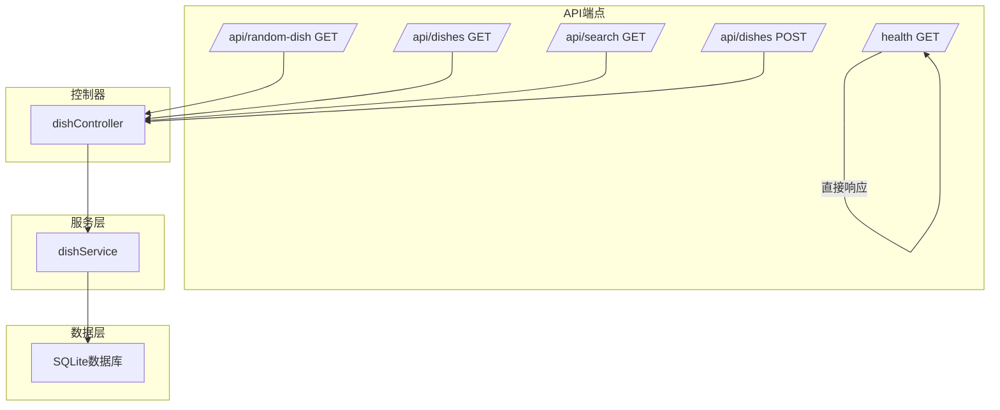
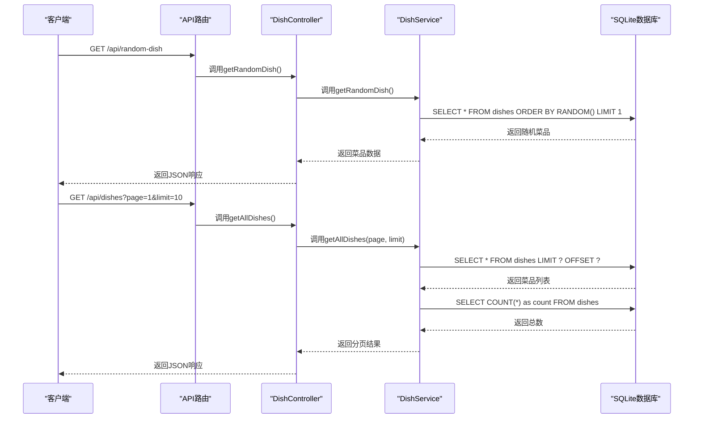
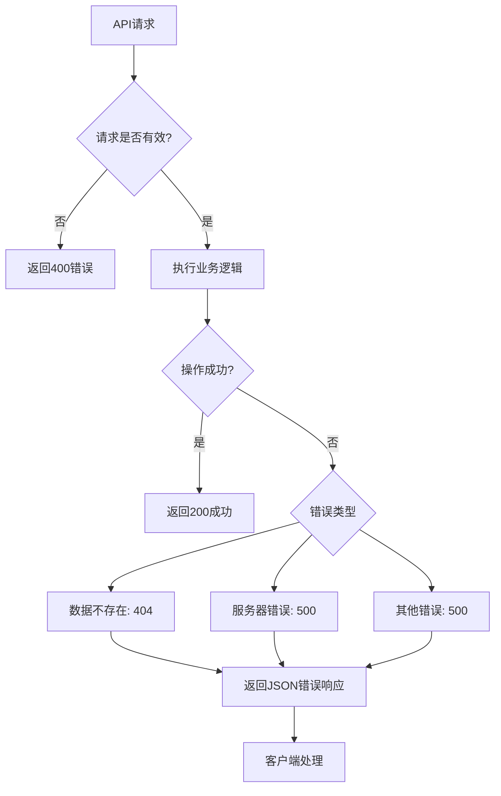

# API端点

<cite>
**Referenced Files in This Document**   
- [api.js](file://backend/src/routes/api.js)
- [dishController.js](file://backend/src/controllers/dishController.js)
- [dishService.js](file://backend/src/services/dishService.js)
- [database.js](file://backend/src/db/database.js)
- [app.js](file://backend/src/app.js)
</cite>

## 目录
1. [简介](#简介)
2. [API端点概览](#api端点概览)
3. [核心端点详细说明](#核心端点详细说明)
4. [请求处理流程](#请求处理流程)
5. [性能与安全性](#性能与安全性)
6. [错误处理机制](#错误处理机制)
7. [使用示例](#使用示例)

## 简介
WhatEating后端提供了一套RESTful API，用于管理菜品数据和提供随机推荐功能。本文档详细描述了所有可用的API端点，包括其HTTP方法、URL路径、请求参数、响应格式和错误码。API基于Express框架构建，通过SQLite数据库存储菜品信息，支持跨域请求，并提供了健康检查端点以监控服务状态。

**Section sources**
- [app.js](file://backend/src/app.js#L1-L10)
- [api.js](file://backend/src/routes/api.js#L1-L5)

## API端点概览
WhatEating后端提供了以下主要API端点：

| 端点路径 | HTTP方法 | 功能描述 |
|---------|---------|---------|
| `/api/random-dish` | GET | 获取随机菜品 |
| `/api/dishes` | GET | 获取所有菜品（支持分页） |
| `/api/search` | GET | 搜索菜品 |
| `/api/dishes` | POST | 添加新菜品 |
| `/health` | GET | 健康检查 |



**Diagram sources**
- [api.js](file://backend/src/routes/api.js#L6-L15)
- [app.js](file://backend/src/app.js#L40-L43)

## 核心端点详细说明

### /api/random-dish 端点
该端点用于获取一个随机的菜品推荐。

**请求信息**
- **HTTP方法**: GET
- **URL路径**: `/api/random-dish`
- **请求参数**: 无
- **请求体**: 无

**响应格式**
```json
{
  "success": true,
  "data": {
    "id": 1,
    "name": "宫保鸡丁",
    "description": "经典川菜，鸡肉鲜嫩，花生香脆，麻辣鲜香",
    "category": "川菜",
    "created_at": "2024-01-01T00:00:00Z"
  }
}
```

**错误响应**
- **404 Not Found**: 当数据库中没有菜品数据时返回
- **500 Internal Server Error**: 当数据库查询失败时返回

**Section sources**
- [api.js](file://backend/src/routes/api.js#L6)
- [dishController.js](file://backend/src/controllers/dishController.js#L3-L24)
- [dishService.js](file://backend/src/services/dishService.js#L3-L10)

### /api/dishes 端点 (GET)
该端点用于获取所有菜品列表，支持分页功能。

**请求信息**
- **HTTP方法**: GET
- **URL路径**: `/api/dishes`
- **查询参数**:
  - `page`: 页码（可选，默认为1）
  - `limit`: 每页数量（可选，默认为10）

**响应格式**
```json
{
  "success": true,
  "data": [
    {
      "id": 1,
      "name": "宫保鸡丁",
      "description": "经典川菜，鸡肉鲜嫩，花生香脆，麻辣鲜香",
      "category": "川菜",
      "created_at": "2024-01-01T00:00:00Z"
    }
  ],
  "total": 25,
  "page": 1,
  "limit": 10,
  "totalPages": 3
}
```

**Section sources**
- [api.js](file://backend/src/routes/api.js#L9)
- [dishController.js](file://backend/src/controllers/dishController.js#L27-L48)
- [dishService.js](file://backend/src/services/dishService.js#L13-L29)

### /api/search 端点
该端点用于根据关键词搜索菜品。

**请求信息**
- **HTTP方法**: GET
- **URL路径**: `/api/search`
- **查询参数**:
  - `keyword`: 搜索关键词（必填）

**响应格式**
```json
{
  "success": true,
  "data": [
    {
      "id": 1,
      "name": "宫保鸡丁",
      "description": "经典川菜，鸡肉鲜嫩，花生香脆，麻辣鲜香",
      "category": "川菜",
      "created_at": "2024-01-01T00:00:00Z"
    }
  ]
}
```

**错误响应**
- **400 Bad Request**: 当未提供搜索关键词时返回
- **500 Internal Server Error**: 当数据库查询失败时返回

**Section sources**
- [api.js](file://backend/src/routes/api.js#L12)
- [dishController.js](file://backend/src/controllers/dishController.js#L51-L74)
- [dishService.js](file://backend/src/services/dishService.js#L32-L40)

### /api/dishes 端点 (POST)
该端点用于添加新的菜品。

**请求信息**
- **HTTP方法**: POST
- **URL路径**: `/api/dishes`
- **请求头**: `Content-Type: application/json`
- **请求体**:
```json
{
  "name": "新菜品名称",
  "description": "菜品描述",
  "category": "菜系分类"
}
```

**响应格式**
```json
{
  "success": true,
  "data": {
    "id": 26,
    "name": "新菜品名称",
    "description": "菜品描述",
    "category": "菜系分类",
    "created_at": "2024-01-01T00:00:00Z"
  }
}
```

**错误响应**
- **400 Bad Request**: 当菜品名称为空时返回
- **500 Internal Server Error**: 当数据库插入失败时返回

**Section sources**
- [api.js](file://backend/src/routes/api.js#L15)
- [dishController.js](file://backend/src/controllers/dishController.js#L77-L100)
- [dishService.js](file://backend/src/services/dishService.js#L43-L53)

### /health 端点
该端点用于健康检查，监控服务状态。

**请求信息**
- **HTTP方法**: GET
- **URL路径**: `/health`
- **请求参数**: 无
- **请求体**: 无

**响应格式**
```json
{
  "status": "ok",
  "timestamp": "2024-01-01T00:00:00.000Z"
}
```

**Section sources**
- [app.js](file://backend/src/app.js#L40-L43)

## 请求处理流程
WhatEating后端的请求处理遵循典型的MVC模式，从路由到控制器再到服务层，最后访问数据库。



**Diagram sources**
- [api.js](file://backend/src/routes/api.js#L6-L9)
- [dishController.js](file://backend/src/controllers/dishController.js#L3-L48)
- [dishService.js](file://backend/src/services/dishService.js#L3-L29)

## 性能与安全性

### 性能特征
- **数据库索引**: 在菜品名称字段上创建了索引，提升了搜索性能
- **分页支持**: 所有列表查询都支持分页，避免一次性返回大量数据
- **内存数据库**: 使用SQLite作为轻量级数据库，适合小型应用
- **缓存机制**: 目前未实现缓存，每次请求都会查询数据库

### 安全性
- **输入验证**: 对关键字段（如菜品名称）进行非空验证
- **SQL注入防护**: 使用参数化查询防止SQL注入攻击
- **跨域支持**: 通过CORS中间件允许跨域请求
- **错误处理**: 生产环境中隐藏详细错误信息，防止信息泄露

**Section sources**
- [database.js](file://backend/src/db/database.js#L15-L17)
- [dishService.js](file://backend/src/services/dishService.js#L32-L40)
- [app.js](file://backend/src/app.js#L6-L8)
- [dishController.js](file://backend/src/controllers/dishController.js#L77-L85)

## 错误处理机制
WhatEating后端实现了全面的错误处理机制，确保客户端能够获得有意义的错误信息。



**Diagram sources**
- [dishController.js](file://backend/src/controllers/dishController.js#L3-L100)
- [app.js](file://backend/src/app.js#L50-L60)

## 使用示例

### 获取随机菜品
```bash
curl -X GET http://localhost:3000/api/random-dish
```

### 获取分页菜品列表
```bash
curl -X GET "http://localhost:3000/api/dishes?page=1&limit=5"
```

### 搜索菜品
```bash
curl -X GET "http://localhost:3000/api/search?keyword=鸡"
```

### 添加新菜品
```bash
curl -X POST http://localhost:3000/api/dishes \
  -H "Content-Type: application/json" \
  -d '{
    "name": "新菜品",
    "description": "这是一道新菜品",
    "category": "创新菜"
  }'
```

### 健康检查
```bash
curl -X GET http://localhost:3000/health
```

**Section sources**
- [api.js](file://backend/src/routes/api.js#L6-L15)
- [app.js](file://backend/src/app.js#L40-L43)
- [dishController.js](file://backend/src/controllers/dishController.js#L3-L100)