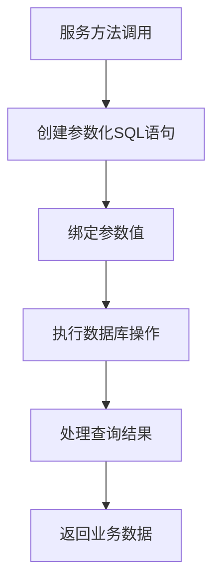
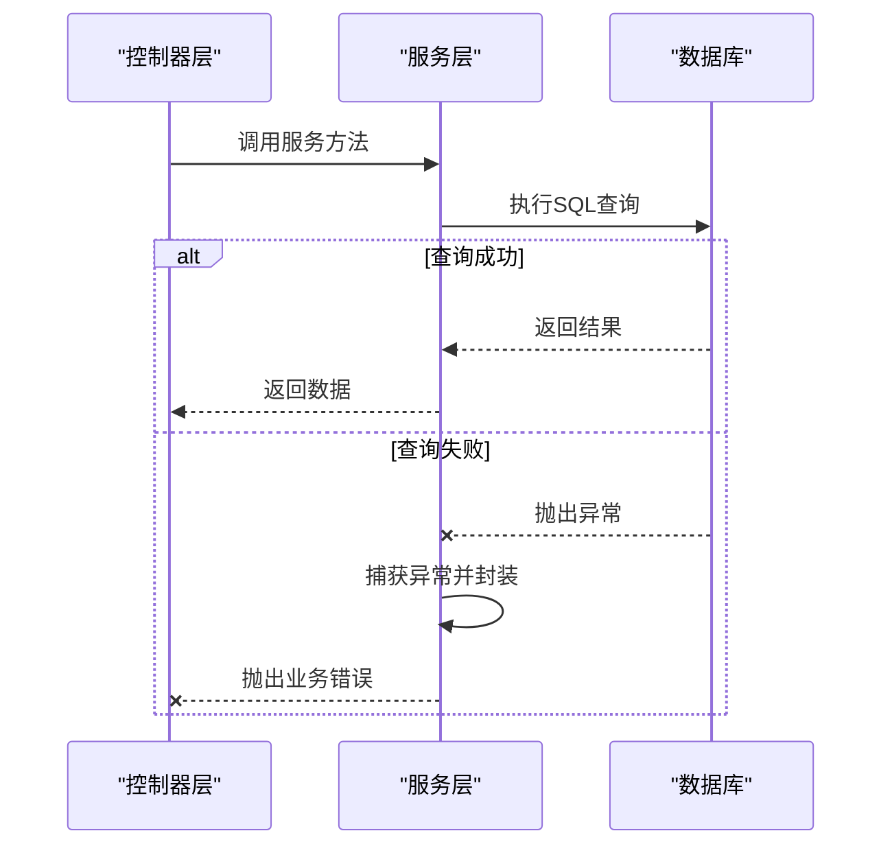
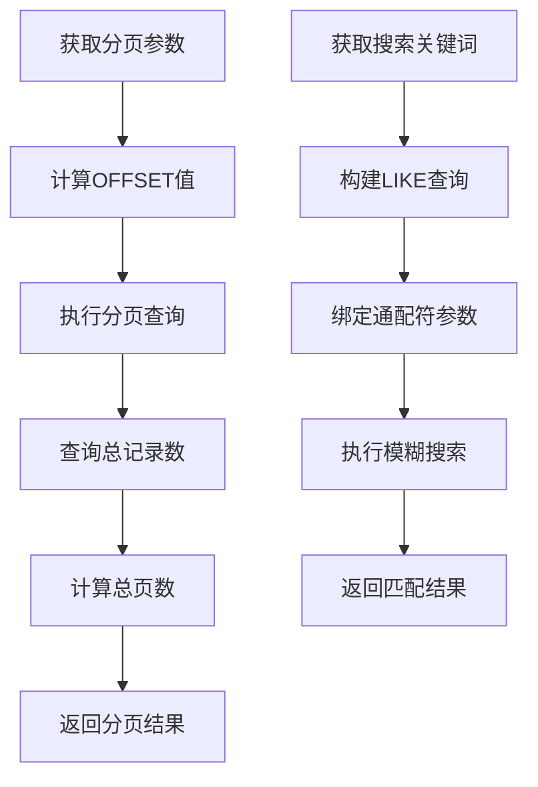

# 业务逻辑层

<cite>
**Referenced Files in This Document**  
- [dishService.js](file://backend/src/services/dishService.js)
- [database.js](file://backend/src/db/database.js)
- [dishController.js](file://backend/src/controllers/dishController.js)
</cite>

## 目录
1. [介绍](#介绍)
2. [核心服务方法实现](#核心服务方法实现)
3. [数据库交互机制](#数据库交互机制)
4. [错误处理与异常传播](#错误处理与异常传播)
5. [分页与搜索逻辑](#分页与搜索逻辑)
6. [服务层设计考量](#服务层设计考量)
7. [数据一致性与操作原子性](#数据一致性与操作原子性)

## 介绍
`dishService.js` 文件实现了餐饮应用的核心业务逻辑，作为控制器层与数据库之间的抽象隔离层。该服务封装了对菜品数据的增删改查操作，确保业务规则集中管理，并提供统一的错误处理机制。通过调用 `better-sqlite3` 提供的数据库接口，服务层执行参数化 SQL 查询，防止 SQL 注入攻击，同时利用事务机制保证数据操作的原子性和一致性。

**Section sources**
- [dishService.js](file://backend/src/services/dishService.js#L1-L65)

## 核心服务方法实现

### getRandomDish 方法
`getRandomDish` 方法用于从数据库中随机获取一道菜品。该方法通过执行 `ORDER BY RANDOM() LIMIT 1` 的 SQL 查询实现随机选择，确保每次调用返回不同的菜品记录。此方法体现了服务层对数据库查询逻辑的封装能力。

### getAllDishes 方法
`getAllDishes` 方法支持分页查询所有菜品数据。它接收页码和每页数量作为参数，计算偏移量后执行分页查询，并返回包含菜品列表、总数、当前页码、每页数量及总页数的完整分页结果对象。

### searchDishes 方法
`searchDishes` 方法实现基于关键词的模糊搜索功能。通过 `LIKE` 操作符和通配符 `%`，在菜品名称和描述字段中进行模式匹配，返回所有符合条件的菜品记录。

### addDish 方法
`addDish` 方法用于添加新的菜品记录。它首先执行插入操作，然后根据返回的最后插入行 ID 查询完整的菜品信息，确保返回最新创建的实体对象。

**Section sources**
- [dishService.js](file://backend/src/services/dishService.js#L3-L53)

## 数据库交互机制

### 参数化 SQL 查询
所有数据库操作均使用参数化查询，通过 `?` 占位符传递参数，有效防止 SQL 注入攻击。例如，在 `addDish` 方法中，`INSERT INTO dishes (name, description, category) VALUES (?, ?, ?)` 使用参数化方式插入数据。

### 数据库连接管理
服务层通过导入 `database.js` 模块获取数据库连接实例。该连接在应用启动时初始化，并在整个生命周期内复用，提高了数据库操作的性能和效率。

**Diagram sources**
- [dishService.js](file://backend/src/services/dishService.js#L3-L65)
- [database.js](file://backend/src/db/database.js#L8-L8)

**Section sources**
- [dishService.js](file://backend/src/services/dishService.js#L3-L65)
- [database.js](file://backend/src/db/database.js#L8-L8)

## 错误处理与异常传播

### Promise 错误处理模式
服务层采用同步 `try-catch` 捕获数据库操作异常。所有方法在捕获到错误后，都会抛出自定义错误消息，包含原始错误信息，便于上层调用者理解和处理。

### 异常传播机制
当数据库操作失败时，服务层不会静默失败，而是将错误封装后向上抛出。这种设计使得控制器层能够根据错误类型返回适当的 HTTP 状态码和错误消息，如 500 内部服务器错误。

**Diagram sources**
- [dishService.js](file://backend/src/services/dishService.js#L3-L65)
- [dishController.js](file://backend/src/controllers/dishController.js#L3-L100)

**Section sources**
- [dishService.js](file://backend/src/services/dishService.js#L3-L65)
- [dishController.js](file://backend/src/controllers/dishController.js#L3-L100)

## 分页与搜索逻辑

### 分页计算方式
分页逻辑通过计算 `totalPages` 实现。首先查询总记录数，然后根据每页数量计算总页数：`Math.ceil(total / limit)`。该计算在 `getAllDishes` 方法中完成，确保前端能够正确显示分页控件。

### 模糊搜索实现
模糊搜索使用 `LIKE` 查询配合通配符 `%` 实现。`searchDishes` 方法构建包含两个条件的 SQL 语句：`name LIKE ? OR description LIKE ?`，并将关键词前后添加 `%` 以实现前后模糊匹配。

**Diagram sources**
- [dishService.js](file://backend/src/services/dishService.js#L13-L29)
- [dishService.js](file://backend/src/services/dishService.js#L32-L40)

**Section sources**
- [dishService.js](file://backend/src/services/dishService.js#L13-L40)

## 服务层设计考量

### 抽象隔离作用
服务层作为控制器与数据库之间的中间层，实现了关注点分离。控制器仅负责处理 HTTP 请求和响应，而服务层专注于业务逻辑和数据访问，提高了代码的可维护性和可测试性。

### 辅助方法设计
`getDishById` 方法作为辅助方法，被其他服务方法间接调用。其设计考虑了数据完整性，即使在插入新记录后也能立即查询到完整信息，确保了数据的一致性。

**Section sources**
- [dishService.js](file://backend/src/services/dishService.js#L56-L63)
- [dishController.js](file://backend/src/controllers/dishController.js#L3-L100)

## 数据一致性与操作原子性

### 事务保证
在 `database.js` 的 `seedInitialData` 方法中，使用 `db.transaction` 确保批量插入操作的原子性。虽然 `dishService.js` 中的单个操作未显式使用事务，但 `better-sqlite3` 默认为每个语句提供原子性保证。

### 数据完整性
通过在数据库层面定义主键约束和非空约束，确保了数据的完整性。服务层在插入数据时遵循这些约束，避免了无效数据的产生。

**Section sources**
- [database.js](file://backend/src/db/database.js#L70-L90)
- [dishService.js](file://backend/src/services/dishService.js#L43-L53)