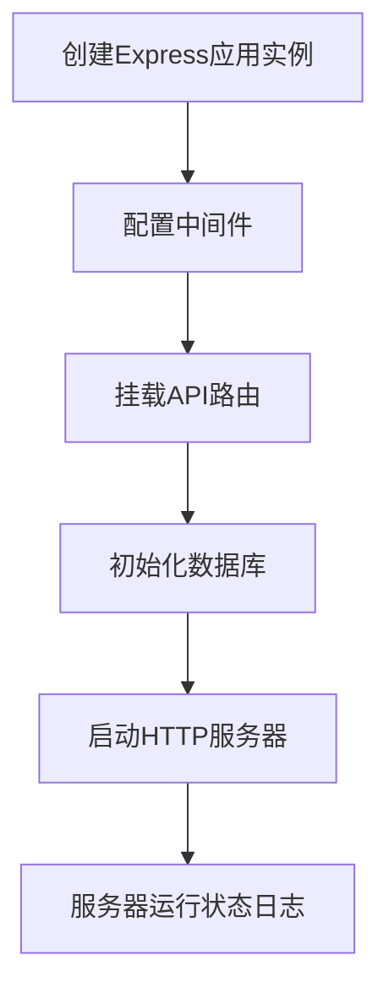
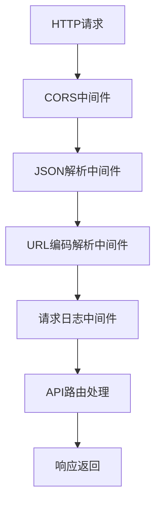
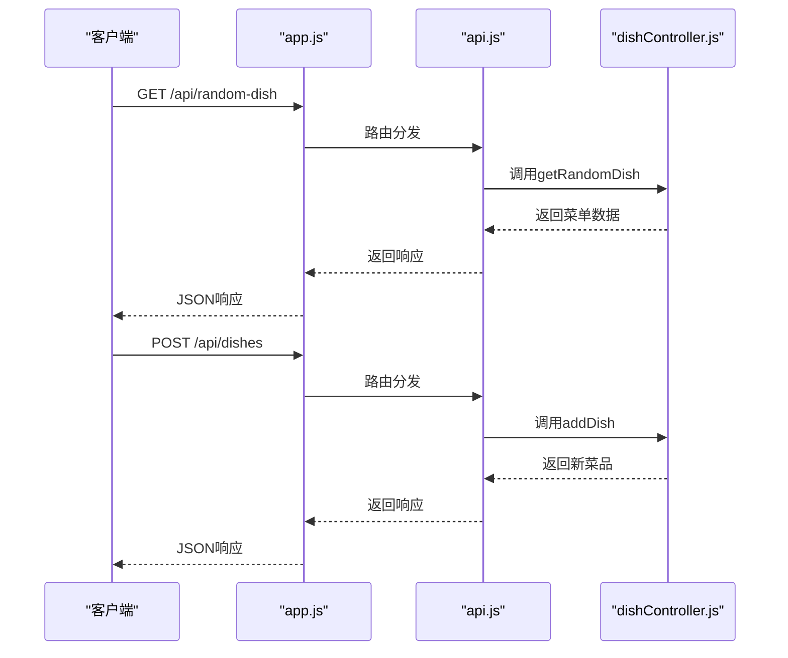
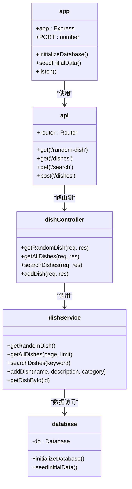
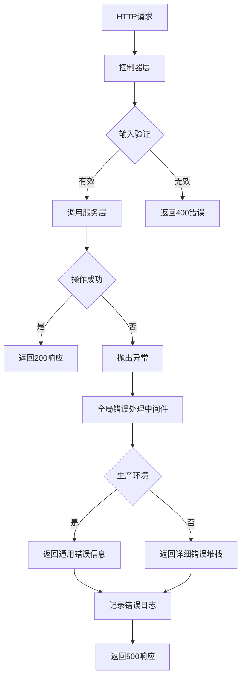
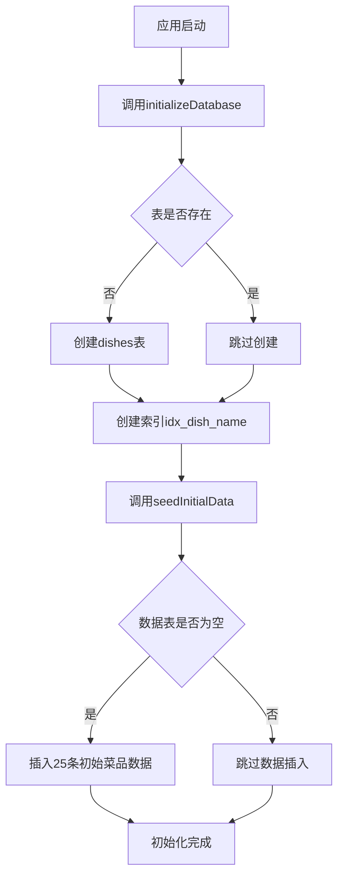

# 后端架构

<cite>
**Referenced Files in This Document**   
- [app.js](file://backend/src/app.js)
- [api.js](file://backend/src/routes/api.js)
- [dishController.js](file://backend/src/controllers/dishController.js)
- [dishService.js](file://backend/src/services/dishService.js)
- [database.js](file://backend/src/db/database.js)
</cite>

## 目录
1. [项目结构](#项目结构)
2. [服务器初始化](#服务器初始化)
3. [中间件配置](#中间件配置)
4. [路由分发机制](#路由分发机制)
5. [MVC架构模式](#mvc架构模式)
6. [RESTful API设计](#restful-api设计)
7. [错误处理与日志记录](#错误处理与日志记录)
8. [数据库初始化](#数据库初始化)
9. [开发与扩展指南](#开发与扩展指南)

## 项目结构

WhatEating后端项目采用分层架构设计，代码组织清晰，遵循关注点分离原则。项目主要分为五个核心模块：

- **app.js**: 应用入口文件，负责服务器初始化、中间件配置和路由挂载
- **routes/api.js**: API路由定义文件，将HTTP请求映射到相应的控制器
- **controllers/dishController.js**: 控制器层，处理HTTP请求和响应
- **services/dishService.js**: 服务层，实现核心业务逻辑
- **db/database.js**: 数据库层，负责数据持久化操作

这种分层结构确保了代码的可维护性和可扩展性，各层职责明确，便于团队协作开发。

**Section sources**
- [app.js](file://backend/src/app.js#L1-L65)
- [api.js](file://backend/src/routes/api.js#L1-L19)
- [dishController.js](file://backend/src/controllers/dishController.js#L1-L102)

## 服务器初始化

服务器初始化过程在`app.js`文件中完成，是整个应用的启动入口。初始化流程包括创建Express应用实例、配置环境变量、设置端口号以及启动HTTP服务器。

服务器启动后会监听指定端口（默认3000），并输出运行状态信息，包括服务器地址、环境模式和API端点。这种初始化模式确保了应用在启动时完成所有必要的配置和资源准备。

**Diagram sources**
- [app.js](file://backend/src/app.js#L5-L65)

**Section sources**
- [app.js](file://backend/src/app.js#L5-L65)

## 中间件配置

中间件是Express.js应用的核心特性，用于处理HTTP请求的各个阶段。WhatEating后端配置了多种中间件来增强应用功能和安全性。

配置的中间件包括：
- **CORS中间件**: 允许跨域请求，支持前端应用与后端API的分离部署
- **JSON解析中间件**: 自动解析JSON格式的请求体
- **URL编码解析中间件**: 解析URL编码的请求体，支持表单提交
- **请求日志中间件**: 记录每个请求的方法、URL和时间戳，便于调试和监控

这些中间件按顺序执行，形成请求处理管道，每个中间件负责特定的任务，共同完成请求的预处理。

**Diagram sources**
- [app.js](file://backend/src/app.js#L9-L15)

**Section sources**
- [app.js](file://backend/src/app.js#L9-L15)

## 路由分发机制

路由分发机制实现了HTTP请求到具体处理函数的映射。`app.js`通过`app.use('/api', apiRoutes)`将所有以`/api`开头的请求委托给`api.js`中的路由处理器。

`api.js`文件定义了具体的路由规则，将不同的HTTP方法和路径映射到控制器中的相应函数。这种分层路由设计使得API结构清晰，易于维护和扩展。

**Diagram sources**
- [app.js](file://backend/src/app.js#L21-L21)
- [api.js](file://backend/src/routes/api.js#L1-L19)

**Section sources**
- [app.js](file://backend/src/app.js#L21-L21)
- [api.js](file://backend/src/routes/api.js#L1-L19)

## MVC架构模式

WhatEating后端严格遵循MVC（Model-View-Controller）架构模式，尽管作为API服务没有视图层，但保留了MVC的核心分层思想。

各层职责划分如下：
- **控制器层 (Controller)**: 处理HTTP请求和响应，验证输入参数，调用服务层方法
- **服务层 (Service)**: 实现核心业务逻辑，处理数据转换和业务规则
- **数据库层 (Database)**: 执行数据持久化操作，管理数据库连接和查询

这种分层架构确保了业务逻辑与数据访问的分离，提高了代码的可测试性和可维护性。

**Diagram sources**
- [app.js](file://backend/src/app.js#L1-L65)
- [api.js](file://backend/src/routes/api.js#L1-L19)
- [dishController.js](file://backend/src/controllers/dishController.js#L1-L102)
- [dishService.js](file://backend/src/services/dishService.js#L1-L65)
- [database.js](file://backend/src/db/database.js#L1-L97)

**Section sources**
- [dishController.js](file://backend/src/controllers/dishController.js#L1-L102)
- [dishService.js](file://backend/src/services/dishService.js#L1-L65)
- [database.js](file://backend/src/db/database.js#L1-L97)

## RESTful API设计

WhatEating后端遵循RESTful API设计原则，提供了一组语义清晰、结构统一的API端点。API设计体现了资源导向的架构风格，使用标准的HTTP方法表示操作类型。

| API端点 | HTTP方法 | 功能描述 | 请求参数 | 响应状态码 |
|--------|---------|---------|---------|-----------|
| `/api/random-dish` | GET | 获取随机菜单 | 无 | 200, 404 |
| `/api/dishes` | GET | 获取所有菜单 | page, limit | 200, 500 |
| `/api/search` | GET | 搜索菜单 | keyword | 200, 400, 500 |
| `/api/dishes` | POST | 添加新菜单 | name, description, category | 201, 400, 500 |
| `/health` | GET | 健康检查 | 无 | 200 |

API设计特点：
- 使用名词复数形式表示资源集合（如`dishes`）
- 使用HTTP状态码准确表示操作结果
- 响应格式统一为JSON，包含`success`、`message`和`data`字段
- 支持分页查询，通过`page`和`limit`参数控制数据量
- 提供健康检查端点，便于系统监控

这种RESTful设计使得API易于理解和使用，符合现代Web API的最佳实践。

**Section sources**
- [api.js](file://backend/src/routes/api.js#L1-L19)
- [dishController.js](file://backend/src/controllers/dishController.js#L1-L102)

## 错误处理与日志记录

后端实现了完善的错误处理和日志记录机制，确保系统的稳定性和可维护性。错误处理分为局部错误处理和全局错误处理两个层次。

具体实现包括：
- **输入验证**: 在控制器层对请求参数进行验证，返回400状态码表示客户端错误
- **全局错误处理**: 使用Express的错误处理中间件捕获未处理的异常
- **环境感知**: 在生产环境中隐藏详细的错误信息，防止敏感信息泄露
- **日志记录**: 记录所有请求和错误信息，便于问题排查和系统监控

这种分层错误处理机制既保证了用户体验，又提供了足够的调试信息。

**Diagram sources**
- [app.js](file://backend/src/app.js#L37-L50)
- [dishController.js](file://backend/src/controllers/dishController.js#L3-L102)

**Section sources**
- [app.js](file://backend/src/app.js#L37-L50)
- [dishController.js](file://backend/src/controllers/dishController.js#L3-L102)

## 数据库初始化

数据库初始化过程在应用启动时自动执行，确保数据存储层的正确配置。初始化包括创建数据表、建立索引和插入初始数据三个主要步骤。

数据库层使用better-sqlite3库与SQLite数据库交互，具有以下特点：
- 使用SQL语句直接操作数据库，性能高效
- 在`dishes`表的`name`字段上创建索引，提升搜索性能
- 通过事务批量插入初始数据，确保数据完整性
- 实现了数据库连接的单例模式，避免资源浪费

这种初始化策略确保了应用在首次运行和后续启动时都能正确配置数据库状态。

**Diagram sources**
- [database.js](file://backend/src/db/database.js#L11-L93)

**Section sources**
- [database.js](file://backend/src/db/database.js#L11-L93)

## 开发与扩展指南

对于开发者而言，WhatEating后端提供了清晰的扩展路径。无论是添加新的API端点还是修改现有业务逻辑，都可以遵循既定的模式进行。

### 添加新API端点
1. 在`services/dishService.js`中实现新的业务逻辑函数
2. 在`controllers/dishController.js`中创建对应的控制器方法
3. 在`routes/api.js`中添加新的路由映射
4. 在`app.js`中确保API路由已正确挂载

### 修改业务逻辑
- **验证规则调整**: 在控制器层修改输入验证逻辑
- **查询优化**: 在服务层优化数据库查询语句
- **数据处理**: 在服务层添加新的数据处理逻辑
- **性能改进**: 在数据库层添加新的索引或优化查询

### 最佳实践
- 保持控制器层轻量，仅处理请求响应和输入验证
- 将复杂的业务逻辑放在服务层，提高代码复用性
- 在数据库层避免业务逻辑，仅执行数据存取操作
- 使用一致的错误处理模式，确保API响应格式统一
- 添加详细的代码注释，特别是复杂的业务逻辑部分

遵循这些指南可以确保代码质量和系统稳定性，同时提高开发效率。

**Section sources**
- [app.js](file://backend/src/app.js#L1-L65)
- [api.js](file://backend/src/routes/api.js#L1-L19)
- [dishController.js](file://backend/src/controllers/dishController.js#L1-L102)
- [dishService.js](file://backend/src/services/dishService.js#L1-L65)
- [database.js](file://backend/src/db/database.js#L1-L97)