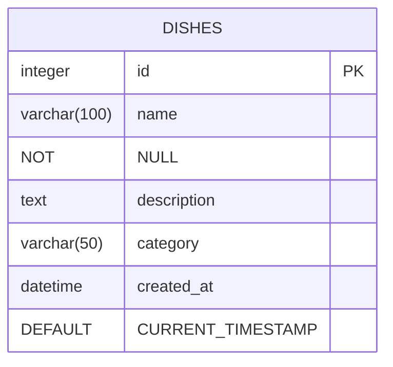

# 数据模型

<cite>
**Referenced Files in This Document**   
- [database.js](file://backend/src/db/database.js)
- [dishService.js](file://backend/src/services/dishService.js)
- [dishController.js](file://backend/src/controllers/dishController.js)
- [api.js](file://backend/src/routes/api.js)
</cite>

## 目录
1. [引言](#引言)
2. [数据库Schema示意图](#数据库schema示意图)
3. [字段详细说明](#字段详细说明)
4. [数据完整性保障](#数据完整性保障)
5. [索引与性能优化](#索引与性能优化)
6. [数据生命周期管理](#数据生命周期管理)
7. [结论](#结论)

## 引言
本文档旨在全面阐述WhatEating项目中菜品（Dish）数据模型的设计与实现。该数据模型是整个应用的核心，存储了所有菜品的信息，包括名称、描述、分类等关键属性。文档将深入解析SQLite数据库中`dishes`表的结构，详细说明各字段的数据类型、约束条件和业务含义，并解释主键自增、NOT NULL约束以及默认时间戳的实现机制。同时，文档还将阐述数据初始化、持久化和搜索性能优化等关键策略，为开发者提供权威的参考。

## 数据库Schema示意图

**Diagram sources**
- [database.js](file://backend/src/db/database.js#L13-L20)

## 字段详细说明

`dishes`表由五个核心字段构成，每个字段都经过精心设计以满足业务需求。

| 字段名 | 数据类型 | 约束条件 | 业务含义 |
| :--- | :--- | :--- | :--- |
| `id` | INTEGER | PRIMARY KEY, AUTOINCREMENT | 菜品的唯一标识符，作为主键自动递增，确保每条记录的唯一性。 |
| `name` | VARCHAR(100) | NOT NULL | 菜品的名称，如“宫保鸡丁”或“兰州拉面”，是用户识别菜品的主要依据，不能为空。 |
| `description` | TEXT | 无 | 菜品的详细描述，用于介绍其风味、口感和特色，内容长度不受限。 |
| `category` | VARCHAR(50) | 无 | 菜品的分类，用于对菜品进行分组，如“川菜”、“粤菜”、“快餐”等。 |
| `created_at` | DATETIME | DEFAULT CURRENT_TIMESTAMP | 记录菜品被创建的时间戳，系统自动填充为当前时间，用于追踪数据的生命周期。 |

**Section sources**
- [database.js](file://backend/src/db/database.js#L13-L20)

## 数据完整性保障

为了确保数据的准确性和可靠性，系统在多个层面实施了数据完整性保障措施。

首先，在数据库层面，通过SQL约束直接在`dishes`表上强制执行规则。`id`字段被定义为主键（PRIMARY KEY）并启用自增（AUTOINCREMENT），这保证了每条菜品记录都拥有一个全局唯一的标识符，从根本上防止了重复或冲突。`name`字段被标记为NOT NULL，强制要求每道菜品必须有一个名称，避免了关键信息的缺失。

其次，在应用逻辑层面，服务层和控制器层共同构成了第二道防线。`dishService.js`中的`addDish`函数负责处理数据插入，它封装了数据库操作，并在捕获到任何错误时抛出异常。`dishController.js`作为API的入口，实现了更严格的输入验证。例如，在`addDish`控制器中，会检查请求体中的`name`字段是否为空，如果为空，则立即返回400错误，阻止无效数据进入服务层。这种分层验证机制（前端校验 + 应用层校验 + 数据库约束）确保了数据从用户输入到持久化存储的整个流程中都保持完整和一致。

**Section sources**
- [database.js](file://backend/src/db/database.js#L13-L20)
- [dishService.js](file://backend/src/services/dishService.js#L45-L50)
- [dishController.js](file://backend/src/controllers/dishController.js#L72-L78)

## 索引与性能优化

为了提升应用的搜索性能，系统在`dishes`表的`name`字段上创建了名为`idx_dish_name`的数据库索引。

该索引通过`CREATE INDEX IF NOT EXISTS idx_dish_name ON dishes(name)`语句在`initializeDatabase`函数中创建。其主要作用是显著加速基于菜品名称的查询操作。当用户在前端进行搜索时，`dishController.js`中的`searchDishes`接口会被调用，该接口最终会执行类似`SELECT * FROM dishes WHERE name LIKE ?`的SQL查询。如果没有索引，数据库将不得不对`dishes`表中的每一行进行全表扫描来匹配搜索关键词，这在数据量较大时会导致性能急剧下降。而有了`idx_dish_name`索引后，数据库可以利用索引的有序结构快速定位到匹配的记录，极大地减少了需要扫描的数据量，从而保证了搜索功能的响应速度和用户体验。

**Section sources**
- [database.js](file://backend/src/db/database.js#L25)
- [dishController.js](file://backend/src/controllers/dishController.js#L50-L66)

## 数据生命周期管理

系统的数据生命周期管理策略由数据初始化和持久化机制两部分组成。

**数据初始化 (seedInitialData)**：在应用首次启动时，`seedInitialData`函数负责填充初始数据。该函数首先检查`dishes`表中是否已存在数据，如果存在则跳过初始化，防止重复填充。如果表为空，函数会将一个包含50道预定义菜品的数组（涵盖川菜、粤菜、家常菜等多个类别）通过事务批量插入到数据库中。这种设计确保了应用在部署后拥有一个可用的、丰富的菜品库，为用户提供即时的使用体验。

**持久化机制**：所有对菜品数据的增删改查（CRUD）操作都通过`dishService.js`中的服务函数进行封装。这些函数使用`better-sqlite3`库与SQLite数据库进行交互，将应用逻辑与数据库操作解耦。例如，添加新菜品时，`addDish`服务函数会执行INSERT语句，并在成功后返回新创建的菜品对象。这种集中化的数据访问模式不仅提高了代码的可维护性，也确保了所有数据操作都遵循统一的错误处理和事务管理规范。

**Section sources**
- [database.js](file://backend/src/db/database.js#L31-L93)
- [dishService.js](file://backend/src/services/dishService.js#L45-L50)

## 结论

WhatEating项目的菜品数据模型设计合理，实现了数据的完整性、一致性和高性能。通过结合数据库层面的约束（主键、NOT NULL、默认值）和应用层面的验证逻辑，系统构建了坚固的数据防护体系。`idx_dish_name`索引的引入有效解决了搜索性能问题。而`seedInitialData`函数则确保了应用的开箱即用。整个数据模型通过清晰的分层架构（数据库 -> 服务层 -> 控制器层）进行管理，为应用的稳定运行和未来扩展奠定了坚实的基础。