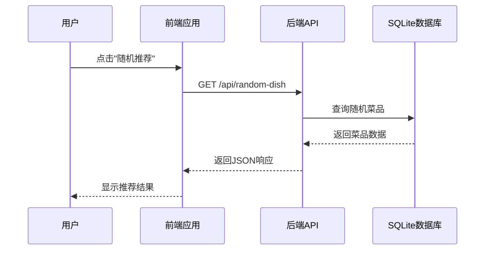
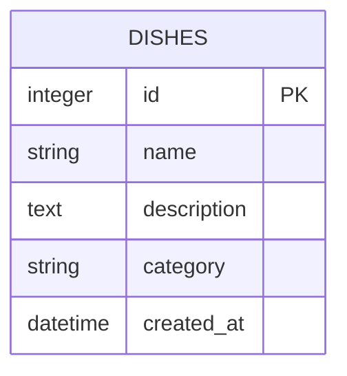

# 开发者入门指南

<cite>
**Referenced Files in This Document**   
- [README.md](file://README.md)
- [backend/package.json](file://backend/package.json)
- [frontend/package.json](file://frontend/package.json)
- [backend/src/app.js](file://backend/src/app.js)
- [frontend/src/services/api.js](file://frontend/src/services/api.js)
- [backend/src/db/database.js](file://backend/src/db/database.js)
- [frontend/src/App.jsx](file://frontend/src/App.jsx)
- [backend/src/routes/api.js](file://backend/src/routes/api.js)
- [backend/src/services/dishService.js](file://backend/src/services/dishService.js)
- [backend/src/controllers/dishController.js](file://backend/src/controllers/dishController.js)
</cite>

## 目录
1. [简介](#简介)
2. [项目结构](#项目结构)
3. [环境准备](#环境准备)
4. [后端启动](#后端启动)
5. [前端启动](#前端启动)
6. [项目运行](#项目运行)
7. [常见问题排查](#常见问题排查)
8. [功能演示](#功能演示)

## 简介
WhatEating是一款全栈美食推荐应用，旨在帮助用户解决"今天吃什么"的难题。本指南将指导新开发者如何快速克隆、安装依赖、启动和测试该项目，确保在5分钟内成功运行项目。

**Section sources**
- [README.md](file://README.md#L1-L113)

## 项目结构
WhatEating项目采用前后端分离架构，主要目录结构如下：

```
WhatEating/
├── backend/              # 后端服务
│   ├── src/
│   │   ├── db/          # 数据库相关
│   │   ├── routes/      # 路由定义
│   │   ├── controllers/ # 控制器
│   │   ├── services/    # 业务逻辑
│   │   └── app.js       # 应用入口
│   └── data/            # SQLite数据库
└── frontend/            # 前端应用
    ├── src/
    │   ├── components/  # React组件
    │   ├── services/    # API服务
    │   └── App.jsx      # 主应用
    └── package.json
```

**Section sources**
- [README.md](file://README.md#L35-L60)

## 环境准备
在开始之前，请确保您的开发环境已安装以下工具：

- **Node.js** (建议版本16.x或更高)
- **npm** (Node.js包管理器)
- **Git** (用于克隆项目)

验证安装：
```bash
node --version
npm --version
git --version
```

**Section sources**
- [README.md](file://README.md#L1-L113)

## 后端启动
### 1. 安装依赖
```bash
cd backend
npm install
```

### 2. 启动服务
```bash
npm start
```

后端服务将运行在 `http://localhost:3000`，您将看到以下输出：
```
🚀 Server is running on http://localhost:3000
📊 Environment: development
🔥 API endpoint: http://localhost:3000/api
```

### 3. 验证后端
打开浏览器访问 `http://localhost:3000/health`，您应该看到：
```json
{
  "status": "ok",
  "timestamp": "2024-01-01T00:00:00.000Z"
}
```

**Section sources**
- [README.md](file://README.md#L63-L72)
- [backend/package.json](file://backend/package.json#L1-L22)
- [backend/src/app.js](file://backend/src/app.js#L1-L64)

## 前端启动
### 1. 安装依赖
```bash
cd frontend
npm install
```

### 2. 启动开发服务器
```bash
npm run dev
```

前端应用将运行在 `http://localhost:5174`，您将看到以下输出：
```
  VITE v5.0.0  ready in 123 ms
  ➜  Local:   http://localhost:5174/
  ➜  Network: use --host to expose
```

**Section sources**
- [README.md](file://README.md#L75-L84)
- [frontend/package.json](file://frontend/package.json#L1-L30)

## 项目运行
### 1. 启动顺序
请按照以下顺序启动项目：
1. 先启动后端服务
2. 再启动前端开发服务器

### 2. 访问应用
打开浏览器访问 `http://localhost:5174`，您将看到一个精美的美食推荐界面。

### 3. 功能交互
点击"随机推荐"按钮，前端将通过API调用后端服务，获取随机美食推荐。



**Diagram sources**
- [frontend/src/services/api.js](file://frontend/src/services/api.js#L2-L22)
- [backend/src/routes/api.js](file://backend/src/routes/api.js#L5-L8)
- [backend/src/controllers/dishController.js](file://backend/src/controllers/dishController.js#L3-L24)
- [backend/src/services/dishService.js](file://backend/src/services/dishService.js#L3-L10)
- [backend/src/db/database.js](file://backend/src/db/database.js#L11-L28)

**Section sources**
- [README.md](file://README.md#L63-L84)
- [frontend/src/App.jsx](file://frontend/src/App.jsx#L1-L50)

## 常见问题排查
### 1. 端口冲突
如果端口被占用，请修改相应配置：

**后端端口修改**：
编辑 `backend/src/app.js` 中的 `PORT` 变量：
```javascript
const PORT = process.env.PORT || 3001; // 修改为3001或其他端口
```

**前端端口修改**：
编辑 `frontend/vite.config.js`（如果存在）：
```javascript
export default defineConfig({
  server: {
    port: 5175 // 修改端口
  }
})
```

### 2. 依赖安装失败
如果 `npm install` 失败，请尝试以下解决方案：

**清除缓存**：
```bash
npm cache clean --force
rm -rf node_modules package-lock.json
npm install
```

**使用国内镜像**：
```bash
npm config set registry https://registry.npmmirror.com
npm install
```

### 3. 网络连接失败
如果前端提示"网络连接失败"，请检查：

1. 后端服务是否已启动
2. API地址是否正确（默认 `http://localhost:3000`）
3. CORS配置是否正确

前端API地址配置在 `frontend/src/services/api.js`：
```javascript
const API_BASE_URL = 'http://localhost:3000/api';
```

**Section sources**
- [README.md](file://README.md#L1-L113)
- [frontend/src/services/api.js](file://frontend/src/services/api.js#L1-L84)
- [backend/src/app.js](file://backend/src/app.js#L1-L64)

## 功能演示
### 1. 主要功能
- ✅ 随机推荐美食
- ✅ 精美的UI设计（橙红渐变主题）
- ✅ 加载动画效果
- ✅ 错误处理提示
- ✅ 响应式设计（支持移动端）
- ✅ 30+道初始菜单数据
- ✅ 分类展示（川菜、粤菜、家常菜等）

### 2. API端点
| 端点 | 方法 | 描述 |
|------|------|------|
| `/api/random-dish` | GET | 获取随机菜单 |
| `/api/dishes` | GET | 获取所有菜单（支持分页） |
| `/api/search?keyword=xxx` | GET | 搜索菜单 |
| `/api/dishes` | POST | 添加新菜单 |
| `/health` | GET | 健康检查 |

### 3. 数据库初始化
项目启动时会自动初始化SQLite数据库，创建`dishes`表并插入30+道初始菜品数据。



**Diagram sources**
- [backend/src/db/database.js](file://backend/src/db/database.js#L11-L28)

**Section sources**
- [README.md](file://README.md#L90-L105)
- [backend/src/db/database.js](file://backend/src/db/database.js#L29-L96)