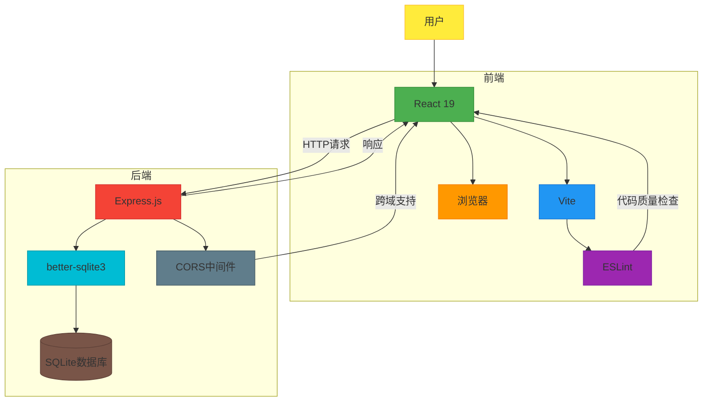

# 技术栈

<cite>
**Referenced Files in This Document**   
- [app.js](file://backend/src/app.js)
- [database.js](file://backend/src/db/database.js)
- [api.js](file://backend/src/routes/api.js)
- [dishController.js](file://backend/src/controllers/dishController.js)
- [dishService.js](file://backend/src/services/dishService.js)
- [vite.config.js](file://frontend/vite.config.js)
- [main.jsx](file://frontend/src/main.jsx)
- [App.jsx](file://frontend/src/App.jsx)
- [api.js](file://frontend/src/services/api.js)
- [package.json](file://backend/package.json)
- [package.json](file://frontend/package.json)
- [eslint.config.js](file://frontend/eslint.config.js)
</cite>

## 目录
1. [技术栈概览](#技术栈概览)
2. [前端技术](#前端技术)
3. [后端技术](#后端技术)
4. [开发工具链](#开发工具链)
5. [技术栈分层图](#技术栈分层图)
6. [总结](#总结)

## 技术栈概览

WhatEating项目采用现代化的全栈JavaScript技术栈，分为前端、后端和开发工具链三个主要部分。前端使用React 19构建用户界面，配合Vite作为构建工具，提供快速的开发体验。后端采用Express.js框架构建RESTful API，使用better-sqlite3作为数据库驱动，实现轻量级的数据存储。开发工具链包括ESLint进行代码质量检查，确保代码风格一致性和可维护性。

**Section sources**
- [package.json](file://backend/package.json)
- [package.json](file://frontend/package.json)

## 前端技术

### React 19

React 19是前端用户界面的核心框架，用于构建响应式和组件化的UI。在WhatEating项目中，React 19通过组件化架构将界面分解为可复用的独立单元，如Header、InputSection、ActionButton和ResultDisplay等组件。React的虚拟DOM机制确保了高效的UI更新，当用户交互导致状态变化时，仅重新渲染必要的部分。

React 19引入了新的API和优化，提升了开发体验和运行时性能。在App.jsx中，使用useState Hook管理应用状态，包括用户输入、菜品结果、加载状态和错误信息。组件间的通信通过props传递回调函数实现，如InputSection组件接收onChange回调来处理输入变化。

**Section sources**
- [main.jsx](file://frontend/src/main.jsx)
- [App.jsx](file://frontend/src/App.jsx)

### Vite

Vite作为现代前端构建工具，为开发过程带来了显著的体验提升。与传统打包工具不同，Vite利用浏览器原生ES模块支持，实现了按需编译，使得开发服务器启动速度极快。在vite.config.js中，配置了@vitejs/plugin-react插件来支持React开发，包括JSX转换和热模块替换（HMR）。

Vite的开发服务器提供即时热更新，当修改代码时，仅更新变更的模块，无需重新加载整个页面。这大大缩短了开发迭代周期。生产构建时，Vite使用Rollup进行代码打包和优化，生成高效的静态资源。

**Section sources**
- [vite.config.js](file://frontend/vite.config.js)

## 后端技术

### Express.js

Express.js是Node.js的轻量级Web框架，用于构建RESTful API。在app.js中，Express应用通过中间件机制组织请求处理流程。首先使用cors中间件处理跨域请求，允许前端应用访问API。接着使用express.json()和express.urlencoded()中间件解析请求体，支持JSON和URL编码格式的数据。

API路由通过/api前缀组织，由api.js定义了五个端点：获取随机菜品、获取所有菜品、搜索菜品、添加菜品和健康检查。错误处理通过全局错误中间件实现，统一返回结构化的错误响应，包含状态码、消息和开发环境下的堆栈信息。

**Section sources**
- [app.js](file://backend/src/app.js)
- [api.js](file://backend/src/routes/api.js)

### better-sqlite3

better-sqlite3是Node.js的SQLite数据库驱动，提供同步API和高性能的数据操作能力。在database.js中，初始化数据库时创建dishes表，并建立名称索引以提升搜索性能。数据库文件存储在data/dishes.db路径下，包含菜品的名称、描述、分类和创建时间等字段。

数据库操作通过预编译语句实现，提高执行效率和安全性。事务机制确保批量插入初始数据的原子性。dishService.js中的服务函数封装了数据库查询，如getRandomDish使用ORDER BY RANDOM()获取随机菜品，searchDishes使用LIKE操作符实现模糊搜索。

**Section sources**
- [database.js](file://backend/src/db/database.js)
- [dishService.js](file://backend/src/services/dishService.js)

## 开发工具链

### ESLint

ESLint是JavaScript/TypeScript的静态代码分析工具，用于保障代码质量和一致性。在eslint.config.js中，配置了多个规则集：@eslint/js的推荐规则、eslint-plugin-react-hooks的React Hook规则和eslint-plugin-react-refresh的Vite集成规则。

关键规则包括禁止未使用变量（no-unused-vars），但允许以大写字母开头的变量（如组件名）被忽略。语言选项设置为最新ECMAScript标准，支持JSX语法。通过全局忽略dist目录，避免对构建输出进行检查。

**Section sources**
- [eslint.config.js](file://frontend/eslint.config.js)

### CORS中间件

CORS（跨域资源共享）中间件解决前端和后端分离部署时的跨域问题。在app.js中，app.use(cors())启用默认CORS策略，允许所有来源的请求。这对于开发环境特别重要，因为前端运行在Vite的3000端口，而后端API运行在Express的3000端口，形成跨域请求。

CORS中间件自动处理预检请求（OPTIONS），设置适当的响应头，如Access-Control-Allow-Origin、Access-Control-Allow-Methods等，确保浏览器安全策略下API的正常访问。

**Section sources**
- [app.js](file://backend/src/app.js)

## 技术栈分层图

**Diagram sources**
- [app.js](file://backend/src/app.js)
- [vite.config.js](file://frontend/vite.config.js)
- [database.js](file://backend/src/db/database.js)

## 总结

WhatEating项目的技术栈体现了现代Web开发的最佳实践。前端采用React 19和Vite，提供高效、响应式的用户界面和卓越的开发体验。后端使用Express.js和better-sqlite3，构建轻量级、高性能的RESTful API。开发工具链通过ESLint确保代码质量，CORS中间件解决跨域问题。

对于新手开发者，该技术栈提供了清晰的学习路径：从React组件化思想到Express路由设计，再到数据库操作。对于有经验的开发者，版本选择（如React 19、Express 4.18.2）和配置细节（如Vite插件、ESLint规则）提供了优化和定制的空间。整体架构简洁明了，易于维护和扩展。