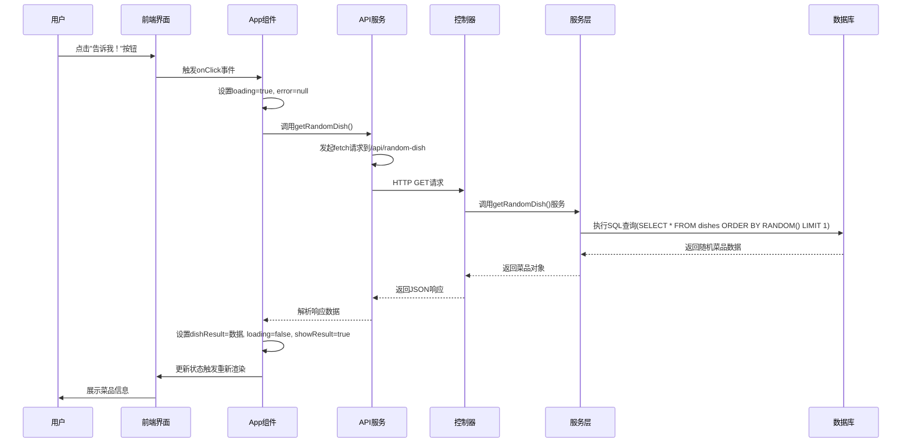
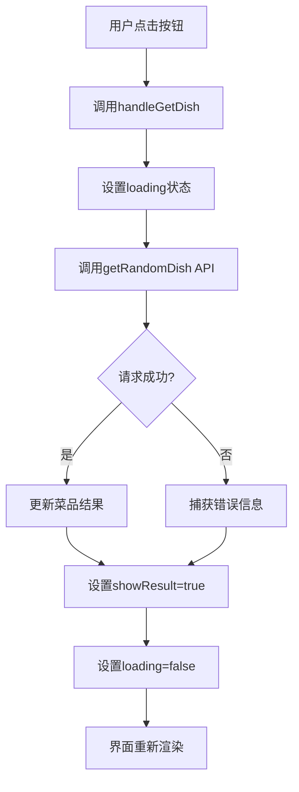

# 数据流与交互

<cite>
**Referenced Files in This Document**   
- [ActionButton.jsx](file://frontend/src/components/ActionButton.jsx)
- [App.jsx](file://frontend/src/App.jsx)
- [api.js](file://frontend/src/services/api.js)
- [dishController.js](file://backend/src/controllers/dishController.js)
- [dishService.js](file://backend/src/services/dishService.js)
- [database.js](file://backend/src/db/database.js)
- [ResultDisplay.jsx](file://frontend/src/components/ResultDisplay.jsx)
- [api.js](file://backend/src/routes/api.js)
</cite>

## 目录
1. [简介](#简介)
2. [核心数据流分析](#核心数据流分析)
3. [端到端序列图](#端到端序列图)
4. [异步操作处理](#异步操作处理)
5. [数据一致性保障](#数据一致性保障)
6. [调试技巧](#调试技巧)
7. [结论](#结论)

## 简介
本文档详尽描绘了WhatEating应用中端到端的数据流动过程，从用户界面操作开始，经过前端状态变化，通过HTTP请求到达后端API，再经由控制器、服务层最终写入数据库，以及反向的数据读取和展示流程。重点分析了点击“告诉我！”按钮触发随机菜品推荐的完整链条。

## 核心数据流分析

### 前端触发流程
当用户点击“告诉我！”按钮时，前端组件`ActionButton`触发`onClick`事件，该事件由`App`组件中的`handleGetDish`函数处理。此函数负责管理应用状态，包括加载状态、错误处理和结果展示。

**Section sources**
- [ActionButton.jsx](file://frontend/src/components/ActionButton.jsx#L2-L14)
- [App.jsx](file://frontend/src/App.jsx#L15-L37)

### API调用流程
`handleGetDish`函数调用`getRandomDish` API服务函数，该函数使用`fetch`发起HTTP GET请求到后端`/api/random-dish`端点。请求处理包含了完整的错误处理机制，能够区分网络错误和业务逻辑错误。

**Section sources**
- [api.js](file://frontend/src/services/api.js#L2-L22)
- [App.jsx](file://frontend/src/App.jsx#L20-L35)

### 后端处理流程
后端接收到请求后，由`api.js`路由文件将请求分发到`dishController.js`中的`getRandomDish`控制器函数。该控制器调用`dishService.js`中的服务层函数，最终通过`database.js`访问SQLite数据库，执行SQL查询获取随机菜品。

**Section sources**
- [api.js](file://backend/src/routes/api.js#L6)
- [dishController.js](file://backend/src/controllers/dishController.js#L3-L24)
- [dishService.js](file://backend/src/services/dishService.js#L3-L10)

### 数据库交互
服务层通过`better-sqlite3`库与数据库交互，执行`SELECT * FROM dishes ORDER BY RANDOM() LIMIT 1` SQL语句获取随机菜品。数据库初始化脚本还包含了创建表结构和插入初始数据的功能。

**Section sources**
- [database.js](file://backend/src/db/database.js#L28-L31)
- [dishService.js](file://backend/src/services/dishService.js#L5)

### 结果展示流程
获取到菜品数据后，前端通过`ResultDisplay`组件将菜品信息渲染到用户界面，包括菜品名称、描述和分类。如果发生错误，则显示相应的错误信息。

**Section sources**
- [ResultDisplay.jsx](file://frontend/src/components/ResultDisplay.jsx#L3-L34)
- [App.jsx](file://frontend/src/App.jsx#L38-L49)

## 端到端序列图

**Diagram sources**
- [ActionButton.jsx](file://frontend/src/components/ActionButton.jsx)
- [App.jsx](file://frontend/src/App.jsx)
- [api.js](file://frontend/src/services/api.js)
- [dishController.js](file://backend/src/controllers/dishController.js)
- [dishService.js](file://backend/src/services/dishService.js)
- [database.js](file://backend/src/db/database.js)

## 异步操作处理

### 前端异步处理
前端使用`async/await`语法处理异步操作，确保代码的可读性和可维护性。`getRandomDish`函数封装了`fetch`请求，处理了网络错误和API响应错误，并提供了用户友好的错误信息。

**Diagram sources**
- [App.jsx](file://frontend/src/App.jsx#L15-L37)
- [api.js](file://frontend/src/services/api.js#L2-L22)

### 后端异步处理
后端使用Express框架处理HTTP请求，控制器函数同步调用服务层函数。服务层函数虽然在语法上是同步的，但由于SQLite操作的特性，实际上也是异步完成的。

**Section sources**
- [dishController.js](file://backend/src/controllers/dishController.js#L3-L24)
- [dishService.js](file://backend/src/services/dishService.js#L3-L10)

## 数据一致性保障

### 错误处理机制
系统在前后端都实现了完善的错误处理机制。前端能够区分网络连接错误和API业务错误，提供相应的用户提示。后端控制器使用try-catch捕获异常，返回标准化的错误响应。

### 状态管理
前端使用React的`useState`钩子管理应用状态，确保UI与数据状态保持一致。当发起请求时，立即更新loading状态，防止用户重复点击。

### 响应验证
前端在接收到API响应后，不仅检查HTTP状态码，还检查响应体中的`success`字段，确保业务逻辑层面的成功。

**Section sources**
- [api.js](file://frontend/src/services/api.js#L8-L18)
- [dishController.js](file://backend/src/controllers/dishController.js#L10-L18)

## 调试技巧

### 浏览器开发者工具
1. **网络面板**：监控`/api/random-dish`请求，检查请求头、响应状态码和响应体
2. **控制台**：查看API调用过程中的错误信息
3. **React开发者工具**：检查组件状态变化，特别是`loading`、`dishResult`和`error`状态

### 服务器日志
1. **数据库初始化日志**：检查`Database initialized successfully`和`Seeded X dishes successfully`日志，确保数据库正常
2. **错误日志**：查看控制器中的错误处理，定位SQL查询或业务逻辑问题
3. **请求日志**：通过Express的中间件记录请求信息，追踪请求处理过程

### 调试建议
- 当遇到"网络连接失败"错误时，首先检查后端服务是否在3000端口运行
- 当返回"暂无菜单数据"时，检查数据库文件是否存在且包含数据
- 使用Postman或curl直接测试API端点，隔离前端问题

**Section sources**
- [api.js](file://frontend/src/services/api.js#L19-L22)
- [dishController.js](file://backend/src/controllers/dishController.js#L10-L18)
- [database.js](file://backend/src/db/database.js#L75-L77)

## 结论
WhatEating应用的数据流设计清晰，从前端用户交互到后端数据存储形成了完整的闭环。通过合理的分层架构，前端负责用户界面和状态管理，后端负责业务逻辑和数据持久化。异步操作的处理确保了用户体验的流畅性，而完善的错误处理机制提高了应用的健壮性。开发者可以利用浏览器开发者工具和服务器日志有效地调试数据流问题。