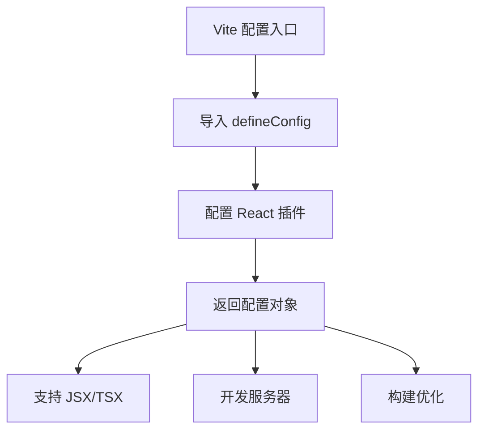
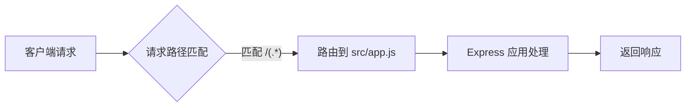

# 环境配置

<cite>
**本文档引用的文件**  
- [vite.config.js](file://frontend/vite.config.js)
- [vercel.json](file://backend/vercel.json)
- [api.js](file://frontend/src/services/api.js)
- [app.js](file://backend/src/app.js)
- [package.json](file://frontend/package.json)
- [package.json](file://backend/package.json)
</cite>

## 目录
1. [简介](#简介)
2. [项目结构](#项目结构)
3. [Vite 构建工具配置](#vite-构建工具配置)
4. [Vercel 部署配置](#vercel-部署配置)
5. [环境变量管理建议](#环境变量管理建议)
6. [本地开发环境搭建步骤](#本地开发环境搭建步骤)
7. [配置修改注意事项](#配置修改注意事项)

## 简介
本指南详细说明了 WhatEating 项目的环境配置，涵盖开发、测试和生产环境的设置。重点解析前端 Vite 构建工具和后端 Vercel 部署的配置细节，为开发者提供完整的本地开发环境搭建流程。

## 项目结构
WhatEating 是一个全栈应用，包含独立的前端和后端模块：

```
WhatEating/
├── backend/              # 后端服务（Node.js + Express）
│   ├── src/              # 源代码
│   ├── package.json      # 依赖管理
│   └── vercel.json       # Vercel 部署配置
└── frontend/             # 前端应用（React + Vite）
    ├── src/              # 源代码
    ├── vite.config.js    # Vite 构建配置
    └── package.json      # 依赖管理
```

前后端分离架构便于独立开发、测试和部署。

**Section sources**
- [README.md](file://README.md#L15-L30)

## Vite 构建工具配置

### 基础配置
`vite.config.js` 文件定义了前端构建的核心配置：



当前配置已包含 React 插件，支持现代前端开发需求。

### 开发服务器与代理
虽然当前 `vite.config.js` 未显式配置开发服务器选项，但可通过扩展配置实现：

```javascript
export default defineConfig({
  plugins: [react()],
  server: {
    port: 5174,
    proxy: {
      '/api': {
        target: 'http://localhost:3000',
        changeOrigin: true,
        secure: false
      }
    }
  }
})
```

此代理设置可解决跨域问题，将前端 `/api` 请求代理到后端服务。

### 构建输出选项
Vite 默认构建输出到 `dist/` 目录，可通过以下配置自定义：

```javascript
export default defineConfig({
  plugins: [react()],
  build: {
    outDir: 'dist',
    assetsDir: 'assets',
    sourcemap: false
  }
})
```

**Diagram sources**
- [vite.config.js](file://frontend/vite.config.js#L1-L8)

**Section sources**
- [vite.config.js](file://frontend/vite.config.js#L1-L8)
- [package.json](file://frontend/package.json#L6-L9)

## Vercel 部署配置

### 部署文件结构
`vercel.json` 定义了后端服务在 Vercel 平台的部署规则：

```json
{
  "version": 2,
  "builds": [
    {
      "src": "src/app.js",
      "use": "@vercel/node"
    }
  ],
  "routes": [
    {
      "src": "/(.*)",
      "dest": "src/app.js"
    }
  ]
}
```

### 构建配置解析
`builds` 字段指定使用 `@vercel/node` 运行时构建 `src/app.js` 文件，确保 Node.js 环境正确配置。

### 重写规则详解
`routes` 中的重写规则将所有请求路由到应用入口：



此配置确保 API 请求（如 `/api/random-dish`）能被正确路由到后端服务。

**Diagram sources**
- [vercel.json](file://backend/vercel.json#L1-L15)
- [app.js](file://backend/src/app.js#L1-L10)

**Section sources**
- [vercel.json](file://backend/vercel.json#L1-L15)
- [app.js](file://backend/src/app.js#L1-L10)

## 环境变量管理建议

### 当前状态
项目目前未显式使用环境变量，API 地址硬编码在 `frontend/src/services/api.js` 中：

```javascript
const API_BASE_URL = 'http://localhost:3000/api';
```

### 推荐实践
建议引入环境变量管理以支持多环境部署：

```bash
# .env.development
VITE_API_BASE_URL=http://localhost:3000/api

# .env.production  
VITE_API_BASE_URL=https://your-production-api.com/api
```

在代码中使用：

```javascript
const API_BASE_URL = import.meta.env.VITE_API_BASE_URL;
```

Vite 会自动加载 `.env` 文件中的变量，前缀 `VITE_` 确保变量暴露给客户端。

**Section sources**
- [api.js](file://frontend/src/services/api.js#L1-L2)
- [vite.config.js](file://frontend/vite.config.js#L1-L8)

## 本地开发环境搭建步骤

### 1. 环境准备
确保已安装：
- Node.js（v14+）
- npm 或 yarn

### 2. 后端启动
```bash
cd backend
npm install
npm start
```
服务将运行在 `http://localhost:3000`

### 3. 前端启动
```bash
cd frontend
npm install
npm run dev
```
应用将运行在 `http://localhost:5174`

### 4. 验证连接
- 访问前端页面并点击"告诉我！"
- 检查控制台是否有错误
- 验证后端日志显示请求记录

**Section sources**
- [README.md](file://README.md#L50-L70)
- [app.js](file://backend/src/app.js#L10-L15)
- [package.json](file://backend/package.json#L7-L9)
- [package.json](file://frontend/package.json#L6-L9)

## 配置修改注意事项

### 配置文件修改原则
1. **备份原始配置**：修改前创建备份
2. **逐步验证**：每次只修改一个配置项
3. **测试覆盖**：确保所有功能在修改后仍正常工作

### Vite 配置修改
添加服务器配置时，确保代理目标与后端实际端口一致：

```javascript
server: {
  port: 5174, // 不要与后端端口冲突
  proxy: {
    '/api': {
      target: 'http://localhost:3000', // 必须匹配后端端口
      changeOrigin: true
    }
  }
}
```

### Vercel 配置修改
修改 `vercel.json` 时注意：
- `src` 路径必须指向正确的入口文件
- `routes` 规则不能破坏现有 API 路由
- 版本号保持最新兼容版本

**Section sources**
- [vite.config.js](file://frontend/vite.config.js#L1-L8)
- [vercel.json](file://backend/vercel.json#L1-L15)
- [app.js](file://backend/src/app.js#L10-L15)