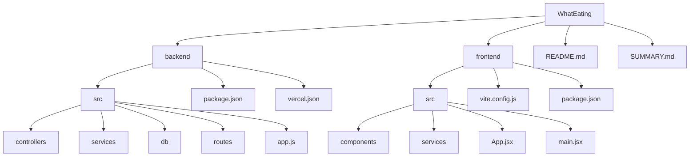
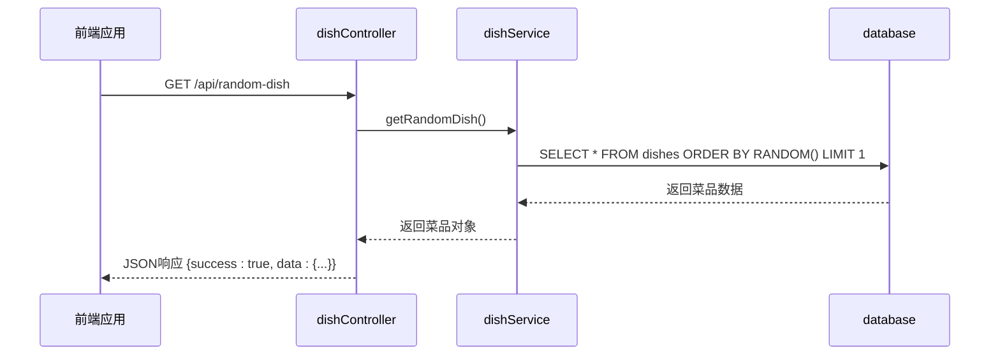
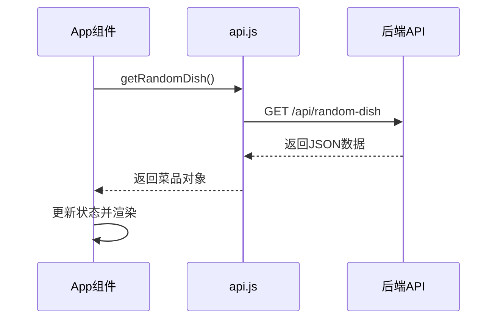

# 目录结构详解

<cite>
**本文档引用的文件**  
- [app.js](file://backend/src/app.js)
- [dishController.js](file://backend/src/controllers/dishController.js)
- [dishService.js](file://backend/src/services/dishService.js)
- [database.js](file://backend/src/db/database.js)
- [api.js](file://backend/src/routes/api.js)
- [App.jsx](file://frontend/src/App.jsx)
- [ActionButton.jsx](file://frontend/src/components/ActionButton.jsx)
- [Header.jsx](file://frontend/src/components/Header.jsx)
- [InputSection.jsx](file://frontend/src/components/InputSection.jsx)
- [ResultDisplay.jsx](file://frontend/src/components/ResultDisplay.jsx)
- [api.js](file://frontend/src/services/api.js)
- [vite.config.js](file://frontend/vite.config.js)
- [vercel.json](file://backend/vercel.json)
</cite>

## 目录结构

WhatEating项目采用前后端分离的架构，整体结构清晰，模块职责分明。根目录下包含`backend`和`frontend`两个核心模块，分别对应后端服务和前端应用。此外，`README.md`和`SUMMARY.md`提供项目说明和概要信息。

后端基于Node.js和Express框架构建，采用MVC设计模式，代码组织在`backend/src`目录中，分为`controllers`、`services`、`db`和`routes`四个子模块，职责明确。前端基于React和Vite构建，`frontend/src`目录下包含组件化UI和API服务封装。



**Diagram sources**  
- [backend](file://backend)
- [frontend](file://frontend)

## 后端MVC结构解析

WhatEating后端采用典型的MVC（Model-View-Controller）架构模式，尽管本项目无前端渲染视图，但其逻辑分层依然遵循MVC原则，将请求处理、业务逻辑和数据访问进行解耦，提升代码可维护性和可测试性。

### 控制器（Controllers）

控制器位于`backend/src/controllers`目录，负责处理HTTP请求和响应。`dishController.js`文件中定义了多个接口处理函数，如`getRandomDish`用于获取随机菜品，`addDish`用于添加新菜品。控制器不包含复杂业务逻辑，仅负责参数校验、调用服务层方法并返回标准化响应。

**Section sources**  
- [dishController.js](file://backend/src/controllers/dishController.js#L3-L24)
- [dishController.js](file://backend/src/controllers/dishController.js#L77-L100)

### 服务层（Services）

服务层位于`backend/src/services`目录，封装核心业务逻辑。`dishService.js`文件中的`getRandomDish`和`addDish`函数实现了具体的业务规则，如从数据库随机查询菜品或插入新菜品记录。服务层作为控制器与数据访问层之间的桥梁，确保业务逻辑的复用性和独立性。



**Diagram sources**  
- [dishController.js](file://backend/src/controllers/dishController.js#L3-L24)
- [dishService.js](file://backend/src/services/dishService.js#L3-L10)
- [database.js](file://backend/src/db/database.js)

### 数据访问层（DB）

数据访问层位于`backend/src/db`目录，由`database.js`文件实现。该文件使用better-sqlite3库管理SQLite数据库连接，并提供`initializeDatabase`和`seedInitialData`函数用于初始化表结构和填充初始菜品数据。所有SQL查询均在此层执行，确保数据操作的安全性和一致性。

**Section sources**  
- [database.js](file://backend/src/db/database.js#L1-L97)

### 路由定义（Routes）

路由配置位于`backend/src/routes`目录，`api.js`文件定义了所有API端点及其对应的控制器处理函数。通过Express的Router机制，将`/random-dish`、`/dishes`等路径映射到具体的控制器方法，实现请求分发。

```mermaid
flowchart TD
A[/api/random-dish] --> B[dishController.getRandomDish]
C[/api/dishes] --> D[dishController.getAllDishes]
E[/api/search] --> F[dishController.searchDishes]
G[/api/dishes] --> H[dishController.addDish]
subgraph 路由模块
A; C; E; G
end
subgraph 控制器模块
B; D; F; H
end
```

**Diagram sources**  
- [api.js](file://backend/src/routes/api.js#L1-L18)

## 前端组件化设计

前端采用React组件化架构，将UI拆分为多个独立、可复用的组件，位于`frontend/src/components`目录。

### UI组件结构

- `Header.jsx`：显示页面标题和副标题
- `InputSection.jsx`：提供文本输入框，用于输入搜索关键词
- `ActionButton.jsx`：可点击按钮，支持加载状态显示
- `ResultDisplay.jsx`：展示菜品结果，支持错误提示

这些组件通过props接收数据和回调函数，实现单向数据流，确保状态管理清晰。

**Section sources**  
- [Header.jsx](file://frontend/src/components/Header.jsx#L1-L12)
- [InputSection.jsx](file://frontend/src/components/InputSection.jsx#L1-L17)
- [ActionButton.jsx](file://frontend/src/components/ActionButton.jsx#L1-L17)
- [ResultDisplay.jsx](file://frontend/src/components/ResultDisplay.jsx#L1-L34)

### API服务封装

`frontend/src/services/api.js`文件封装了所有对后端API的调用，提供`getRandomDish`、`addDish`等异步函数。该文件统一处理网络请求、响应解析和错误转换，如将`Failed to fetch`错误转换为更友好的提示信息，提升用户体验。



**Diagram sources**  
- [api.js](file://frontend/src/services/api.js#L2-L22)
- [api.js](file://frontend/src/services/api.js#L60-L83)

## 配置文件说明

### Vite配置

`vite.config.js`是前端构建工具Vite的配置文件，通过`defineConfig`定义项目构建选项。当前配置仅启用React插件，支持JSX语法解析，适用于标准React项目开发。

**Section sources**  
- [vite.config.js](file://frontend/vite.config.js#L1-L8)

### Vercel部署配置

`vercel.json`是Vercel平台的部署配置文件，指定项目版本为2，构建目标为`src/app.js`，并使用`@vercel/node`运行时。所有请求路由`/(.*)`均指向`src/app.js`，确保Express应用能正确处理所有HTTP请求。

**Section sources**  
- [vercel.json](file://backend/vercel.json#L1-L16)

## 模块化设计总结

WhatEating项目通过清晰的目录结构和分层架构，体现了良好的模块化设计原则：

1. **关注点分离**：前后端分离，后端MVC分层，前端组件化
2. **职责单一**：每个文件和函数都有明确职责
3. **可维护性**：代码结构清晰，易于理解和修改
4. **可扩展性**：新增功能可遵循现有模式快速开发

这种结构有助于新开发者快速定位关键文件，理解项目整体架构，是现代Web应用开发的最佳实践。

**Section sources**  
- [app.js](file://backend/src/app.js#L1-L64)
- [App.jsx](file://frontend/src/App.jsx#L1-L49)