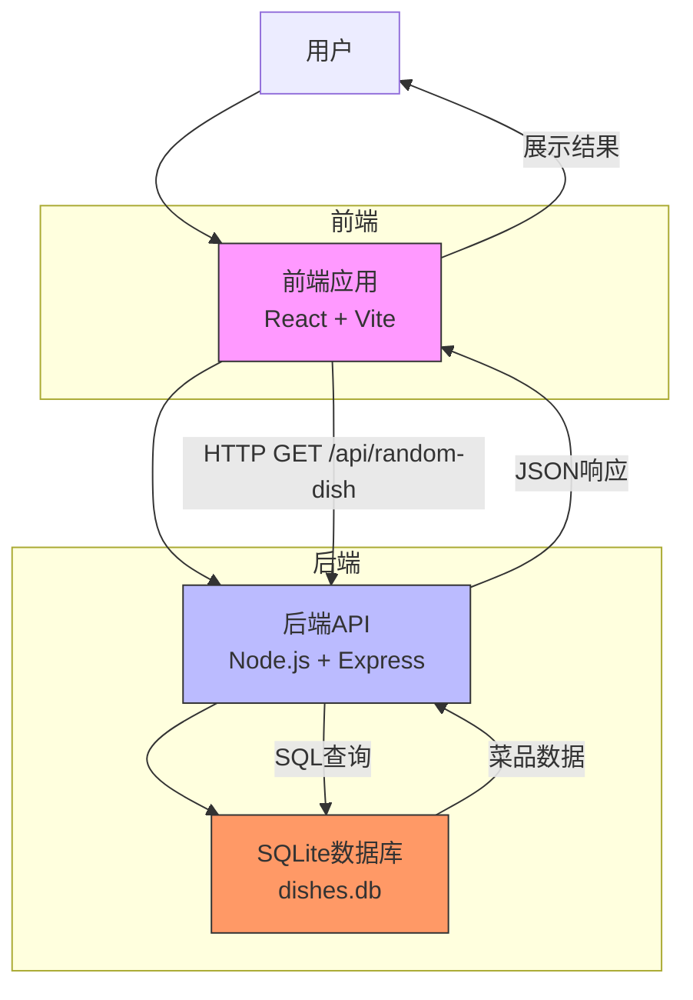

# 系统概述

<cite>
**本文档引用文件**  
- [app.js](file://backend/src/app.js)
- [database.js](file://backend/src/db/database.js)
- [api.js](file://backend/src/routes/api.js)
- [dishService.js](file://backend/src/services/dishService.js)
- [dishController.js](file://backend/src/controllers/dishController.js)
- [App.jsx](file://frontend/src/App.jsx)
- [api.js](file://frontend/src/services/api.js)
- [ActionButton.jsx](file://frontend/src/components/ActionButton.jsx)
- [ResultDisplay.jsx](file://frontend/src/components/ResultDisplay.jsx)
- [README.md](file://README.md)
- [SUMMARY.md](file://SUMMARY.md)
</cite>

## 目录
1. [项目简介](#项目简介)
2. [整体架构](#整体架构)
3. [核心功能模块](#核心功能模块)
4. [技术选型分析](#技术选型分析)
5. [用户工作流](#用户工作流)
6. [系统上下文图](#系统上下文图)
7. [设计哲学与发展目标](#设计哲学与发展目标)

## 项目简介

“WhatEating”是一款旨在解决“今天吃什么”这一日常选择难题的全栈Web应用。通过随机推荐、搜索和添加菜品三大核心功能，帮助用户快速做出饮食决策。项目采用前后端分离架构，在3天内高效完成开发，包含30+道涵盖川菜、粤菜、家常菜、面食、快餐等类别的初始菜品数据。

该应用不仅具备实用功能，还注重用户体验，前端采用橙红渐变主题与动画效果，实现美观且响应式的界面；后端提供稳定API服务，支持健康检查与错误处理，具备生产部署能力（已配置Vercel部署文件）。

**Section sources**
- [README.md](file://README.md#L1-L113)
- [SUMMARY.md](file://SUMMARY.md#L1-L88)

## 整体架构

WhatEating采用典型的前后端分离架构，前端与后端通过HTTP API进行通信，数据库独立部署，形成清晰的三层结构：

- **前端层**：基于React + Vite构建，负责用户界面展示与交互逻辑，通过Fetch API调用后端服务。
- **后端层**：基于Node.js + Express构建，提供RESTful API接口，处理业务逻辑与数据验证。
- **数据层**：使用SQLite轻量级数据库，通过better-sqlite3驱动进行数据持久化存储。

后端遵循分层架构设计：
- **数据库层**（database.js）：负责表结构初始化、索引创建与数据填充。
- **服务层**（dishService.js）：封装核心业务逻辑，如随机推荐、搜索、分页等。
- **控制器层**（dishController.js）：处理HTTP请求，调用服务层方法并返回响应。
- **路由层**（api.js）：定义API端点，将请求映射到对应控制器。

这种分层设计提升了代码的可维护性与可测试性。

**Section sources**
- [app.js](file://backend/src/app.js#L1-L64)
- [database.js](file://backend/src/db/database.js#L1-L96)
- [dishService.js](file://backend/src/services/dishService.js#L1-L64)
- [dishController.js](file://backend/src/controllers/dishController.js#L1-L101)
- [api.js](file://backend/src/routes/api.js#L1-L18)

## 核心功能模块

### 随机推荐
用户点击“告诉我！”按钮后，系统从数据库中随机返回一道菜品。该功能通过SQL的`ORDER BY RANDOM()`实现，确保每次推荐的公平性与多样性。

### 搜索功能
用户可通过关键词搜索菜品名称或描述。后端使用`LIKE`语句进行模糊匹配，并建立数据库索引以提升查询性能。

### 添加菜品
支持通过POST请求向数据库添加新菜品，包含名称、描述和分类字段。后端对输入进行基本验证（如名称不能为空），确保数据完整性。

### 分页浏览
`/api/dishes`接口支持分页参数（page, limit），返回当前页数据及总页数信息，便于前端实现分页控件。

### 健康检查
`/health`端点用于检查后端服务运行状态，返回JSON格式的健康信息，适用于部署监控。

**Section sources**
- [dishService.js](file://backend/src/services/dishService.js#L3-L64)
- [dishController.js](file://backend/src/controllers/dishController.js#L3-L101)
- [api.js](file://backend/src/routes/api.js#L1-L18)

## 技术选型分析

### 前端：React + Vite
选择React因其组件化思想有利于UI复用与状态管理，Vite提供快速的开发服务器启动与热更新体验，显著提升开发效率。React的声明式编程模型使UI逻辑更清晰，适合构建交互式单页应用。

### 后端：Express.js
Express作为Node.js最流行的Web框架，提供了简洁的路由、中间件机制与HTTP处理能力。其轻量级特性与高灵活性非常适合构建API服务，且社区生态丰富，易于集成CORS、JSON解析等功能。

### 数据库：SQLite
SQLite作为嵌入式数据库，无需独立服务器进程，数据存储为单个文件（`dishes.db`），极大简化了部署与维护成本。对于本项目这种低并发、读多写少的应用场景，SQLite在性能与可靠性上完全满足需求，且天然支持ACID事务。

### 前后端分离优势
- **开发解耦**：前后端可并行开发，通过API契约协作。
- **技术独立**：可分别选择最适合的技术栈。
- **部署灵活**：前端可部署至CDN，后端部署至Serverless平台（如Vercel）。
- **可扩展性**：便于未来支持多端（如移动端）共享同一后端服务。

**Section sources**
- [README.md](file://README.md#L15-L30)
- [SUMMARY.md](file://SUMMARY.md#L10-L25)
- [package.json](file://backend/package.json#L1-L22)
- [package.json](file://frontend/package.json#L1-L30)

## 用户工作流

1. 用户访问前端应用（`http://localhost:5174`）。
2. 点击“告诉我！”按钮，触发`getRandomDish()`函数。
3. 前端通过Fetch API向`http://localhost:3000/api/random-dish`发起GET请求。
4. 后端接收到请求，调用`dishService.getRandomDish()`从数据库随机获取一道菜品。
5. 后端将菜品数据以JSON格式返回给前端。
6. 前端接收到数据后，更新状态并渲染结果卡片，展示菜品名称、描述与分类。
7. 若请求失败（如网络问题或后端未运行），前端捕获错误并显示“网络连接失败”提示。

此工作流体现了典型的前后端交互模式，从前端用户操作到后端数据响应的完整闭环。

**Section sources**
- [App.jsx](file://frontend/src/App.jsx#L1-L49)
- [api.js](file://frontend/src/services/api.js#L2-L22)
- [dishController.js](file://backend/src/controllers/dishController.js#L3-L24)
- [dishService.js](file://backend/src/services/dishService.js#L3-L10)
- [ActionButton.jsx](file://frontend/src/components/ActionButton.jsx#L1-L17)
- [ResultDisplay.jsx](file://frontend/src/components/ResultDisplay.jsx#L1-L34)

## 系统上下文图

**Diagram sources**
- [App.jsx](file://frontend/src/App.jsx#L1-L49)
- [api.js](file://frontend/src/services/api.js#L2-L22)
- [app.js](file://backend/src/app.js#L1-L64)
- [database.js](file://backend/src/db/database.js#L1-L96)

## 设计哲学与发展目标

### 设计哲学
- **极简主义**：专注于解决单一问题（吃什么），避免功能臃肿。
- **快速交付**：3天内完成全栈开发，体现MVP（最小可行产品）理念。
- **用户体验优先**：通过渐变色彩、动画效果与清晰的错误提示提升交互体验。
- **部署就绪**：包含Vercel部署配置，支持快速上线。

### 发展目标（来自SUMMARY.md建议）
1. **生产部署**：将前后端分别部署至Vercel/Netlify等平台，实现公网访问。
2. **功能扩展**：
   - 实现前端搜索功能
   - 添加菜品收藏与历史记录
   - 支持菜品图片上传
   - 按分类筛选
3. **质量提升**：
   - 添加单元测试与集成测试
   - 进行性能优化与SEO改进
   - 支持PWA（渐进式Web应用）

项目已具备完整的基础功能与清晰的演进路径，可作为学习全栈开发的优秀实践案例。

**Section sources**
- [SUMMARY.md](file://SUMMARY.md#L60-L88)
- [README.md](file://README.md#L1-L113)