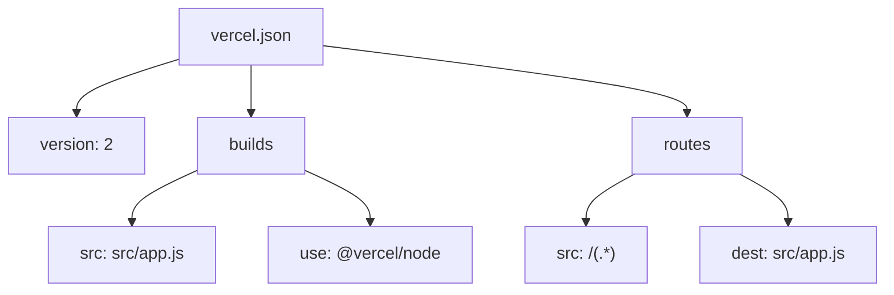
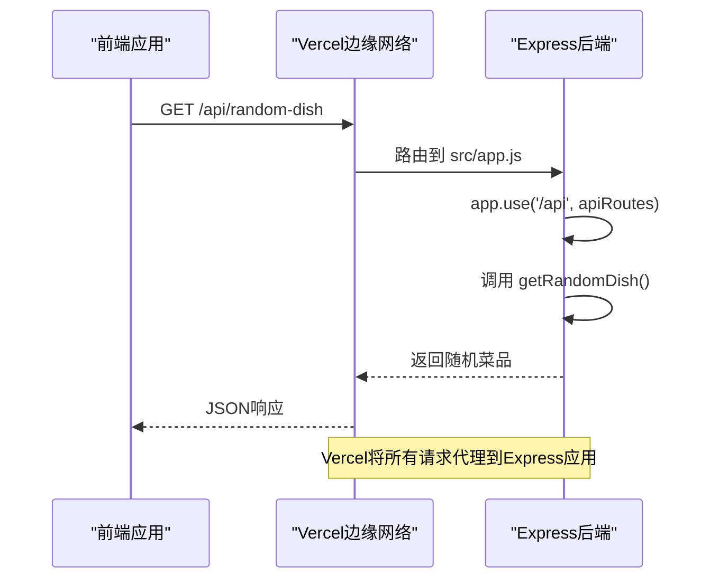
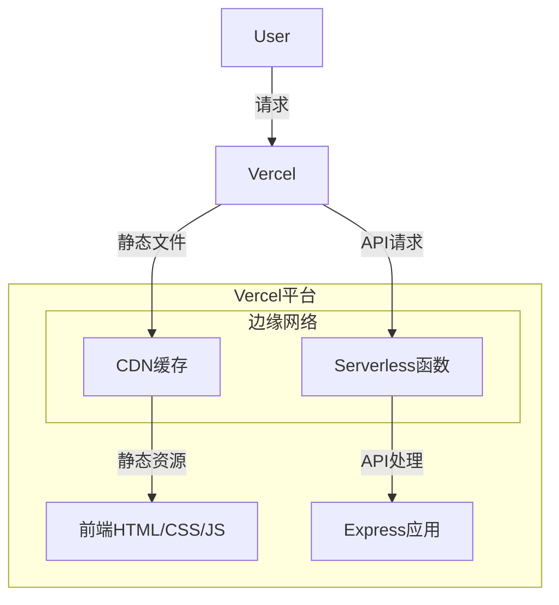
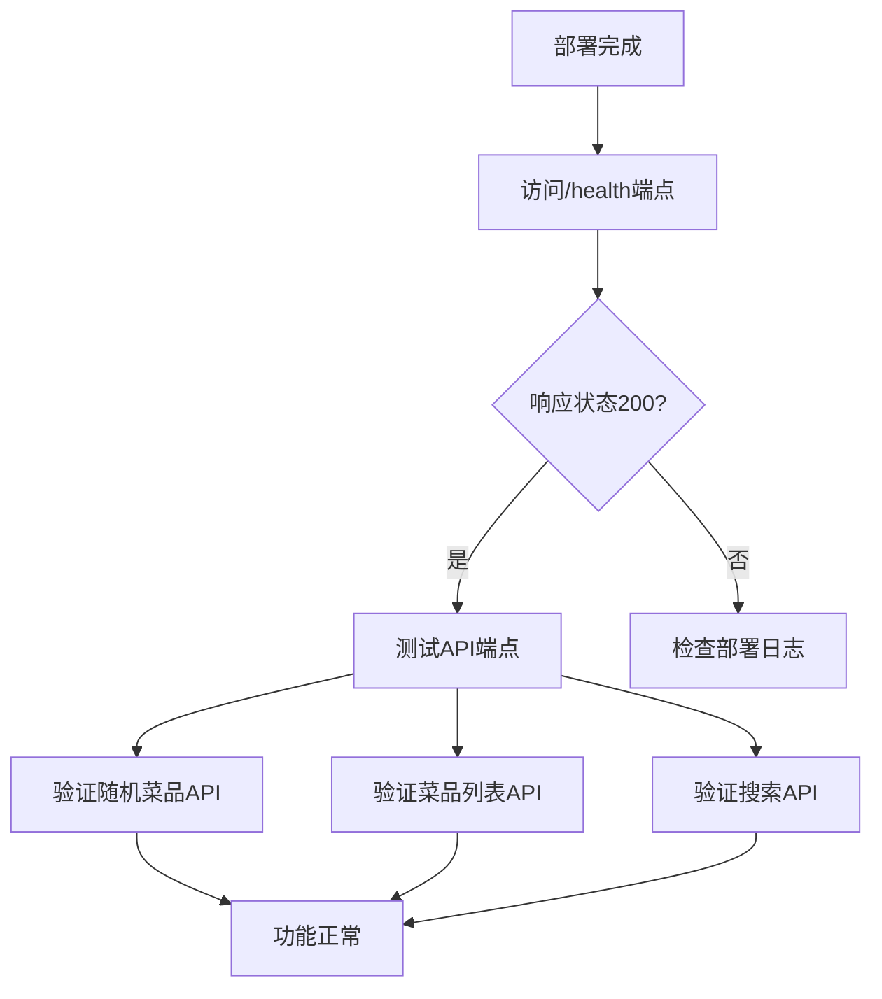

# 部署配置

<cite>
**本文档引用的文件**  
- [vercel.json](file://backend/vercel.json)
- [app.js](file://backend/src/app.js)
- [api.js](file://backend/src/routes/api.js)
- [database.js](file://backend/src/db/database.js)
- [api.js](file://frontend/src/services/api.js)
- [README.md](file://README.md)
</cite>

## 目录
1. [简介](#简介)
2. [项目结构](#项目结构)
3. [Vercel部署配置](#vercel部署配置)
4. [后端API代理机制](#后端api代理机制)
5. [完整部署流程](#完整部署流程)
6. [部署策略](#部署策略)
7. [高级配置](#高级配置)
8. [部署后验证](#部署后验证)
9. [结论](#结论)

## 简介
本文档详细说明了WhatEating全栈应用在Vercel平台上的部署配置。WhatEating是一款解决"今天吃什么"难题的美食推荐应用，包含React前端和Node.js/Express后端。文档重点解析了Vercel的部署机制，特别是如何通过`vercel.json`配置文件将API请求代理到后端服务，确保前后端能够无缝协作。

**Section sources**
- [README.md](file://README.md#L1-L20)

## 项目结构
WhatEating项目采用清晰的前后端分离架构，分为`backend`和`frontend`两个主要目录。后端使用Node.js + Express框架，前端使用React + Vite构建。这种结构使得前后端可以独立开发、测试和部署。

```
WhatEating/
├── backend/              # 后端服务
│   ├── src/
│   │   ├── db/          # 数据库相关
│   │   ├── routes/      # 路由定义
│   │   ├── controllers/ # 控制器
│   │   ├── services/    # 业务逻辑
│   │   └── app.js       # 应用入口
│   └── vercel.json      # Vercel部署配置
└── frontend/            # 前端应用
    ├── src/
    │   ├── components/  # React组件
    │   ├── services/    # API服务
    └── vite.config.js   # Vite构建配置
```

**Diagram sources**
- [README.md](file://README.md#L25-L50)

## Vercel部署配置
Vercel部署的核心是`backend/vercel.json`文件，它定义了如何构建和路由后端应用。该配置文件确保Express应用能够在Vercel的Serverless环境中正确运行。



**Diagram sources**
- [vercel.json](file://backend/vercel.json#L1-L15)

### 构建配置
`vercel.json`中的`builds`部分指定了如何构建后端应用：
- `src`: 指定入口文件为`src/app.js`
- `use`: 使用`@vercel/node`构建器，这是Vercel为Node.js应用提供的官方构建器

### 路由配置
`routes`部分定义了请求路由规则，将所有路径的请求都指向`src/app.js`，确保Express应用能够处理所有传入的HTTP请求。

**Section sources**
- [vercel.json](file://backend/vercel.json#L1-L15)

## 后端API代理机制
WhatEating应用的API代理机制基于Express的路由中间件和Vercel的请求路由规则共同实现。这种机制确保了所有以`/api`开头的请求都能正确路由到相应的API处理函数。



**Diagram sources**
- [app.js](file://backend/src/app.js#L15-L25)
- [api.js](file://backend/src/routes/api.js#L1-L10)

### Express路由集成
在`backend/src/app.js`中，通过`app.use('/api', apiRoutes)`将API路由挂载到`/api`路径下。这意味着所有以`/api`开头的请求都会被转发到`apiRoutes`处理。

### 路由定义
`backend/src/routes/api.js`文件定义了具体的API端点，包括：
- `GET /random-dish`: 获取随机推荐菜品
- `GET /dishes`: 获取所有菜品列表
- `GET /search`: 搜索菜品
- `POST /dishes`: 添加新菜品

**Section sources**
- [app.js](file://backend/src/app.js#L15-L25)
- [api.js](file://backend/src/routes/api.js#L1-L19)

## 完整部署流程
从代码提交到生产环境部署的完整流程如下：


**Diagram sources**
- [vercel.json](file://backend/vercel.json#L1-L15)
- [README.md](file://README.md#L80-L90)

### 步骤详解
1. **代码推送**: 开发者将代码推送到GitHub仓库
2. **自动检测**: Vercel监控GitHub仓库，检测到代码变更
3. **代码拉取**: Vercel自动拉取最新的代码
4. **构建过程**: 根据`vercel.json`配置构建后端应用
5. **部署执行**: 将构建结果部署到Vercel的全球边缘网络
6. **域名分配**: 为部署分配临时预览URL和生产域名

**Section sources**
- [README.md](file://README.md#L80-L90)

## 部署策略
WhatEating采用混合部署策略，将静态前端文件和动态后端API分开处理，但统一部署在Vercel平台上。

### 静态文件部署
前端使用Vite构建，生成静态文件部署到Vercel的CDN网络：
- 构建命令: `npm run build`
- 输出目录: `dist/`
- 部署到Vercel的边缘缓存

### 动态API部署
后端API作为Serverless函数部署：
- 使用`@vercel/node`构建器
- 每个请求触发新的函数实例
- 自动扩展以处理流量高峰



**Diagram sources**
- [vercel.json](file://backend/vercel.json#L1-L15)
- [vite.config.js](file://frontend/vite.config.js#L1-L8)

**Section sources**
- [vercel.json](file://backend/vercel.json#L1-L15)
- [vite.config.js](file://frontend/vite.config.js#L1-L8)

## 高级配置
### 自定义域名配置
在Vercel仪表板中，可以为部署添加自定义域名：
1. 进入项目设置
2. 在"Domains"部分添加自定义域名
3. 按照提示配置DNS记录
4. 等待SSL证书自动配置完成

### 环境变量设置
通过Vercel仪表板设置环境变量：
- `NODE_ENV`: 设置为`production`
- 数据库连接字符串等敏感信息
- API密钥和其他配置

### 部署监控
Vercel提供全面的部署监控功能：
- 实时构建日志
- 性能监控
- 错误追踪
- 流量分析

**Section sources**
- [README.md](file://README.md#L85-L90)

## 部署后验证
部署完成后，必须进行健康检查以确保所有功能正常工作。

### 健康检查端点
应用提供了`/health`端点用于健康检查：
```bash
curl https://your-deployment-url/health
```
预期响应：
```json
{
  "status": "ok",
  "timestamp": "2024-01-01T00:00:00.000Z"
}
```

### API端点验证
验证关键API端点是否正常工作：
- `GET /api/random-dish`: 确保能返回随机菜品
- `GET /api/dishes`: 确保能返回菜品列表
- `GET /api/search?keyword=鸡`: 确保搜索功能正常



**Diagram sources**
- [app.js](file://backend/src/app.js#L55-L60)
- [api.js](file://backend/src/routes/api.js#L1-L19)

**Section sources**
- [app.js](file://backend/src/app.js#L55-L60)
- [api.js](file://backend/src/routes/api.js#L1-L19)

## 结论
WhatEating项目的Vercel部署配置通过`vercel.json`文件实现了简单而强大的部署机制。通过将所有请求路由到Express应用入口文件，确保了API路由的完整性和一致性。这种部署策略结合了静态文件的快速加载和Serverless函数的弹性扩展，为应用提供了高性能、高可用的生产环境。开发者只需关注业务逻辑开发，Vercel自动处理构建、部署和扩展等复杂任务。